# iPhone Companion App - Architecture Diagrams

**Visual representation of the iPhone Companion App architecture**

---

## Component Hierarchy

```mermaid
graph TB
    App[WhiteRoomApp<br/>SwiftUI Entry Point]
    Root[RootView<br/>Tab Navigation]
    TabView[TabView<br/>4 Main Tabs]

    TabView --> PianoRoll[PianoRollFeature<br/>Note Editing]
    TabView --> Mixing[MixingConsoleFeature<br/>Audio Mixing]
    TabView --> Instruments[InstrumentParamsFeature<br/>Parameter Editing]
    TabView --> Settings[SettingsFeature<br/>App Configuration]

    PianoRoll --> NoteCanvas[NoteCanvas<br/>Canvas Rendering]
    PianoRoll --> Keyboard[PianoKeyboard<br/>Touch Keyboard]
    PianoRoll --> Timeline[TimelineView<br/>Playhead + Zoom]
    PianoRoll --> Velocity[VelocityEditor<br/>Gesture Control]

    Mixing --> ChannelStrips[ChannelStripsView<br/>Vertical Layout]
    Mixing --> Faders[FadersView<br/>Haptic Feedback]
    Mixing --> Meters[LevelMetersView<br/>60Hz Updates]
    Mixing --> PanKnobs[PanKnobsView<br/>Gesture Control]

    Instruments --> Presets[PresetManager<br/>CRUD Operations]
    Instruments --> ParameterKnobs[ParameterKnobs<br/>Rotary Controls]
    Instruments --> Sliders[ParameterSliders<br/>Linear Controls]
    Instruments --> Automation[AutomationView<br/>Curve Editor]

    style App fill:#4CAF50,stroke:#2E7D32,stroke-width:3px
    style PianoRoll fill:#2196F3,stroke:#1565C0,stroke-width:2px
    style Mixing fill:#FF9800,stroke:#EF6C00,stroke-width:2px
    style Instruments fill:#9C27B0,stroke:#7B1FA2,stroke-width:2px
    style Settings fill:#607D8B,stroke:#455A64,stroke-width:2px
```

---

## Data Flow Architecture

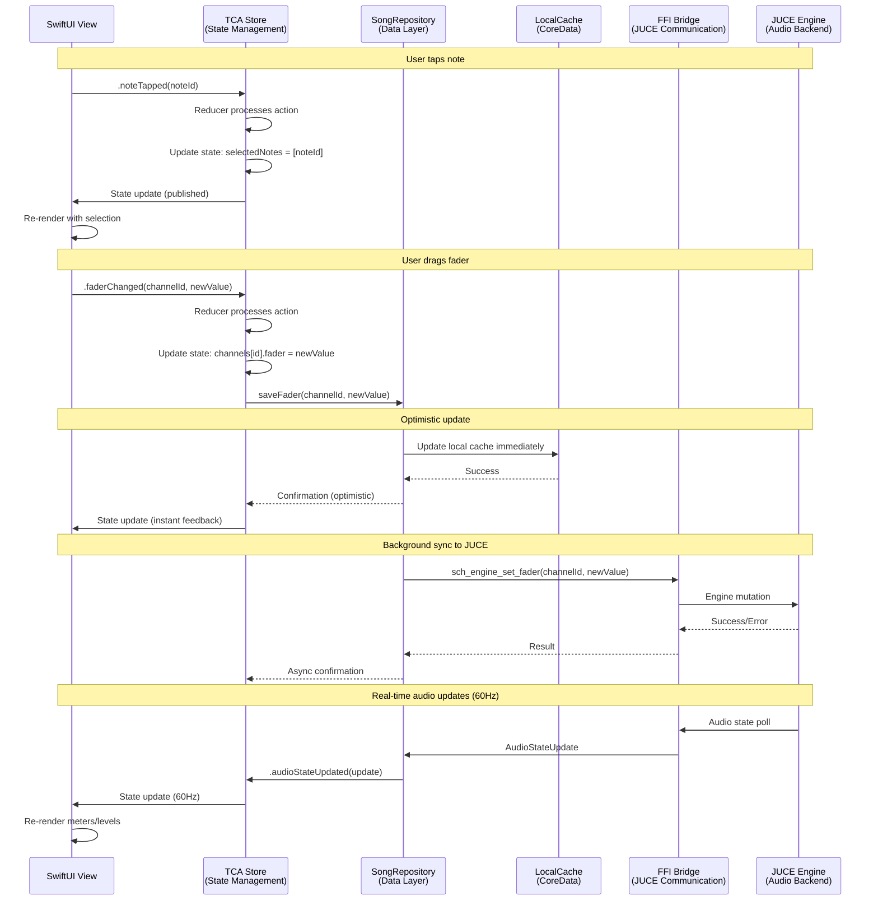

---

## State Management (TCA)

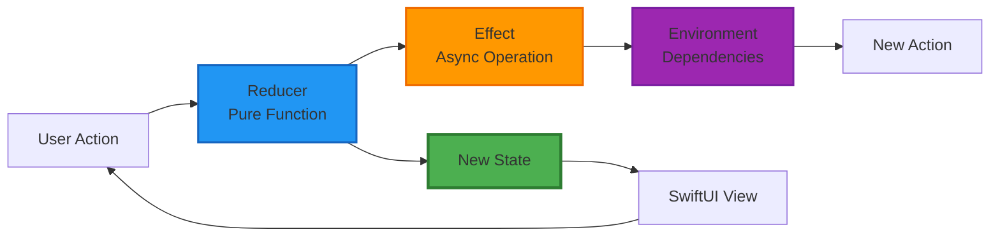

### TCA Feature Structure

```mermaid
graph TB
    Feature[PianoRollFeature]
    State[State<br/>notes: [NoteEvent]<br/>selectedNotes: Set<UUID><br/>zoomLevel: Double<br/>scrollOffset: CGPoint]
    Action[Action<br/>noteTapped(UUID)<br/>noteDragged(UUID, CGPoint)<br/>zoomChanged(Double)<br/>recordingToggled(Bool)]
    Environment[Environment<br/>songRepository: SongRepository<br/>mainQueue: DispatchQueue<br/>audioPoller: AudioStatePoller]
    Reducer[Reducer<br/>Pure Function]
    Store[Store<br/>Runtime State Machine]

    State --> Reducer
    Action --> Reducer
    Environment --> Reducer
    Reducer --> Store
    Store --> View[SwiftUI View]

    style State fill:#4CAF50,stroke:#2E7D32,stroke-width:2px
    style Action fill:#2196F3,stroke:#1565C0,stroke-width:2px
    style Environment fill:#9C27B0,stroke:#7B1FA2,stroke-width:2px
    style Reducer fill:#FF9800,stroke:#EF6C00,stroke-width:2px
    style Store fill:#F44336,stroke:#C62828,stroke-width:2px
```

---

## Repository Pattern

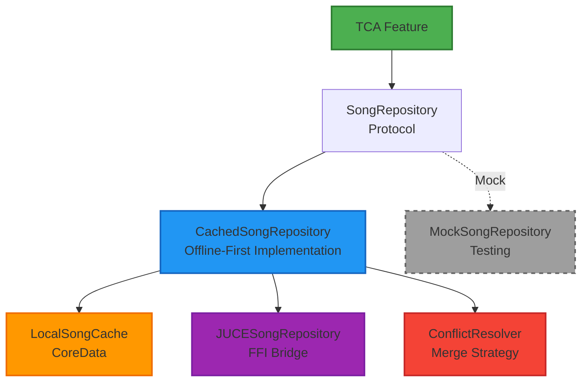

---

## Offline Sync Strategy

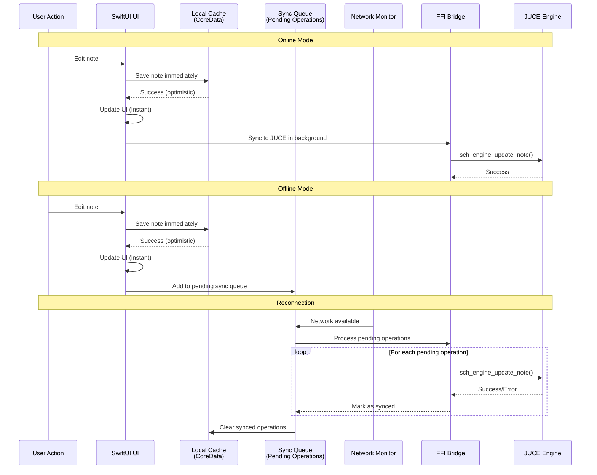

---

## Real-time Updates

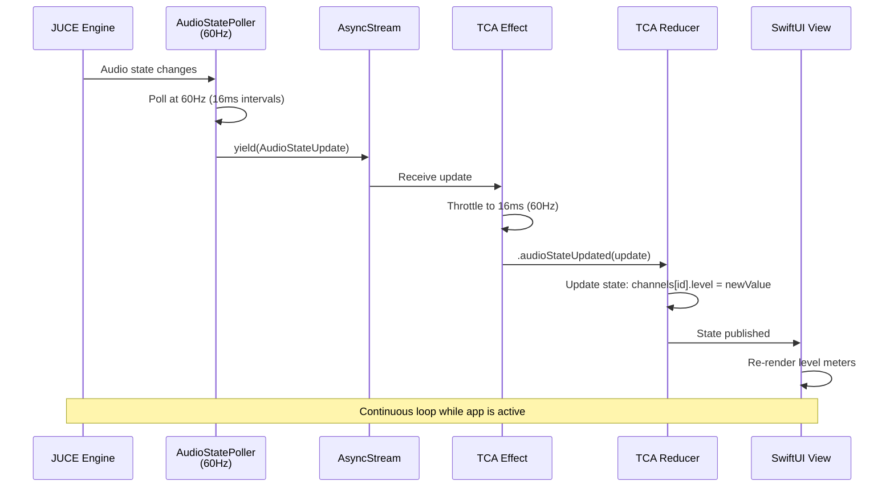

---

## Performance Optimization

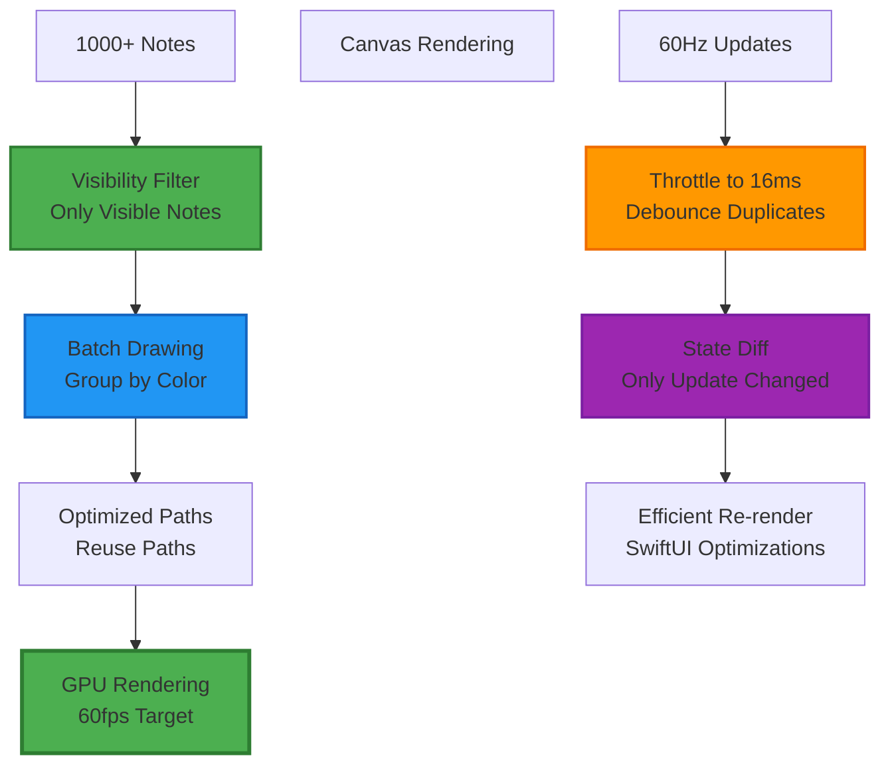

---

## Component Reusability

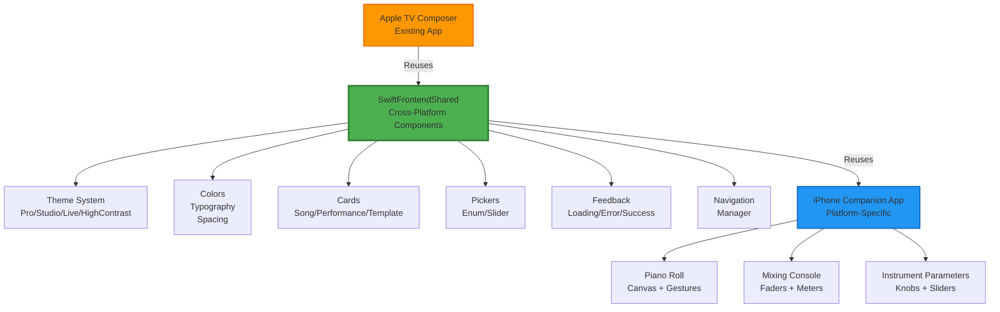

---

## FFI Bridge Integration

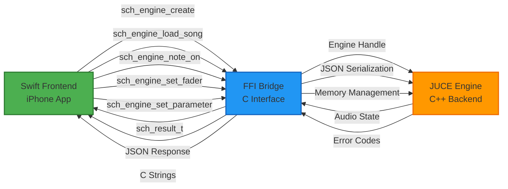

---

## Testing Architecture

```mermaid
graph TB
    Unit[Unit Tests<br/>80%+ Coverage]
    Integration[Integration Tests<br/>Repository + FFI]
    UI[UI Tests<br/>SwiftUI Testing]
    Perf[Performance Tests<br/>60fps Targets]

    Unit --> Reducer[TCA Reducers<br/>Pure Functions]
    Unit --> Logic[Business Logic<br/>Conflict Resolution]
    Unit --> Util[Utilities<br/>Formatting, Parsing]

    Integration --> Repo[Repository<br/>Cache + FFI]
    Integration --> Sync[Offline Sync<br/>Queue Processing]
    Integration --> FFI[FFI Bridge<br/>C Integration]

    UI --> PianoRoll[Piano Roll<br/>Draw, Select, Edit]
    UI --> Mixing[Mixing Console<br/>Faders, Meters]
    UI --> Params[Parameters<br/>Knobs, Sliders]

    Perf --> Canvas[Canvas Rendering<br/>1000+ Notes]
    Perf --> Updates[60Hz Updates<br/>Real-time Polling]
    Perf --> Memory[Memory Usage<br/><100MB Target]

    style Unit fill:#4CAF50,stroke:#2E7D32,stroke-width:2px
    style Integration fill:#2196F3,stroke:#1565C0,stroke-width:2px
    style UI fill:#FF9800,stroke:#EF6C00,stroke-width:2px
    style Perf fill:#9C27B0,stroke:#7B1FA2,stroke-width:2px
```

---

## Navigation Flow

```mermaid
graph TB
    Start[App Launch]
    Auth[Authentication<br/>(Future)]
    Main[Main Tab View]

    Start --> Auth
    Auth --> Main

    Main --> Piano[Piano Roll Tab]
    Main --> Mix[Mixing Console Tab]
    Main --> Inst[Instrument Params Tab]
    Main --> Set[Settings Tab]

    Piano --> Editor[Note Editor]
    Piano --> Velocity[Velocity Editor<br/>Sheet Modal]
    Piano --> Quantize[Quantization Menu<br/>Action Sheet]

    Mix --> Channel[Channel Detail<br/>Push Navigation]
    Mix --> Master[Master Fader<br/>Bottom Sheet]

    Inst --> Preset[Preset Manager<br/>Sheet Modal]
    Inst --> Automate[Automation Editor<br/>Push Navigation]
    Inst --> Learn[MIDI Learn<br/>Long-press Gesture]

    Set --> Theme[Theme Picker]
    Set --> About[About Screen]

    style Start fill:#4CAF50,stroke:#2E7D32,stroke-width:2px
    style Main fill:#2196F3,stroke:#1565C0,stroke-width:2px
    style Piano fill:#FF9800,stroke:#EF6C00,stroke-width:2px
    style Mix fill:#9C27B0,stroke:#7B1FA2,stroke-width:2px
    style Inst fill:#F44336,stroke:#C62828,stroke-width:2px
```

---

## Parallel Work Tracks

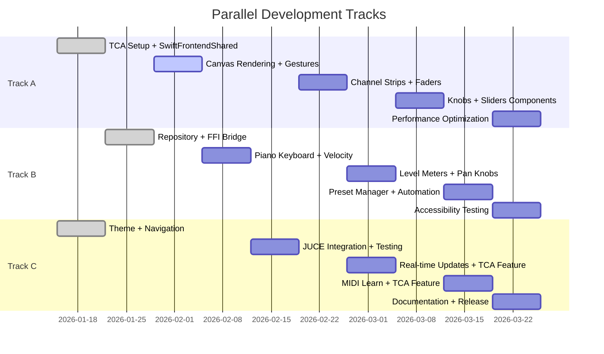

---

## Risk Mitigation

```mermaid
graph TB
    Risk[Risk Identification]
    FFI_Latency[FFI Bridge Latency]
    Canvas_Perf[Canvas Performance]
    Realtime_Sync[Real-time Sync Issues]
    Learning_Curve[TCA Learning Curve]

    Risk --> FFI_Latency
    Risk --> Canvas_Perf
    Risk --> Realtime_Sync
    Risk --> Learning_Curve

    FFI_Latency --> Cache[Aggressive Caching]
    FFI_Latency --> Optimistic[Optimistic UI Updates]
    FFI_Latency --> Mock[Mock Data Fallback]

    Canvas_Perf --> Optimize[Optimize Rendering]
    Canvas_Perf --> Visible[Only Draw Visible]
    Canvas_Perf --> Test[Test on Older Devices]

    Realtime_Sync --> Conflict[Conflict Resolution]
    Realtime_Sync --> Offline[Offline-First]
    Realtime_Sync --> Retry[Retry with Backoff]

    Learning_Curve --> Training[Team Training]
    Learning_Curve --> Generation[Code Generation]
    Learning_Curve --> Pairing[Pair Programming]

    style Risk fill:#F44336,stroke:#C62828,stroke-width:3px
    style Cache fill:#4CAF50,stroke:#2E7D32,stroke-width:2px
    style Optimize fill:#4CAF50,stroke:#2E7D32,stroke-width:2px
    style Conflict fill:#4CAF50,stroke:#2E7D32,stroke-width:2px
    style Training fill:#4CAF50,stroke:#2E7D32,stroke-width:2px
```

---

## Deployment Pipeline

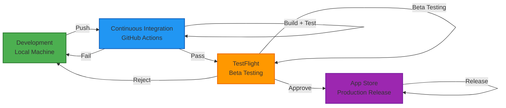

---

**Document Version**: 1.0
**Created**: 2026-01-15
**Author**: Claude (Mobile App Builder Agent)
**Related**: `plans/iphone-companion-app-implementation.md`, `docs/iphone-companion-app-summary.md`
