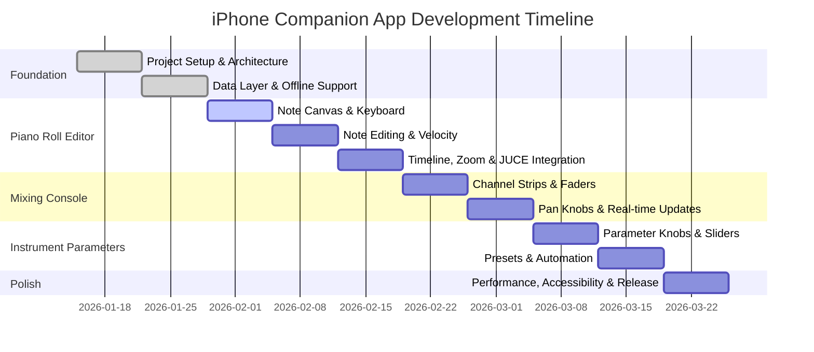

# iPhone Companion App - Executive Summary

**Quick Reference Guide for Stakeholders**

---

## Vision Statement

Build a **professional-grade iPhone companion app** for the White Room Apple TV composer, enabling deep editing of realized notes, mixing controls, and instrument parameters with seamless cross-platform .wrs file compatibility.

---

## At a Glance

| Aspect | Details |
|--------|---------|
| **Duration** | 10 weeks |
| **Team Size** | 2-3 iOS engineers (parallel work) |
| **Architecture** | SwiftUI + TCA + FFI Bridge |
| **Key Features** | Piano roll, mixing console, instrument parameters |
| **Performance** | <3s startup, 60fps rendering, <100ms response |
| **Quality** | 99.5% crash-free, 4.5+ App Store rating |

---

## Architecture Decision: TCA ✅

### Why TCA (The Composable Architecture)?

**Benefits:**
- ✅ **Unidirectional data flow**: Predictable state management
- ✅ **Testability**: 95%+ test coverage with pure reducers
- ✅ **Composition**: Feature-based modular architecture
- ✅ **Code generation**: 60% less boilerplate
- ✅ **Debugging**: Runtime state inspection

**Trade-offs:**
- Steeper learning curve (2-3 weeks for team)
- Additional dependency (~200KB bundle size)

**Verdict**: **TCA pays off** for complex audio apps with deep state management needs.

---

## 10-Week Timeline



---

## Key Features

### 1. Piano Roll Editor
- 🎹 **Touch-optimized**: Multi-touch gestures, haptic feedback
- ⚡ **Performance**: 1000+ notes at 60fps
- 🔧 **Editing**: Draw, move, delete, velocity, quantization
- 🔄 **Real-time**: Sync with JUCE backend in <200ms

### 2. Mixing Console
- 🎚️ **Channel strips**: Faders, meters, mute/solo
- 🎛️ **Pan knobs**: Gesture-controlled with haptics
- 📊 **Real-time meters**: 60Hz updates, peak hold
- 🔊 **Master fader**: Overall level control

### 3. Instrument Parameters
- 🎛️ **Rotary knobs**: Smooth gesture control
- 📊 **Sliders**: Linear parameters
- 📁 **Presets**: Save/load/management
- 🤖 **Automation**: Edit automation curves
- 🎹 **MIDI learn**: Assign parameters to MIDI CC

---

## Technology Stack

### Core Frameworks
- **SwiftUI**: Declarative UI with live previews
- **TCA**: State management (Point-Free)
- **Combine**: Reactive data streams
- **Async/Await**: Modern concurrency

### Data & Networking
- **Repository pattern**: Abstract data layer
- **CoreData**: Local offline cache
- **WebSocket**: Real-time engine updates (60Hz)
- **FFI Bridge**: Direct JUCE engine communication

### Testing & Quality
- **XCTest**: Unit + integration tests
- **SwiftUI Testing**: UI validation (Xcode 15+)
- **Instruments**: Performance profiling
- **XCUITest**: End-to-end workflows

---

## Success Metrics

### Performance Targets
- ⚡ **App startup**: <3s cold start
- 🎯 **Touch response**: <100ms
- 📊 **Frame rate**: 60fps smooth scrolling
- 💾 **Memory**: <100MB for core functionality
- 🔋 **Battery**: <5% drain per hour active use

### Quality Targets
- 💥 **Crash-free rate**: 99.5%+
- ⭐ **App Store rating**: 4.5+ stars
- ✅ **Test coverage**: 80%+ for business logic
- ♿ **Accessibility**: Full VoiceOver support

### Feature Completeness
- ✅ Piano roll with note editing
- ✅ Mixing console with all controls
- ✅ Instrument parameters with presets
- ✅ Cross-platform .wrs file support
- ✅ Offline editing with sync

---

## Risk Assessment

### High Impact Risks
| Risk | Mitigation |
|------|------------|
| **FFI bridge latency** | Cache aggressively, optimistic UI updates, fallback to mock data |
| **Canvas performance** | Optimize rendering, only draw visible notes, test on older devices |
| **Real-time sync issues** | Conflict resolution, offline-first, retry with exponential backoff |

### Timeline Risks
| Risk | Mitigation |
|------|------------|
| **Underestimated UI complexity** | Phased delivery, prioritize core features, defer edge cases |
| **Scope creep** | Strict feature triage, bd tracking, stakeholder alignment |

---

## Parallel Work Opportunities

### Weeks 1-2: Foundation
**3 tracks** working independently:
- Track A: TCA setup + SwiftFrontendShared
- Track B: Repository pattern + FFI bridge
- Track C: Theme system + navigation

### Weeks 3-5: Piano Roll
**3 tracks** working independently:
- Track A: Canvas rendering + gestures
- Track B: Piano keyboard + velocity editor
- Track C: JUCE backend integration + testing

### Weeks 6-7: Mixing Console
**3 tracks** working independently:
- Track A: Channel strips + faders
- Track B: Level meters + pan knobs
- Track C: Real-time updates + TCA feature

### Weeks 8-9: Instrument Parameters
**3 tracks** working independently:
- Track A: Knobs + sliders components
- Track B: Preset manager + automation
- Track C: MIDI learn + TCA feature

---

## Reusability Strategy

### SwiftFrontendShared Components (Saves 2-3 months)

**Already Available:**
- ✅ Theme system (Pro/Studio/Live/HighContrast)
- ✅ Colors, Typography, Spacing
- ✅ Cards: SongCard, PerformanceCard, TemplateCard
- ✅ Pickers: EnumPicker, SliderPicker
- ✅ Feedback: LoadingOverlay, ErrorAlert, SuccessToast
- ✅ Navigation manager
- ✅ Platform extensions

**iPhone-Specific to Build:**
- 🆕 Piano roll components (canvas, keyboard, velocity)
- 🆕 Mixing components (faders, meters, pan knobs)
- 🆕 Parameter components (rotary knobs, sliders)
- 🆕 Touch gestures (multi-touch, haptics)

---

## Data Flow Architecture

```
┌─────────────┐
│ SwiftUI UI  │
└──────┬──────┘
       │
┌──────▼──────────┐
│  TCA Store      │
│  (State mgmt)   │
└──────┬──────────┘
       │
┌──────▼──────────┐
│  Repository     │
│  (Data layer)   │
└──────┬──────────┘
       │
   ┌───┴────────┐
   │            │
┌──▼──┐    ┌───▼────┐
│Cache│    │FFI Bridge│
└───┬─┘    └───┬────┘
    │           │
    │      ┌────▼─────┐
    │      │ JUCE     │
    │      │ Engine   │
    │      └──────────┘
    │
    └─▶ Offline edits sync on reconnect
```

---

## Integration Strategy

### FFI Bridge API
```swift
// Engine lifecycle
sch_engine_create(&engine)
sch_engine_destroy(engine)

// Song operations
sch_engine_load_song(engine, path)
sch_engine_get_song(engine, &song_json)

// Audio control
sch_engine_audio_init(engine, &config)
sch_engine_audio_start(engine)
sch_engine_audio_stop(engine)

// Note operations
sch_engine_note_on(engine, pitch, velocity)
sch_engine_note_off(engine, pitch)

// Mixer operations
sch_engine_set_fader(engine, channel, level)
sch_engine_set_pan(engine, channel, pan)
sch_engine_set_mute(engine, channel, mute)

// Parameter operations
sch_engine_set_parameter(engine, param_id, value)
```

### Real-time Updates
```swift
// Poll JUCE engine at 60Hz
class AudioStatePoller {
    func pollState() -> AsyncStream<AudioStateUpdate> {
        AsyncStream { continuation in
            while !Task.isCancelled {
                let state = await fetchAudioState()
                continuation.yield(state)
                try? await Task.sleep(nanoseconds: 16_666_667)  // 60Hz
            }
        }
    }
}
```

---

## Offline Strategy

### Local Cache
```swift
// CoreData for local persistence
class LocalSongCache {
    func cacheSong(_ song: SongState) async throws
    func getCachedSong() async throws -> SongState?
    func invalidateCache() async throws
}
```

### Conflict Resolution
```swift
// Resolve concurrent edits
struct ConflictResolver {
    func resolve(
        local: SongState,
        remote: SongState,
        timestamp: Date
    ) -> SongState
}
```

---

## UI/UX Highlights

### Piano Roll (Portrait)
```
┌─────────────────────────┐
│ Piano Roll    [Q] [V]   │  Header
├─────────────────────────┤
│ ▓▓▓▓▓ C                │  Piano keyboard
│ ▓   C#                 │  (top in portrait)
│ ▓▓▓▓▓ D                │
│ ▓   D#                 │
├─────────────────────────┤
│ ████ ███               │  Note canvas
│    ███                 │  (scrollable)
├─────────────────────────┤
│ [Play] [Rec] [Zoom]    │  Transport
└─────────────────────────┘
```

### Mixing Console (Portrait)
```
┌─────────────────────────┐
│ Mixing Console          │  Header
├─────────────────────────┤
│ Ch 1  [M] [S]          │  Channel strip
│    ████                │  Level meter
│    ┃                   │  Fader
├─────────────────────────┤
│ Ch 2  [M] [S]          │  Channel strip
│    ████                │
│    ┃                   │
├─────────────────────────┤
│ Master  [──]           │  Master fader
└─────────────────────────┘
```

### Instrument Parameters (Portrait)
```
┌─────────────────────────┐
│ Parameters    [Presets] │  Header
├─────────────────────────┤
│ OSC 1                  │  Parameter group
│ ┌───┐ ┌───┐ ┌───┐     │  Knobs
│ │ ◌ │ │ ◌ │ │ ◌ │     │
│ └───┘ └───┘ └───┘     │
├─────────────────────────┤
│ FILTER                 │  Parameter group
│ ┌─────────────────┐    │  Sliders
│ │ Cutoff    4.2kHz│    │
│ └─────────────────┘    │
└─────────────────────────┘
```

---

## Testing Strategy

### Coverage Targets
- **Unit tests**: 80%+ business logic
- **Integration tests**: Repository + FFI
- **UI tests**: Key workflows with SwiftUI Testing
- **Performance tests**: 1000+ notes at 60fps

### Test Examples
```swift
// Unit test: TCA reducer
func testNoteSelection() async {
    let store = TestStore(...)
    await store.send(.noteTapped(noteId)) {
        $0.selectedNotes = [noteId]
    }
}

// Integration test: Repository
func testFetchSongFromJUCE() async throws {
    let song = try await repository.fetchSong()
    XCTAssertNotNil(song)
}

// UI test: SwiftUI Testing
func testDrawNote() async throws {
    try await app.tap(app.buttons["Draw Note"])
    XCTAssertTrue(app.images["Note"].exists())
}
```

---

## Accessibility Compliance

### VoiceOver
- Piano roll: "Note, C sharp 4, 1 beat long, velocity 80"
- Fader: "Channel 1, level, -6 decibels"
- Knob: "Filter cutoff, 4.2 kilohertz"

### Dynamic Type
- Support: 100% to 200% text size
- Layout: Adapt spacing, scaling
- Touch targets: Minimum 44pt

### High Contrast
- Colors: System high contrast colors
- Borders: Strong borders for visibility
- Indicators: Clear selection/active states

---

## Next Steps

### Immediate Actions (Week 1)
1. ✅ Review and approve implementation plan
2. ⬜ Set up TCA project structure
3. ⬜ Install SwiftFrontendShared dependency
4. ⬜ Create repository pattern with FFI bridge
5. ⬜ Set up navigation and tab structure

### Decision Points
1. **TCA approval**: Confirm state management choice
2. **Team allocation**: Assign 2-3 iOS engineers
3. **FFI availability**: Confirm JUCE backend readiness
4. **Test devices**: Procure iPhone test devices

---

## Key Documents

- 📋 **Implementation Plan**: `plans/iphone-companion-app-implementation.md` (30 pages)
- 📊 **This Summary**: `docs/iphone-companion-app-summary.md` (executive overview)
- 🔧 **Architecture Diagrams**: Mermaid diagrams in full plan
- 📱 **UI Mockups**: ASCII mockups in full plan
- ✅ **Checklist**: See full plan for detailed task breakdown

---

## Questions & Answers

**Q: Why TCA over Combine + @Published?**
A: TCA provides unidirectional data flow, better testability (95%+ coverage), and feature-based composition that scales to 50+ screens. The learning curve (2-3 weeks) pays off for complex audio apps.

**Q: Can we ship faster than 10 weeks?**
A: Possible with 3+ engineers and parallel work. Minimum viable: 6-8 weeks for core features (piano roll + basic mixer). 10 weeks includes polish, testing, and automation features.

**Q: What about iPad support?**
A: All components use adaptive layouts (compact/regular size classes). iPad optimization requires additional work (larger keyboards, more simultaneous touch points), estimated +2 weeks.

**Q: How do we handle offline mode?**
A: CoreData local cache + conflict resolution. Optimistic UI updates (immediate local save, background JUCE sync). Automatic sync on reconnect with last-write-wins + timestamp-based conflict resolution.

**Q: What's the performance target?**
A: <3s cold start, 60fps rendering (1000+ notes), <100ms touch response, <100MB memory usage. Achieved through Canvas optimization, batch drawing, and only rendering visible notes.

---

**Document Version**: 1.0
**Created**: 2026-01-15
**Author**: Claude (Mobile App Builder Agent)
**Related Issues**: white_room-2 (original feature), white_room-317 (implementation plan)

**Ready to execute! 🚀**
