# System Architecture Diagrams

**Visual architecture documentation for White Room using Mermaid diagrams.**

---

## Table of Contents

1. [High-Level Architecture](#high-level-architecture)
2. [Component Interaction](#component-interaction)
3. [Data Flow](#data-flow)
4. [Deployment Architecture](#deployment-architecture)

---

## High-Level Architecture

### System Overview

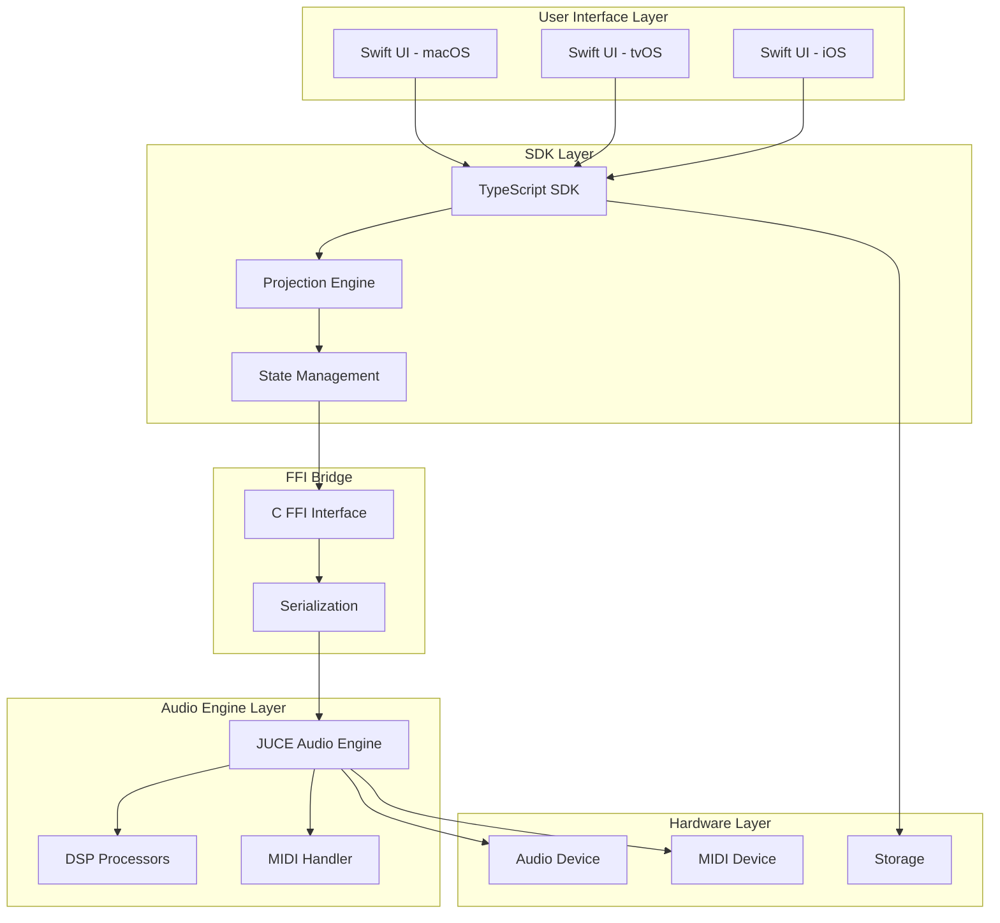

### Platform Architecture

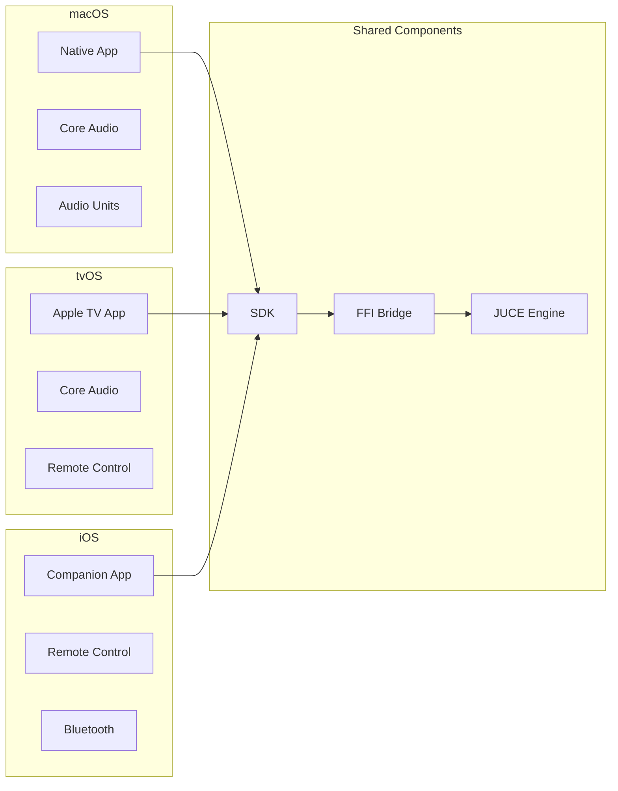

---

## Component Interaction

### MVC Pattern (SwiftUI)

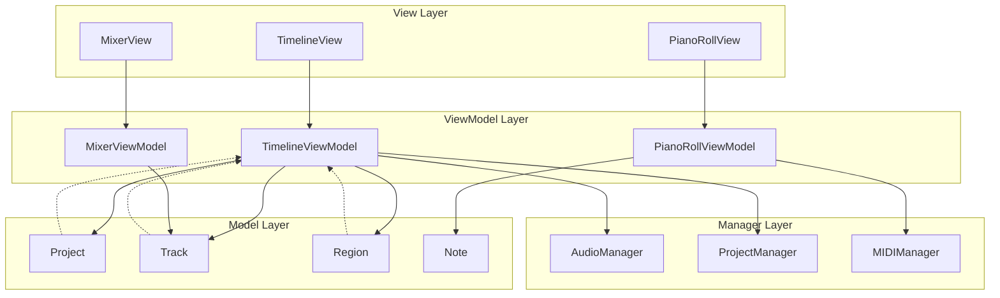

### FFI Bridge Interaction

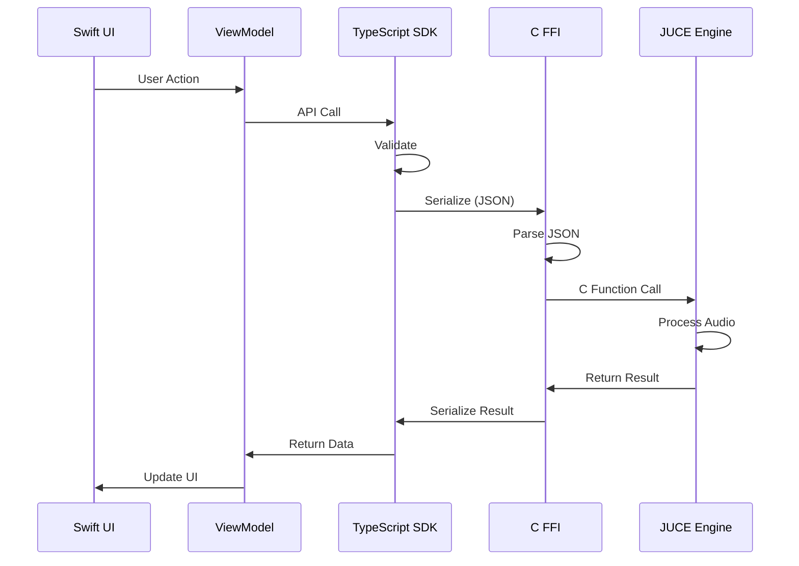

---

## Data Flow

### Audio Processing Flow

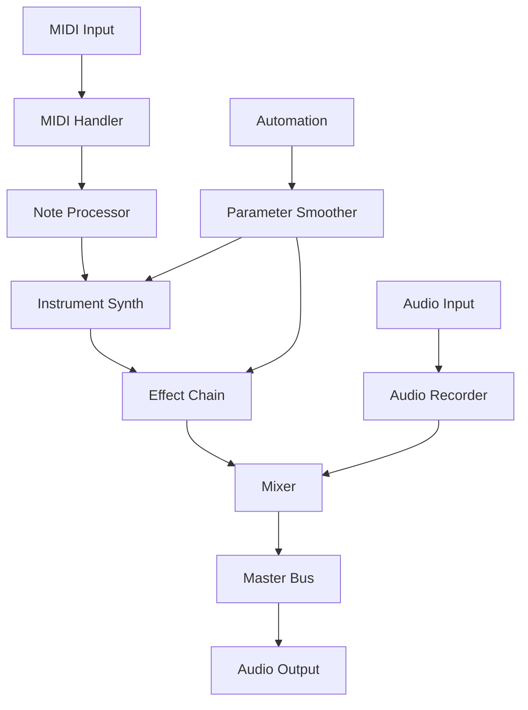

### Project Save Flow

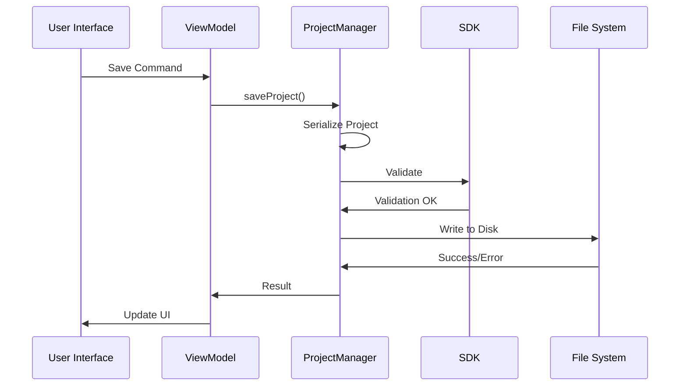

### Real-Time Playback Flow

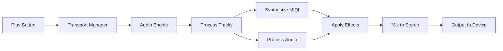

---

## Deployment Architecture

### CI/CD Pipeline

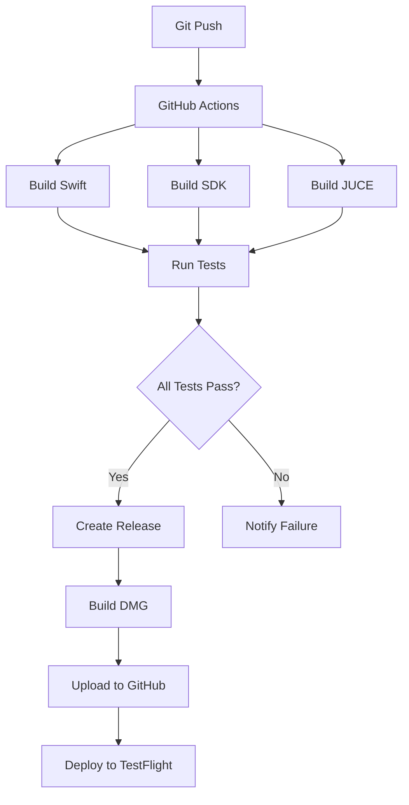

### Multi-Platform Deployment

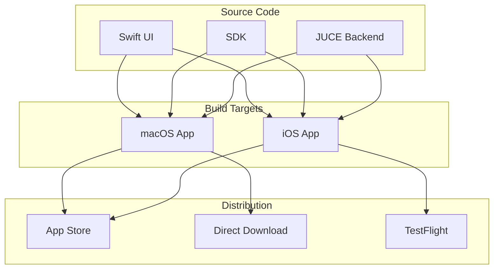

### Runtime Architecture

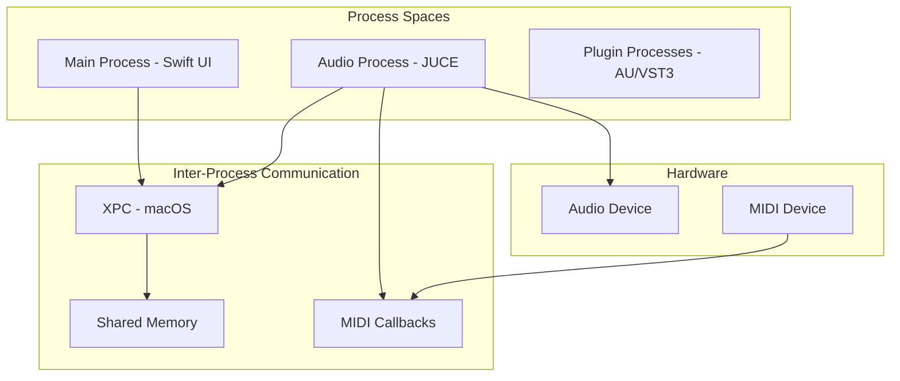

---

## Component Relationships

### Dependency Graph

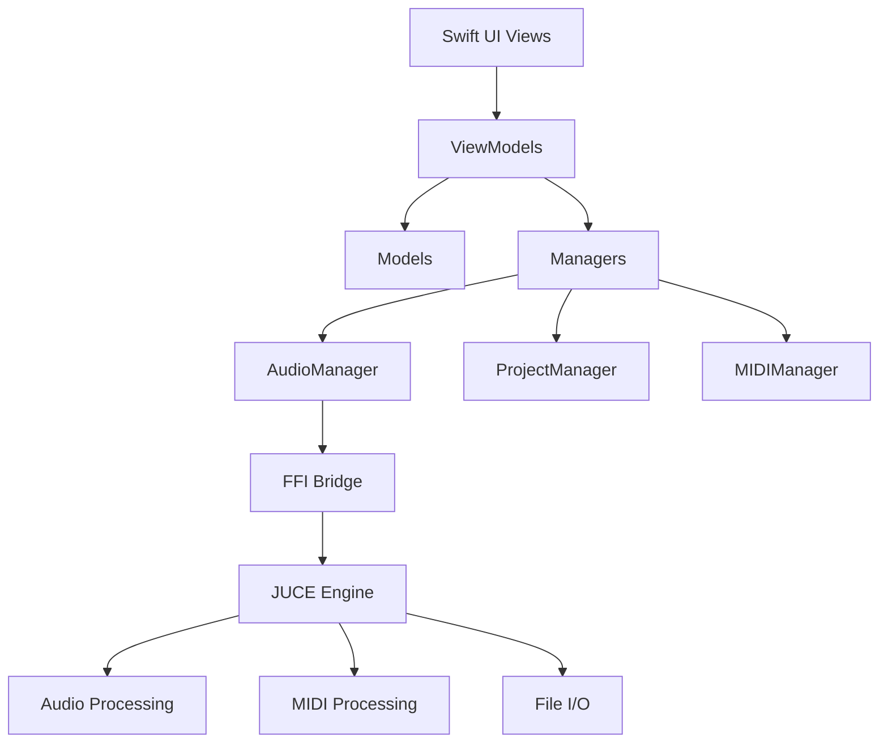

### Module Dependencies

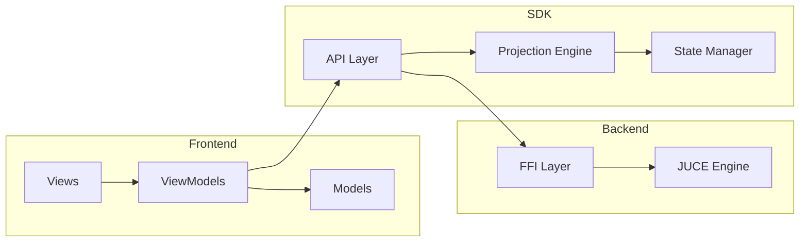

---

## State Management

### Data Flow Architecture

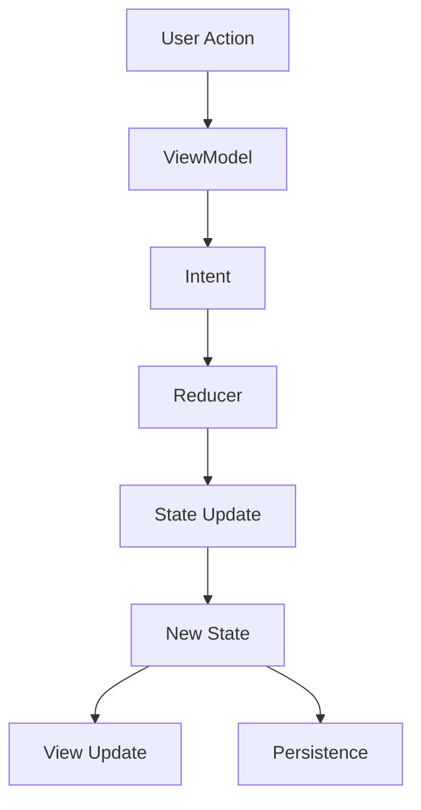

### State Synchronization

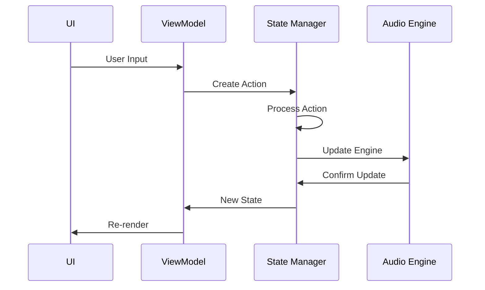

---

## Plugin Architecture

### Audio Unit Hosting

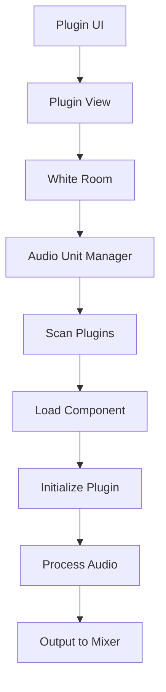

### Effect Chain Processing

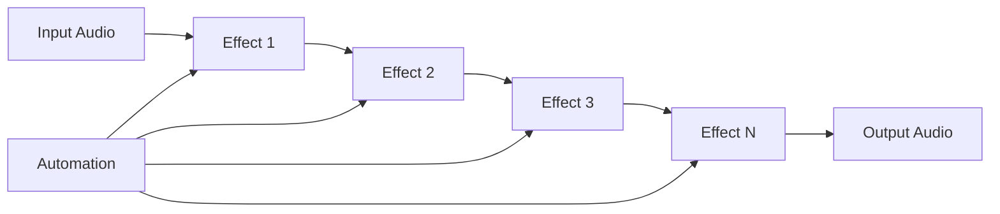

---

**Last Updated**: January 16, 2026
**Version**: 1.0.0

---

*These diagrams use Mermaid syntax. Render them using any Mermaid-compatible renderer (GitHub, MkDocs with Mermaid plugin, etc.).*
