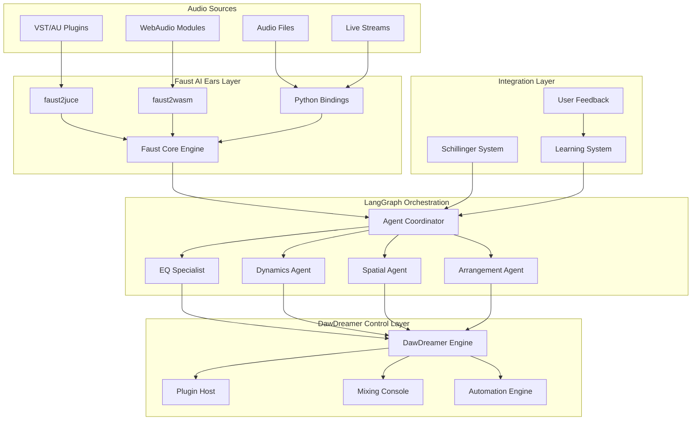
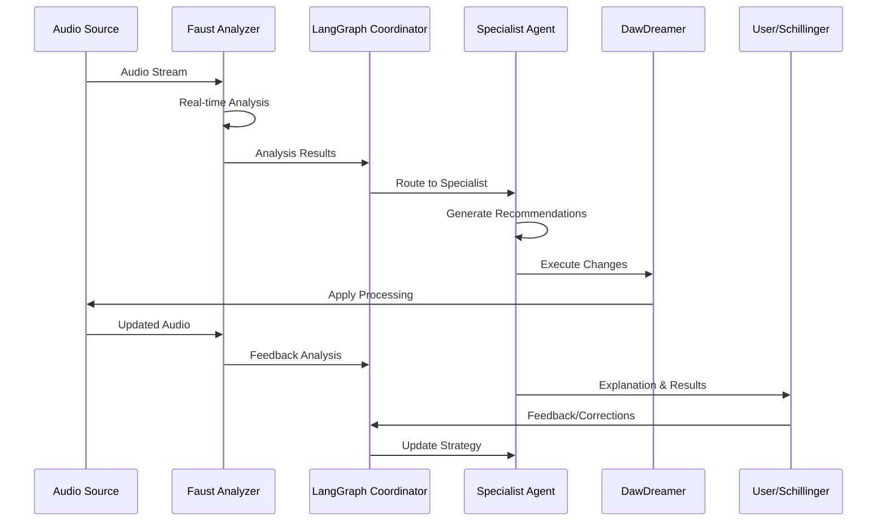

# Design Document

## Overview

The Audio Agent transformation represents a fundamental architectural shift from a VST-focused plugin host to a comprehensive AI-driven audio analysis and mixing system. The design centers around three core technologies working in concert:

1. **Faust-based "AI Ears"** - Universal audio analysis that can listen to any audio source
2. **LangGraph Agent Orchestration** - Intelligent coordination of specialized AI agents
3. **DawDreamer Integration** - Hands-on mixing control with professional DAW capabilities

This system serves as both a proof-of-concept for autonomous AI mixing and an expandable workflow that integrates with the Schillinger composition system.

## Architecture

### High-Level System Architecture



### Component Interaction Flow



## Components and Interfaces

### 1. Faust "AI Ears" System

#### Core Analysis Engine
```faust
// Universal Audio Analyzer
analyzer = environment {
    // Spectral Analysis
    spectral_analyzer = an.analyzer(1024);
    spectral_centroid = an.spectral_centroid;
    spectral_rolloff = an.spectral_rolloff;
    
    // Dynamic Analysis  
    rms_analyzer = an.rms_envelope_rect(0.1);
    peak_analyzer = an.peak_envelope_rect(0.01);
    dynamic_range = peak_analyzer - rms_analyzer;
    
    // Harmonic Analysis
    pitch_tracker = an.pitchtracker;
    harmonic_analyzer = an.harmonic_analyzer;
    
    // Perceptual Analysis
    loudness_meter = an.loudness_meter;
    masking_analyzer = an.masking_curve;
};

// Output formatting for LangGraph
analysis_output = analyzer : format_for_agents;
```

#### Multi-Platform Compilation
- **faust2juce**: Compiles to C++ for DawDreamer integration
- **faust2wasm**: Compiles to WebAssembly for browser environments
- **Python bindings**: Direct integration with LangGraph agents

#### Analysis Data Structure
```python
from pydantic import BaseModel
from typing import Dict, List, Optional
import numpy as np

class AudioAnalysis(BaseModel):
    """Standardized analysis output from Faust"""
    timestamp: float
    
    # Spectral characteristics
    spectral_centroid: float
    spectral_rolloff: float
    spectral_flux: float
    mfcc: List[float]
    
    # Dynamic characteristics
    rms_level: float
    peak_level: float
    dynamic_range: float
    transient_density: float
    
    # Harmonic characteristics
    fundamental_freq: Optional[float]
    harmonic_content: List[float]
    inharmonicity: float
    
    # Perceptual characteristics
    loudness_lufs: float
    perceived_brightness: float
    perceived_warmth: float
    
    # Mixing insights
    frequency_balance: Dict[str, float]  # bass, mid, treble
    stereo_width: float
    phase_correlation: float
    suggested_actions: List[str]
```

### 2. LangGraph Agent Orchestration

#### Agent Coordinator
```python
from langgraph.graph import StateGraph
from typing import Dict, Any, List

class AgentCoordinator:
    """Central orchestration of specialist agents"""
    
    def __init__(self):
        self.graph = StateGraph(AgentState)
        self.setup_agent_graph()
    
    def setup_agent_graph(self):
        # Add specialist agents
        self.graph.add_node("eq_specialist", self.eq_agent_node)
        self.graph.add_node("dynamics_specialist", self.dynamics_agent_node)
        self.graph.add_node("spatial_specialist", self.spatial_agent_node)
        self.graph.add_node("arrangement_specialist", self.arrangement_agent_node)
        
        # Add coordination logic
        self.graph.add_node("coordinator", self.coordination_node)
        self.graph.add_node("conflict_resolver", self.conflict_resolution_node)
        
        # Define routing logic
        self.graph.add_conditional_edges(
            "coordinator",
            self.route_to_specialists,
            {
                "eq_issues": "eq_specialist",
                "dynamics_issues": "dynamics_specialist",
                "spatial_issues": "spatial_specialist",
                "arrangement_issues": "arrangement_specialist"
            }
        )
```

#### Specialist Agents with Pydantic V2

**Plugin Specialist Agent**
```python
from pydantic import BaseModel, Field, ConfigDict, field_validator
from typing import List, Dict, Optional, Literal
from enum import Enum

class PluginCategory(str, Enum):
    EQ = "eq"
    COMPRESSOR = "compressor"
    REVERB = "reverb"
    DELAY = "delay"
    DISTORTION = "distortion"
    MODULATION = "modulation"
    FILTER = "filter"
    UTILITY = "utility"

class PluginRecommendation(BaseModel):
    """Plugin selection recommendation with context awareness"""
    model_config = ConfigDict(strict=True, validate_assignment=True)
    
    plugin_name: str = Field(..., description="Specific plugin to use")
    plugin_category: PluginCategory
    plugin_format: Literal["VST3", "AU", "WAM"] = Field(..., description="Plugin format")
    confidence: float = Field(..., ge=0.0, le=1.0)
    reasoning: str = Field(..., min_length=10)
    style_context: str = Field(..., description="Musical style context")
    alternative_plugins: List[str] = Field(default_factory=list)
    
    @field_validator('plugin_name')
    @classmethod
    def validate_plugin_name(cls, v: str) -> str:
        if len(v.strip()) == 0:
            raise ValueError("Plugin name cannot be empty")
        return v.strip()

class PluginFeatureVector(BaseModel):
    """Rich feature representation of a plugin for vector similarity search"""
    model_config = ConfigDict(strict=True, validate_assignment=True)
    
    plugin_id: str = Field(..., min_length=1)
    plugin_name: str = Field(..., min_length=1)
    plugin_category: PluginCategory
    plugin_format: Literal["VST3", "AU", "WAM"]
    
    # Technical characteristics
    cpu_usage: float = Field(..., ge=0.0, le=1.0, description="CPU intensity 0-1")
    latency_ms: float = Field(..., ge=0.0, description="Plugin latency in milliseconds")
    quality_rating: float = Field(..., ge=0.0, le=1.0, description="Overall quality score")
    
    # Sonic characteristics (embeddings)
    frequency_response: List[float] = Field(..., description="Frequency response curve embedding")
    harmonic_character: List[float] = Field(..., description="Harmonic distortion characteristics")
    dynamic_behavior: List[float] = Field(..., description="Dynamic response characteristics")
    spatial_properties: List[float] = Field(..., description="Stereo/spatial processing traits")
    
    # Musical context features
    genre_affinity: Dict[str, float] = Field(default_factory=dict, description="Genre suitability scores")
    tempo_suitability: Dict[str, float] = Field(default_factory=dict, description="Tempo range suitability")
    instrument_compatibility: Dict[str, float] = Field(default_factory=dict, description="Instrument type compatibility")
    
    # User interaction features
    ease_of_use: float = Field(..., ge=0.0, le=1.0, description="User-friendliness score")
    preset_quality: float = Field(..., ge=0.0, le=1.0, description="Quality of included presets")
    parameter_count: int = Field(..., ge=0, description="Number of adjustable parameters")
    
    # Manufacturer and vintage characteristics
    manufacturer: str = Field(..., min_length=1)
    vintage_character: float = Field(default=0.0, ge=0.0, le=1.0, description="Vintage/analog character")
    modern_character: float = Field(default=0.0, ge=0.0, le=1.0, description="Modern/digital character")
    
    # Combined feature vector for similarity search
    feature_vector: List[float] = Field(..., description="Combined normalized feature vector")

class PluginVectorDatabase(BaseModel):
    """Vector database for semantic plugin search"""
    model_config = ConfigDict(strict=True, validate_assignment=True)
    
    plugins: Dict[str, PluginFeatureVector] = Field(default_factory=dict)
    vector_index: Optional[Any] = Field(default=None, description="Vector similarity index (FAISS, Chroma, etc.)")
    
    def add_plugin(self, plugin: PluginFeatureVector):
        """Add plugin to vector database"""
        self.plugins[plugin.plugin_id] = plugin
        self._update_vector_index()
    
    def search_similar_plugins(
        self, 
        query_vector: List[float], 
        top_k: int = 5,
        filters: Optional[Dict[str, Any]] = None
    ) -> List[tuple[PluginFeatureVector, float]]:
        """Search for plugins similar to query vector"""
        # Implementation would use vector similarity search
        # Returns list of (plugin, similarity_score) tuples
        pass
    
    def create_query_vector_from_context(
        self, 
        audio_analysis: 'AudioAnalysis',
        composition_context: 'CompositionContext',
        user_preferences: Optional['UserPreferences'] = None
    ) -> List[float]:
        """Create search query vector from musical context"""
        query_features = []
        
        # Audio analysis features
        if audio_analysis:
            query_features.extend([
                audio_analysis.spectral_centroid / 10000,  # Normalize
                audio_analysis.dynamic_range / 30,
                audio_analysis.perceived_brightness,
                audio_analysis.perceived_warmth,
                audio_analysis.frequency_balance.get("bass", 0.5),
                audio_analysis.frequency_balance.get("mid", 0.5),
                audio_analysis.frequency_balance.get("treble", 0.5)
            ])
        else:
            query_features.extend([0.5] * 7)  # Default values
        
        # Compositional context features
        tempo_normalized = (composition_context.tempo - 60) / 140  # Normalize 60-200 BPM to 0-1
        is_minor = 1.0 if composition_context.key_signature.lower().endswith('m') else 0.0
        
        query_features.extend([
            tempo_normalized,
            is_minor,
            self._encode_style(composition_context.style),
            self._encode_time_signature(composition_context.time_signature)
        ])
        
        # User preference features
        if user_preferences:
            query_features.extend([
                user_preferences.target_loudness / -30,  # Normalize LUFS
                self._encode_experience_level(user_preferences.experience_level)
            ])
        else:
            query_features.extend([0.5, 0.5])  # Default values
        
        return query_features
    
    def _encode_style(self, style: str) -> float:
        """Encode musical style as numeric feature"""
        style_encoding = {
            "electronic": 0.9, "techno": 0.85, "house": 0.8, "trance": 0.75,
            "rock": 0.6, "metal": 0.55, "punk": 0.5,
            "jazz": 0.4, "blues": 0.35, "classical": 0.3,
            "pop": 0.7, "r&b": 0.65, "hip_hop": 0.6
        }
        return style_encoding.get(style.lower(), 0.5)
    
    def _encode_time_signature(self, time_sig: str) -> float:
        """Encode time signature as numeric feature"""
        if time_sig.startswith('4/'):
            return 0.5  # Common time
        elif time_sig.startswith('3/'):
            return 0.3  # Waltz time
        elif time_sig.startswith('6/'):
            return 0.6  # Compound time
        else:
            return 0.5  # Default
    
    def _encode_experience_level(self, level: str) -> float:
        """Encode user experience level"""
        levels = {"beginner": 0.2, "intermediate": 0.5, "advanced": 0.8, "professional": 1.0}
        return levels.get(level, 0.5)

class PluginSpecialist(BaseModel):
    """Specialized in selecting appropriate plugins using vector similarity search"""
    model_config = ConfigDict(strict=True, validate_assignment=True)
    
    vector_db: PluginVectorDatabase = Field(default_factory=PluginVectorDatabase)
    user_plugin_ratings: Dict[str, float] = Field(default_factory=dict)
    
    def select_plugin_for_context(
        self, 
        category: PluginCategory,
        audio_analysis: 'AudioAnalysis',
        composition_context: 'CompositionContext',
        user_preferences: Optional['UserPreferences'] = None,
        additional_filters: Optional[Dict[str, Any]] = None
    ) -> PluginRecommendation:
        """Select optimal plugin using vector similarity search"""
        
        # Create query vector from context
        query_vector = self.vector_db.create_query_vector_from_context(
            audio_analysis, 
            composition_context, 
            user_preferences
        )
        
        # Add category filter
        filters = {"plugin_category": category.value}
        if additional_filters:
            filters.update(additional_filters)
        
        # Search for similar plugins
        similar_plugins = self.vector_db.search_similar_plugins(
            query_vector, 
            top_k=10,
            filters=filters
        )
        
        if not similar_plugins:
            raise ValueError(f"No plugins available for category {category}")
        
        # Apply user preference weighting
        scored_plugins = []
        for plugin_vector, similarity_score in similar_plugins:
            final_score = similarity_score
            
            # User rating bonus
            if plugin_vector.plugin_name in self.user_plugin_ratings:
                user_rating = self.user_plugin_ratings[plugin_vector.plugin_name]
                final_score = (final_score * 0.7) + (user_rating * 0.3)
            
            # CPU usage penalty for resource-constrained contexts
            if user_preferences and hasattr(user_preferences, 'prefer_low_cpu'):
                if user_preferences.prefer_low_cpu and plugin_vector.cpu_usage > 0.7:
                    final_score *= 0.8
            
            # Quality rating bonus
            final_score = (final_score * 0.8) + (plugin_vector.quality_rating * 0.2)
            
            scored_plugins.append((plugin_vector, final_score))
        
        # Sort by final score
        scored_plugins.sort(key=lambda x: x[1], reverse=True)
        best_plugin_vector, confidence = scored_plugins[0]
        
        # Generate reasoning based on vector similarity
        reasoning = self._generate_vector_based_reasoning(
            best_plugin_vector, 
            query_vector, 
            audio_analysis, 
            composition_context
        )
        
        return PluginRecommendation(
            plugin_name=best_plugin_vector.plugin_name,
            plugin_category=category,
            plugin_format=best_plugin_vector.plugin_format,
            confidence=min(confidence, 1.0),
            reasoning=reasoning,
            style_context=composition_context.style,
            alternative_plugins=[pv.plugin_name for pv, _ in scored_plugins[1:4]]
        )
    
    def _generate_vector_based_reasoning(
        self,
        plugin_vector: PluginFeatureVector,
        query_vector: List[float],
        audio_analysis: 'AudioAnalysis',
        composition_context: 'CompositionContext'
    ) -> str:
        """Generate human-readable reasoning for plugin selection"""
        
        reasons = []
        
        # Analyze why this plugin was selected
        if plugin_vector.quality_rating > 0.8:
            reasons.append(f"High quality rating ({plugin_vector.quality_rating:.1f}/1.0)")
        
        if composition_context.tempo in plugin_vector.tempo_suitability:
            tempo_score = plugin_vector.tempo_suitability[str(composition_context.tempo)]
            if tempo_score > 0.7:
                reasons.append(f"Excellent tempo compatibility for {composition_context.tempo} BPM")
        
        if composition_context.style.lower() in plugin_vector.genre_affinity:
            genre_score = plugin_vector.genre_affinity[composition_context.style.lower()]
            if genre_score > 0.7:
                reasons.append(f"Strong affinity for {composition_context.style} style")
        
        # Audio analysis matching
        if audio_analysis:
            if audio_analysis.perceived_brightness > 0.7 and plugin_vector.modern_character > 0.6:
                reasons.append("Modern character matches bright audio content")
            elif audio_analysis.perceived_warmth > 0.7 and plugin_vector.vintage_character > 0.6:
                reasons.append("Vintage character complements warm audio content")
        
        # CPU efficiency
        if plugin_vector.cpu_usage < 0.3:
            reasons.append("Low CPU usage for efficient processing")
        
        # Ease of use
        if plugin_vector.ease_of_use > 0.8:
            reasons.append("User-friendly interface and workflow")
        
        if not reasons:
            reasons.append("Best overall match based on feature similarity")
        
        return f"Selected {plugin_vector.plugin_name} by {plugin_vector.manufacturer}: " + ", ".join(reasons) + "."
    
    def _score_plugin_for_context(
        self, 
        plugin: str, 
        analysis: 'AudioAnalysis', 
        style: str,
        user_preferences: Optional['UserPreferences']
    ) -> float:
        """Score plugin suitability for current context"""
        score = 0.5  # Base score
        
        # User preference bonus
        if user_preferences and plugin in self.user_plugin_ratings:
            score += self.user_plugin_ratings[plugin] * 0.3
        
        # Style-specific bonuses
        style_bonuses = {
            "rock": {"FabFilter Pro-Q 3": 0.2, "Waves SSL E-Channel": 0.3},
            "jazz": {"Neve 1073": 0.3, "Pultec EQP-1A": 0.2},
            "electronic": {"Serum": 0.3, "Massive X": 0.2},
            "classical": {"Altiverb": 0.3, "Vienna Suite": 0.2}
        }
        
        if style in style_bonuses and plugin in style_bonuses[style]:
            score += style_bonuses[style][plugin]
        
        return min(score, 1.0)

class EQSpecialist(BaseModel):
    """Specialized in frequency balance and tonal shaping"""
    model_config = ConfigDict(strict=True, validate_assignment=True)
    
    plugin_specialist: PluginSpecialist = Field(default_factory=PluginSpecialist)
    
    def analyze_frequency_issues(
        self, 
        analysis: 'AudioAnalysis',
        composition_context: 'CompositionContext'
    ) -> List['EQRecommendation']:
        """Identify frequency balance issues using flexible rule engine"""
        
        # Use the same flexible configuration engine for EQ decisions
        eq_rule_engine = EQRecommendationEngine()
        
        # Create context for EQ analysis
        eq_context = EQAnalysisContext(
            audio_analysis=analysis,
            composition_context=composition_context,
            target_category=PluginCategory.EQ
        )
        
        # Generate EQ recommendations using rule engine
        recommendations = eq_rule_engine.generate_recommendations(eq_context)
        
        return recommendations
```

**Plugin Instrument Agent for Software Instruments**
```python
from typing import Dict, List, Optional, Union
from abc import ABC, abstractmethod

class PluginInstrumentType(str, Enum):
    """Software instrument plugin types"""
    SYNTHESIZER = "synthesizer"           # Serum, Massive, Sylenth1
    DRUM_MACHINE = "drum_machine"         # Battery, Superior Drummer, BFD
    ORCHESTRAL = "orchestral"             # Kontakt libraries, Spitfire Audio
    PIANO = "piano"                       # Keyscape, Addictive Keys, Pianoteq
    CLASSIC_SYNTH = "classic_synth"       # Minimoog, Prophet, Jupiter emulations
    BASS_SYNTH = "bass_synth"            # Trilian, SubBoomBass
    GUITAR_SYNTH = "guitar_synth"        # Ample Guitar, RealGuitar
    SAMPLER = "sampler"                   # Kontakt, HALion, EXS24
    ROMPLER = "rompler"                   # Omnisphere, Nexus
    MODULAR_SYNTH = "modular_synth"      # VCV Rack, Reaktor, Voltage Modular

class EffectType(str, Enum):
    """Effect plugin types"""
    EQ = "eq"
    COMPRESSOR = "compressor"
    REVERB = "reverb"
    DELAY = "delay"
    CHORUS = "chorus"
    FLANGER = "flanger"
    PHASER = "phaser"
    DISTORTION = "distortion"
    FILTER = "filter"
    GATE = "gate"
    LIMITER = "limiter"
    EXCITER = "exciter"
    STEREO_ENHANCER = "stereo_enhancer"
    PITCH_SHIFTER = "pitch_shifter"
    VOCODER = "vocoder"

class HardwareEmulationType(str, Enum):
    """Classic hardware emulation types"""
    VINTAGE_EQ = "vintage_eq"             # Neve 1073, API 550A, Pultec EQP-1A
    VINTAGE_COMPRESSOR = "vintage_compressor"  # 1176, LA-2A, Fairchild 670
    VINTAGE_REVERB = "vintage_reverb"     # Lexicon 480L, AMS RMX16
    VINTAGE_DELAY = "vintage_delay"       # Echoplex, Space Echo, Memory Man
    VINTAGE_PREAMP = "vintage_preamp"     # Neve, API, SSL preamps
    VINTAGE_CONSOLE = "vintage_console"   # SSL 4000, Neve VR, API Legacy
    TAPE_MACHINE = "tape_machine"         # Studer A800, Ampex ATR-102
    VINTAGE_SYNTH = "vintage_synth"       # Minimoog, Prophet-5, Jupiter-8

class PluginInstrumentSubAgent(BaseModel, ABC):
    """Base class for software instrument plugin sub-agents"""
    model_config = ConfigDict(strict=True, validate_assignment=True)
    
    instrument_type: PluginInstrumentType
    plugin_specialist: PluginSpecialist = Field(default_factory=PluginSpecialist)
    
    @abstractmethod
    def select_instrument_plugin(
        self, 
        composition_context: 'CompositionContext',
        user_preferences: Optional['UserPreferences'] = None
    ) -> 'PluginInstrumentRecommendation':
        """Select appropriate software instrument plugin"""
        pass
    
    @abstractmethod
    def configure_instrument_plugin(
        self,
        plugin_recommendation: 'PluginInstrumentRecommendation',
        composition_context: 'CompositionContext'
    ) -> Dict[str, Union[str, float, int]]:
        """Configure the selected instrument plugin"""
        pass

class SynthesizerSubAgent(PluginInstrumentSubAgent):
    """Sub-agent for selecting and configuring synthesizer plugins"""
    instrument_type: PluginInstrumentType = Field(default=PluginInstrumentType.SYNTHESIZER, frozen=True)
    
    def select_instrument_plugin(
        self, 
        composition_context: 'CompositionContext',
        user_preferences: Optional['UserPreferences'] = None
    ) -> 'PluginInstrumentRecommendation':
        """Select synthesizer based on musical style and context"""
        
        # Style-specific synthesizer preferences
        synth_preferences = {
            "electronic": ["Serum", "Massive X", "Sylenth1", "Omnisphere"],
            "ambient": ["Omnisphere", "Padshop Pro", "Zebra2"],
            "trance": ["Sylenth1", "Spire", "Serum"],
            "dubstep": ["Serum", "Massive X", "FM8"],
            "house": ["Sylenth1", "Serum", "Diva"],
            "techno": ["Massive X", "Operator", "Monark"],
            "pop": ["Omnisphere", "Keyscape", "Serum"],
            "rock": ["Minimoog V", "Prophet V", "Jupiter-8V"]
        }
        
        style = composition_context.style.lower()
        preferred_synths = synth_preferences.get(style, ["Serum", "Omnisphere"])
        
        # Score available synthesizers
        available_synths = self.plugin_specialist.available_plugins.get("synthesizer", [])
        scored_synths = []
        
        for synth in available_synths:
            score = 0.5  # Base score
            
            # Style preference bonus
            if synth in preferred_synths:
                score += 0.3
            
            # User preference bonus
            if user_preferences and synth in user_preferences.preferred_plugins.get("synthesizer", []):
                score += 0.2
            
            scored_synths.append((synth, score))
        
        if not scored_synths:
            raise ValueError("No synthesizer plugins available")
        
        best_synth, confidence = max(scored_synths, key=lambda x: x[1])
        
        return PluginInstrumentRecommendation(
            agent_id="synthesizer_sub_agent",
            plugin_name=best_synth,
            plugin_type=PluginInstrumentType.SYNTHESIZER,
            confidence=confidence,
            reasoning=f"Selected {best_synth} for {style} style composition. Optimal for {composition_context.key_signature} in {composition_context.tempo} BPM.",
            style_context=style,
            composition_context=composition_context
        )
    
    def configure_instrument_plugin(
        self,
        plugin_recommendation: 'PluginInstrumentRecommendation',
        composition_context: 'CompositionContext'
    ) -> Dict[str, Union[str, float, int]]:
        """Configure synthesizer parameters based on composition"""
        config = {}
        
        # Tempo-based configuration
        if composition_context.tempo > 140:
            config.update({
                "attack": 0.01,  # Fast attack for electronic music
                "release": 0.3,  # Short release
                "filter_cutoff": 0.7  # Brighter sound
            })
        else:
            config.update({
                "attack": 0.05,  # Slower attack for ambient
                "release": 1.2,  # Longer release
                "filter_cutoff": 0.5  # Warmer sound
            })
        
        # Key-based configuration
        if "m" in composition_context.key_signature.lower():  # Minor key
            config.update({
                "oscillator_detune": 0.02,  # Slight detune for darker sound
                "filter_resonance": 0.3
            })
        else:  # Major key
            config.update({
                "oscillator_detune": 0.0,  # Clean tuning for brighter sound
                "filter_resonance": 0.2
            })
        
        return config

class DrumMachineSubAgent(PluginInstrumentSubAgent):
    """Sub-agent for selecting and configuring drum machine plugins"""
    instrument_type: PluginInstrumentType = Field(default=PluginInstrumentType.DRUM_MACHINE, frozen=True)
    
    def select_instrument_plugin(
        self, 
        composition_context: 'CompositionContext',
        user_preferences: Optional['UserPreferences'] = None
    ) -> 'PluginInstrumentRecommendation':
        """Select drum machine based on musical style"""
        
        drum_preferences = {
            "electronic": ["Battery 4", "Maschine", "BFD3"],
            "hip_hop": ["Maschine", "MPC Beats", "Battery 4"],
            "rock": ["Superior Drummer 3", "BFD3", "Addictive Drums 2"],
            "jazz": ["BFD3", "Superior Drummer 3"],
            "pop": ["Addictive Drums 2", "Battery 4", "Superior Drummer 3"],
            "techno": ["Maschine", "Battery 4", "Drum Rack"],
            "house": ["Battery 4", "Maschine", "Drum Rack"]
        }
        
        style = composition_context.style.lower()
        preferred_drums = drum_preferences.get(style, ["Battery 4", "Superior Drummer 3"])
        
        available_drums = self.plugin_specialist.available_plugins.get("drum_machine", [])
        scored_drums = []
        
        for drum in available_drums:
            score = 0.5
            if drum in preferred_drums:
                score += 0.4
            if user_preferences and drum in user_preferences.preferred_plugins.get("drum_machine", []):
                score += 0.2
            scored_drums.append((drum, score))
        
        if not scored_drums:
            raise ValueError("No drum machine plugins available")
        
        best_drum, confidence = max(scored_drums, key=lambda x: x[1])
        
        return PluginInstrumentRecommendation(
            agent_id="drum_machine_sub_agent",
            plugin_name=best_drum,
            plugin_type=PluginInstrumentType.DRUM_MACHINE,
            confidence=confidence,
            reasoning=f"Selected {best_drum} for {style} style drums. Matches {composition_context.tempo} BPM tempo requirements.",
            style_context=style,
            composition_context=composition_context
        )
    
    def configure_instrument_plugin(
        self,
        plugin_recommendation: 'PluginInstrumentRecommendation',
        composition_context: 'CompositionContext'
    ) -> Dict[str, Union[str, float, int]]:
        """Configure drum machine using flexible rule engine"""
        
        # Use the flexible configuration engine
        config_engine = PluginConfigurationEngine()
        
        # Create context for configuration
        context = ConfigurationContext(
            tempo=composition_context.tempo,
            key_signature=composition_context.key_signature,
            style=composition_context.style,
            time_signature=composition_context.time_signature,
            plugin_type=PluginInstrumentType.DRUM_MACHINE,
            plugin_name=plugin_recommendation.plugin_name
        )
        
        # Generate configuration using rule engine
        config = config_engine.generate_configuration(context)
        
        return config

### Flexible Plugin Configuration Engine

```python
from typing import Dict, List, Any, Callable, Optional, Union
from dataclasses import dataclass
from abc import ABC, abstractmethod
import json

class ConfigurationContext(BaseModel):
    """Rich context for plugin configuration decisions"""
    model_config = ConfigDict(strict=True, validate_assignment=True)
    
    # Musical context
    tempo: int = Field(..., ge=60, le=200)
    key_signature: str = Field(..., pattern=r'^[A-G][#b]?[mM]?$')
    style: str = Field(..., min_length=1)
    time_signature: str = Field(..., pattern=r'^\d+/\d+$')
    
    # Plugin context
    plugin_type: Union[PluginInstrumentType, EffectType, HardwareEmulationType]
    plugin_name: str = Field(..., min_length=1)
    
    # Audio analysis context
    audio_analysis: Optional['AudioAnalysis'] = None
    
    # User context
    user_preferences: Optional['UserPreferences'] = None
    experience_level: str = Field(default="intermediate")
    
    # Compositional context
    harmonic_complexity: float = Field(default=0.5, ge=0.0, le=1.0)
    rhythmic_complexity: float = Field(default=0.5, ge=0.0, le=1.0)
    arrangement_density: float = Field(default=0.5, ge=0.0, le=1.0)

class ConfigurationRule(BaseModel, ABC):
    """Base class for configuration rules"""
    model_config = ConfigDict(strict=True, validate_assignment=True)
    
    rule_id: str = Field(..., min_length=1)
    priority: int = Field(..., ge=1, le=10)
    conditions: List[str] = Field(..., min_length=1)
    description: str = Field(..., min_length=10)
    
    @abstractmethod
    def applies_to_context(self, context: ConfigurationContext) -> bool:
        """Check if this rule applies to the given context"""
        pass
    
    @abstractmethod
    def generate_config(self, context: ConfigurationContext) -> Dict[str, Any]:
        """Generate configuration based on context"""
        pass

class TempoBasedRule(ConfigurationRule):
    """Rule that configures based on tempo ranges"""
    
    tempo_ranges: Dict[str, Dict[str, Any]] = Field(default_factory=dict)
    
    def applies_to_context(self, context: ConfigurationContext) -> bool:
        return any(
            self._tempo_in_range(context.tempo, range_def)
            for range_def in self.tempo_ranges.keys()
        )
    
    def generate_config(self, context: ConfigurationContext) -> Dict[str, Any]:
        for range_name, config in self.tempo_ranges.items():
            if self._tempo_in_range(context.tempo, range_name):
                return self._interpolate_config(context.tempo, range_name, config)
        return {}
    
    def _tempo_in_range(self, tempo: int, range_def: str) -> bool:
        """Check if tempo falls within range definition like '60-90', '>140', '<80'"""
        if '-' in range_def:
            min_tempo, max_tempo = map(int, range_def.split('-'))
            return min_tempo <= tempo <= max_tempo
        elif range_def.startswith('>'):
            return tempo > int(range_def[1:])
        elif range_def.startswith('<'):
            return tempo < int(range_def[1:])
        return False
    
    def _interpolate_config(self, tempo: int, range_def: str, config: Dict[str, Any]) -> Dict[str, Any]:
        """Interpolate configuration values based on exact tempo within range"""
        # For now, return base config - could add interpolation logic
        return config.copy()

class StyleBasedRule(ConfigurationRule):
    """Rule that configures based on musical style"""
    
    style_configs: Dict[str, Dict[str, Any]] = Field(default_factory=dict)
    style_families: Dict[str, List[str]] = Field(default_factory=dict)  # Group related styles
    
    def applies_to_context(self, context: ConfigurationContext) -> bool:
        style = context.style.lower()
        return (
            style in self.style_configs or
            any(style in family for family in self.style_families.values())
        )
    
    def generate_config(self, context: ConfigurationContext) -> Dict[str, Any]:
        style = context.style.lower()
        
        # Direct style match
        if style in self.style_configs:
            return self.style_configs[style].copy()
        
        # Style family match
        for family_name, styles in self.style_families.items():
            if style in styles and family_name in self.style_configs:
                return self.style_configs[family_name].copy()
        
        return {}

class HarmonicContextRule(ConfigurationRule):
    """Rule that configures based on harmonic context"""
    
    key_configs: Dict[str, Dict[str, Any]] = Field(default_factory=dict)
    mode_configs: Dict[str, Dict[str, Any]] = Field(default_factory=dict)
    
    def applies_to_context(self, context: ConfigurationContext) -> bool:
        return (
            context.key_signature in self.key_configs or
            self._get_mode(context.key_signature) in self.mode_configs
        )
    
    def generate_config(self, context: ConfigurationContext) -> Dict[str, Any]:
        config = {}
        
        # Key-specific configuration
        if context.key_signature in self.key_configs:
            config.update(self.key_configs[context.key_signature])
        
        # Mode-based configuration
        mode = self._get_mode(context.key_signature)
        if mode in self.mode_configs:
            config.update(self.mode_configs[mode])
        
        return config
    
    def _get_mode(self, key_signature: str) -> str:
        """Extract mode (major/minor) from key signature"""
        return "minor" if key_signature.lower().endswith('m') else "major"

class AudioAnalysisRule(ConfigurationRule):
    """Rule that configures based on audio analysis results"""
    
    analysis_thresholds: Dict[str, Dict[str, Any]] = Field(default_factory=dict)
    
    def applies_to_context(self, context: ConfigurationContext) -> bool:
        return context.audio_analysis is not None
    
    def generate_config(self, context: ConfigurationContext) -> Dict[str, Any]:
        if not context.audio_analysis:
            return {}
        
        config = {}
        analysis = context.audio_analysis
        
        # Dynamic range based configuration
        if "dynamic_range" in self.analysis_thresholds:
            dr_config = self.analysis_thresholds["dynamic_range"]
            if analysis.dynamic_range > dr_config.get("high_threshold", 15):
                config.update(dr_config.get("high_action", {}))
            elif analysis.dynamic_range < dr_config.get("low_threshold", 5):
                config.update(dr_config.get("low_action", {}))
        
        # Frequency balance based configuration
        if "frequency_balance" in self.analysis_thresholds:
            fb_config = self.analysis_thresholds["frequency_balance"]
            bass_level = analysis.frequency_balance.get("bass", 0.5)
            
            if bass_level > fb_config.get("bass_high_threshold", 0.7):
                config.update(fb_config.get("bass_high_action", {}))
            elif bass_level < fb_config.get("bass_low_threshold", 0.3):
                config.update(fb_config.get("bass_low_action", {}))
        
        return config

class UserPreferenceRule(ConfigurationRule):
    """Rule that adapts configuration based on user preferences and experience"""
    
    experience_modifiers: Dict[str, Dict[str, float]] = Field(default_factory=dict)
    preference_weights: Dict[str, float] = Field(default_factory=dict)
    
    def applies_to_context(self, context: ConfigurationContext) -> bool:
        return context.user_preferences is not None
    
    def generate_config(self, context: ConfigurationContext) -> Dict[str, Any]:
        if not context.user_preferences:
            return {}
        
        config = {}
        prefs = context.user_preferences
        
        # Experience level modifiers
        if context.experience_level in self.experience_modifiers:
            modifiers = self.experience_modifiers[context.experience_level]
            config.update(modifiers)
        
        # User-specific preferences
        if hasattr(prefs, 'mixing_style') and prefs.mixing_style in self.preference_weights:
            weight = self.preference_weights[prefs.mixing_style]
            config["user_preference_weight"] = weight
        
        return config

class PluginConfigurationEngine(BaseModel):
    """Flexible engine for generating plugin configurations"""
    model_config = ConfigDict(strict=True, validate_assignment=True)
    
    rules: List[ConfigurationRule] = Field(default_factory=list)
    rule_registry: Dict[str, type] = Field(default_factory=dict)
    
    def __init__(self, **data):
        super().__init__(**data)
        self._load_default_rules()
    
    def _load_default_rules(self):
        """Load default configuration rules"""
        
        # Drum machine tempo-based rule
        drum_tempo_rule = TempoBasedRule(
            rule_id="drum_tempo_basic",
            priority=5,
            conditions=["plugin_type == 'drum_machine'"],
            description="Basic tempo-based drum machine configuration",
            tempo_ranges={
                "60-90": {
                    "kit_type": "ballad",
                    "swing": 0.1,
                    "velocity_sensitivity": 0.8,
                    "humanization": 0.15
                },
                "90-120": {
                    "kit_type": "standard",
                    "swing": 0.05,
                    "velocity_sensitivity": 0.7,
                    "humanization": 0.1
                },
                "120-140": {
                    "kit_type": "rock",
                    "swing": 0.02,
                    "velocity_sensitivity": 0.6,
                    "humanization": 0.08
                },
                ">140": {
                    "kit_type": "electronic",
                    "swing": 0.0,
                    "velocity_sensitivity": 0.5,
                    "humanization": 0.05
                }
            }
        )
        
        # Drum machine style-based rule
        drum_style_rule = StyleBasedRule(
            rule_id="drum_style_basic",
            priority=6,
            conditions=["plugin_type == 'drum_machine'"],
            description="Style-based drum machine configuration",
            style_families={
                "electronic": ["electronic", "techno", "house", "trance", "dubstep"],
                "rock": ["rock", "metal", "punk", "alternative"],
                "urban": ["hip_hop", "r&b", "trap", "drill"],
                "acoustic": ["jazz", "blues", "folk", "country"]
            },
            style_configs={
                "electronic": {
                    "kick_level": 1.0,
                    "snare_level": 0.7,
                    "hihat_level": 0.8,
                    "processing": "digital",
                    "reverb_type": "plate"
                },
                "rock": {
                    "kick_level": 0.8,
                    "snare_level": 0.9,
                    "overhead_level": 0.6,
                    "processing": "analog",
                    "reverb_type": "room"
                },
                "urban": {
                    "kick_level": 0.9,
                    "snare_level": 0.8,
                    "hihat_level": 0.7,
                    "processing": "punchy",
                    "reverb_type": "hall"
                },
                "acoustic": {
                    "kick_level": 0.6,
                    "snare_level": 0.7,
                    "overhead_level": 0.8,
                    "processing": "natural",
                    "reverb_type": "room"
                }
            }
        )
        
        # Synthesizer harmonic context rule
        synth_harmonic_rule = HarmonicContextRule(
            rule_id="synth_harmonic_basic",
            priority=4,
            conditions=["plugin_type == 'synthesizer'"],
            description="Harmonic context-based synthesizer configuration",
            mode_configs={
                "major": {
                    "oscillator_detune": 0.0,
                    "filter_resonance": 0.2,
                    "brightness": 0.7,
                    "warmth": 0.6
                },
                "minor": {
                    "oscillator_detune": 0.02,
                    "filter_resonance": 0.3,
                    "brightness": 0.5,
                    "warmth": 0.8
                }
            }
        )
        
        # Audio analysis-based rule for EQ
        eq_analysis_rule = AudioAnalysisRule(
            rule_id="eq_analysis_basic",
            priority=7,
            conditions=["plugin_type == 'eq'"],
            description="Audio analysis-based EQ configuration",
            analysis_thresholds={
                "frequency_balance": {
                    "bass_high_threshold": 0.7,
                    "bass_high_action": {
                        "high_pass_freq": 80,
                        "high_pass_slope": 12,
                        "low_shelf_gain": -2
                    },
                    "bass_low_threshold": 0.3,
                    "bass_low_action": {
                        "low_shelf_freq": 100,
                        "low_shelf_gain": 2,
                        "warmth_boost": 1.5
                    }
                },
                "dynamic_range": {
                    "high_threshold": 20,
                    "high_action": {
                        "gentle_compression": True,
                        "preserve_transients": True
                    },
                    "low_threshold": 5,
                    "low_action": {
                        "expansion": True,
                        "enhance_dynamics": True
                    }
                }
            }
        )
        
        self.rules = [drum_tempo_rule, drum_style_rule, synth_harmonic_rule, eq_analysis_rule]
    
    def generate_configuration(self, context: ConfigurationContext) -> Dict[str, Any]:
        """Generate configuration by applying all applicable rules"""
        
        # Find applicable rules
        applicable_rules = [
            rule for rule in self.rules 
            if rule.applies_to_context(context)
        ]
        
        # Sort by priority (higher priority first)
        applicable_rules.sort(key=lambda r: r.priority, reverse=True)
        
        # Generate base configuration
        final_config = {}
        
        # Apply rules in priority order
        for rule in applicable_rules:
            rule_config = rule.generate_config(context)
            
            # Merge configurations with conflict resolution
            final_config = self._merge_configurations(final_config, rule_config, rule.priority)
        
        # Apply post-processing
        final_config = self._post_process_configuration(final_config, context)
        
        return final_config
    
    def _merge_configurations(
        self, 
        base_config: Dict[str, Any], 
        new_config: Dict[str, Any], 
        priority: int
    ) -> Dict[str, Any]:
        """Merge configurations with intelligent conflict resolution"""
        
        merged = base_config.copy()
        
        for key, value in new_config.items():
            if key not in merged:
                # New key, add it
                merged[key] = value
            else:
                # Conflict resolution based on priority and value types
                existing_value = merged[key]
                
                if isinstance(existing_value, (int, float)) and isinstance(value, (int, float)):
                    # Numeric values: weighted average based on priority
                    weight = priority / 10.0
                    merged[key] = existing_value * (1 - weight) + value * weight
                elif isinstance(existing_value, str) and isinstance(value, str):
                    # String values: higher priority wins
                    if priority >= 5:  # Arbitrary threshold
                        merged[key] = value
                else:
                    # Other types: higher priority wins
                    if priority >= 5:
                        merged[key] = value
        
        return merged
    
    def _post_process_configuration(
        self, 
        config: Dict[str, Any], 
        context: ConfigurationContext
    ) -> Dict[str, Any]:
        """Apply post-processing to ensure configuration validity"""
        
        processed = config.copy()
        
        # Clamp numeric values to reasonable ranges
        numeric_ranges = {
            "swing": (0.0, 0.2),
            "velocity_sensitivity": (0.0, 1.0),
            "humanization": (0.0, 0.3),
            "kick_level": (0.0, 1.0),
            "snare_level": (0.0, 1.0),
            "hihat_level": (0.0, 1.0),
            "filter_resonance": (0.0, 1.0),
            "brightness": (0.0, 1.0),
            "warmth": (0.0, 1.0)
        }
        
        for key, (min_val, max_val) in numeric_ranges.items():
            if key in processed and isinstance(processed[key], (int, float)):
                processed[key] = max(min_val, min(max_val, processed[key]))
        
        # Add metadata
        processed["_config_metadata"] = {
            "generated_for": context.plugin_name,
            "plugin_type": str(context.plugin_type),
            "style": context.style,
            "tempo": context.tempo,
            "generation_timestamp": __import__('time').time()
        }
        
        return processed
    
    def add_custom_rule(self, rule: ConfigurationRule):
        """Add a custom configuration rule"""
        self.rules.append(rule)
        self.rules.sort(key=lambda r: r.priority, reverse=True)
    
    def load_rules_from_file(self, file_path: str):
        """Load configuration rules from JSON file"""
        with open(file_path, 'r') as f:
            rules_data = json.load(f)
        
        for rule_data in rules_data:
            rule_type = rule_data.get("type")
            if rule_type in self.rule_registry:
                rule_class = self.rule_registry[rule_type]
                rule = rule_class(**rule_data)
                self.add_custom_rule(rule)
```

class OrchestralSubAgent(PluginInstrumentSubAgent):
    """Sub-agent for orchestral sample libraries"""
    instrument_type: PluginInstrumentType = Field(default=PluginInstrumentType.ORCHESTRAL, frozen=True)
    
    def select_instrument_plugin(
        self, 
        composition_context: 'CompositionContext',
        user_preferences: Optional['UserPreferences'] = None
    ) -> 'PluginInstrumentRecommendation':
        """Select orchestral library based on composition needs"""
        
        orchestral_preferences = {
            "classical": ["Vienna Symphonic Library", "Spitfire Audio", "EastWest Hollywood Orchestra"],
            "cinematic": ["Spitfire Audio", "Cinesamples", "ProjectSAM"],
            "ambient": ["Spitfire Audio Albion", "Native Instruments Symphony Series"],
            "epic": ["EastWest Hollywood Orchestra", "ProjectSAM", "8Dio"]
        }
        
        style = composition_context.style.lower()
        preferred_orchestral = orchestral_preferences.get(style, ["Spitfire Audio", "EastWest Hollywood Orchestra"])
        
        available_orchestral = self.plugin_specialist.available_plugins.get("orchestral", [])
        scored_orchestral = []
        
        for orch in available_orchestral:
            score = 0.5
            if orch in preferred_orchestral:
                score += 0.4
            if user_preferences and orch in user_preferences.preferred_plugins.get("orchestral", []):
                score += 0.2
            scored_orchestral.append((orch, score))
        
        if not scored_orchestral:
            raise ValueError("No orchestral plugins available")
        
        best_orchestral, confidence = max(scored_orchestral, key=lambda x: x[1])
        
        return PluginInstrumentRecommendation(
            agent_id="orchestral_sub_agent",
            plugin_name=best_orchestral,
            plugin_type=PluginInstrumentType.ORCHESTRAL,
            confidence=confidence,
            reasoning=f"Selected {best_orchestral} for {style} orchestral arrangement in {composition_context.key_signature}.",
            style_context=style,
            composition_context=composition_context
        )
    
    def configure_instrument_plugin(
        self,
        plugin_recommendation: 'PluginInstrumentRecommendation',
        composition_context: 'CompositionContext'
    ) -> Dict[str, Union[str, float, int]]:
        """Configure orchestral library"""
        config = {}
        
        # Tempo-based articulation selection
        if composition_context.tempo < 80:
            config["default_articulation"] = "legato"
            config["expression"] = 0.7
        elif composition_context.tempo > 120:
            config["default_articulation"] = "staccato"
            config["expression"] = 0.9
        else:
            config["default_articulation"] = "sustain"
            config["expression"] = 0.8
        
        # Key-based dynamics
        if "m" in composition_context.key_signature.lower():
            config["dynamics"] = 0.6  # Softer for minor keys
        else:
            config["dynamics"] = 0.8  # Brighter for major keys
        
        return config

class PianoSubAgent(InstrumentSubAgent):
    """Specialized sub-agent for piano processing"""
    instrument_type: InstrumentType = Field(default=InstrumentType.PIANO, frozen=True)
    
    def analyze_instrument_needs(
        self, 
        analysis: 'AudioAnalysis',
        composition_context: Optional['CompositionContext'] = None
    ) -> List['InstrumentRecommendation']:
        """Piano-specific analysis and recommendations"""
        recommendations = []
        
        # Piano-specific plugin selection
        piano_reverb = self.plugin_specialist.select_plugin_for_context(
            PluginCategory.REVERB,
            composition_context.style if composition_context else "classical",
            analysis
        )
        
        # Piano typically needs subtle reverb for natural sound
        if analysis.stereo_width < 0.3:
            recommendations.append(InstrumentRecommendation(
                agent_id="piano_sub_agent",
                recommendation_type="spatial_enhancement",
                plugin_recommendation=piano_reverb,
                instrument_type=InstrumentType.PIANO,
                processing_chain=[
                    {"plugin": piano_reverb.plugin_name, "preset": "Concert Hall", "wet_level": 0.15}
                ],
                confidence=0.8,
                reasoning=f"Piano lacks spatial dimension. {piano_reverb.plugin_name} will add natural room ambience.",
                priority=7
            ))
        
        # Piano-specific EQ considerations
        if analysis.frequency_balance.get("mid", 0) < 0.4:
            eq_plugin = self.plugin_specialist.select_plugin_for_context(
                PluginCategory.EQ, "classical", analysis
            )
            recommendations.append(InstrumentRecommendation(
                agent_id="piano_sub_agent",
                recommendation_type="tonal_shaping",
                plugin_recommendation=eq_plugin,
                instrument_type=InstrumentType.PIANO,
                processing_chain=[
                    {"plugin": eq_plugin.plugin_name, "frequency": 2500, "gain": 1.5, "q": 0.8}
                ],
                confidence=0.75,
                reasoning="Piano needs midrange presence for clarity and definition.",
                priority=6
            ))
        
        return recommendations

class DrumSubAgent(InstrumentSubAgent):
    """Specialized sub-agent for drum processing with kit-specific sub-sub-agents"""
    instrument_type: InstrumentType = Field(default=InstrumentType.DRUMS, frozen=True)
    
    # Sub-sub-agents for individual drum elements
    kick_agent: 'KickDrumAgent' = Field(default_factory=lambda: KickDrumAgent())
    snare_agent: 'SnareDrumAgent' = Field(default_factory=lambda: SnareDrumAgent())
    hihat_agent: 'HiHatAgent' = Field(default_factory=lambda: HiHatAgent())
    
    def analyze_instrument_needs(
        self, 
        analysis: 'AudioAnalysis',
        composition_context: Optional['CompositionContext'] = None
    ) -> List['InstrumentRecommendation']:
        """Drum kit analysis with individual element processing"""
        recommendations = []
        
        # Analyze individual drum elements
        kick_recs = self.kick_agent.analyze_kick_needs(analysis, composition_context)
        snare_recs = self.snare_agent.analyze_snare_needs(analysis, composition_context)
        hihat_recs = self.hihat_agent.analyze_hihat_needs(analysis, composition_context)
        
        recommendations.extend(kick_recs)
        recommendations.extend(snare_recs)
        recommendations.extend(hihat_recs)
        
        # Overall drum bus processing
        if analysis.dynamic_range > 15:  # Drums need controlled dynamics
            comp_plugin = self.plugin_specialist.select_plugin_for_context(
                PluginCategory.COMPRESSOR, 
                composition_context.style if composition_context else "rock",
                analysis
            )
            recommendations.append(InstrumentRecommendation(
                agent_id="drum_sub_agent",
                recommendation_type="drum_bus_compression",
                plugin_recommendation=comp_plugin,
                instrument_type=InstrumentType.DRUMS,
                processing_chain=[
                    {"plugin": comp_plugin.plugin_name, "threshold": -8, "ratio": 4, "attack": 3, "release": 50}
                ],
                confidence=0.9,
                reasoning=f"Drum kit needs bus compression for cohesion. {comp_plugin.plugin_name} will glue the kit together.",
                priority=9
            ))
        
        return recommendations

class KickDrumAgent(BaseModel):
    """Sub-sub-agent specifically for kick drum processing"""
    model_config = ConfigDict(strict=True, validate_assignment=True)
    
    def analyze_kick_needs(
        self, 
        analysis: 'AudioAnalysis',
        composition_context: Optional['CompositionContext'] = None
    ) -> List['InstrumentRecommendation']:
        """Kick drum specific analysis"""
        recommendations = []
        
        # Kick drum typically dominates 60-80Hz range
        if analysis.frequency_balance.get("bass", 0) < 0.5:
            recommendations.append(InstrumentRecommendation(
                agent_id="kick_drum_agent",
                recommendation_type="kick_enhancement",
                instrument_type=InstrumentType.DRUMS,
                processing_chain=[
                    {"plugin": "FabFilter Pro-Q 3", "frequency": 70, "gain": 3, "q": 1.2, "type": "bell"}
                ],
                confidence=0.85,
                reasoning="Kick drum lacks fundamental frequency presence for solid foundation.",
                priority=8
            ))
        
        return recommendations

class PluginInstrumentAgent(BaseModel):
    """Master agent for instrument-specific plugin selection and processing"""
    model_config = ConfigDict(strict=True, validate_assignment=True)
    
    # Sub-agents for different instrument types
    sub_agents: Dict[InstrumentType, InstrumentSubAgent] = Field(default_factory=dict)
    plugin_specialist: PluginSpecialist = Field(default_factory=PluginSpecialist)
    
    def __init__(self, **data):
        super().__init__(**data)
        # Initialize sub-agents
        self.sub_agents = {
            InstrumentType.PIANO: PianoSubAgent(),
            InstrumentType.DRUMS: DrumSubAgent(),
            InstrumentType.GUITAR: GuitarSubAgent(),
            InstrumentType.BASS: BassSubAgent(),
            InstrumentType.VOCAL: VocalSubAgent(),
            InstrumentType.SYNTHESIZER: SynthesizerSubAgent()
        }
    
    def identify_instrument_type(self, analysis: 'AudioAnalysis') -> InstrumentType:
        """Identify the primary instrument type from audio analysis"""
        # Use spectral characteristics to identify instrument
        if analysis.fundamental_freq and analysis.fundamental_freq < 100:
            if analysis.transient_density > 0.7:
                return InstrumentType.DRUMS
            else:
                return InstrumentType.BASS
        elif analysis.harmonic_content and len(analysis.harmonic_content) > 5:
            if analysis.spectral_centroid > 2000:
                return InstrumentType.PIANO
            else:
                return InstrumentType.GUITAR
        elif analysis.perceived_brightness > 0.7:
            return InstrumentType.VOCAL
        else:
            return InstrumentType.SYNTHESIZER
    
    def process_instrument(
        self, 
        analysis: 'AudioAnalysis',
        composition_context: Optional['CompositionContext'] = None,
        instrument_hint: Optional[InstrumentType] = None
    ) -> List['InstrumentRecommendation']:
        """Process instrument with appropriate sub-agent"""
        
        # Determine instrument type
        instrument_type = instrument_hint or self.identify_instrument_type(analysis)
        
        # Route to appropriate sub-agent
        if instrument_type in self.sub_agents:
            sub_agent = self.sub_agents[instrument_type]
            return sub_agent.analyze_instrument_needs(analysis, composition_context)
        else:
            # Fallback to general processing
            return self._general_instrument_processing(analysis, instrument_type)
    
    def _general_instrument_processing(
        self, 
        analysis: 'AudioAnalysis', 
        instrument_type: InstrumentType
    ) -> List['InstrumentRecommendation']:
        """General processing for instruments without specific sub-agents"""
        recommendations = []
        
        # Basic EQ recommendation
        eq_plugin = self.plugin_specialist.select_plugin_for_context(
            PluginCategory.EQ, "general", analysis
        )
        
        recommendations.append(InstrumentRecommendation(
            agent_id="plugin_instrument_agent",
            recommendation_type="general_processing",
            plugin_recommendation=eq_plugin,
            instrument_type=instrument_type,
            processing_chain=[
                {"plugin": eq_plugin.plugin_name, "preset": "default"}
            ],
            confidence=0.6,
            reasoning=f"General processing for {instrument_type.value} instrument.",
            priority=5
        ))
        
        return recommendations

class InstrumentRecommendation(BaseModel):
    """Instrument-specific processing recommendation"""
    model_config = ConfigDict(strict=True, validate_assignment=True)
    
    agent_id: str
    recommendation_type: str
    instrument_type: InstrumentType
    plugin_recommendation: Optional[PluginRecommendation] = None
    processing_chain: List[Dict[str, Union[str, float, int]]] = Field(default_factory=list)
    confidence: float = Field(..., ge=0.0, le=1.0)
    reasoning: str = Field(..., min_length=10)
    priority: int = Field(..., ge=1, le=10)

**Dynamics Specialist Agent**
```python
class DynamicsSpecialist(BaseModel):
    """Specialized in compression, limiting, and dynamic control"""
    model_config = ConfigDict(strict=True, validate_assignment=True)
    
    plugin_specialist: PluginSpecialist = Field(default_factory=PluginSpecialist)
    
    def analyze_dynamic_issues(
        self, 
        analysis: 'AudioAnalysis',
        style_context: str = "general"
    ) -> List['DynamicsRecommendation']:
        """Identify dynamic range and transient issues with plugin selection"""
        recommendations = []
        
        if analysis.dynamic_range > 20:
            # Select appropriate compressor based on style
            comp_plugin = self.plugin_specialist.select_plugin_for_context(
                PluginCategory.COMPRESSOR, style_context, analysis
            )
            
            recommendations.append(DynamicsRecommendation(
                agent_id="dynamics_specialist",
                recommendation_type="dynamic_control",
                plugin_recommendation=comp_plugin,
                processor_type="compressor",
                threshold=-12.0,
                ratio=3.0,
                attack=10.0,
                release=100.0,
                confidence=0.8,
                reasoning=f"Wide dynamic range needs gentle compression for consistency. {comp_plugin.plugin_name} provides musical compression.",
                priority=7
            ))
        
        if analysis.transient_density > 0.8:
            # Select transient shaper
            transient_plugin = self.plugin_specialist.select_plugin_for_context(
                PluginCategory.UTILITY, style_context, analysis
            )
            
            recommendations.append(DynamicsRecommendation(
                agent_id="dynamics_specialist",
                recommendation_type="transient_control",
                plugin_recommendation=transient_plugin,
                processor_type="transient_shaper",
                attack_gain=-2.0,
                sustain_gain=1.0,
                confidence=0.75,
                reasoning=f"High transient density overwhelming the mix. {transient_plugin.plugin_name} will control transients.",
                priority=6
            ))
        
        return recommendations
```

#### Agent State Management
```python
class AgentState(TypedDict):
    """Shared state across all agents"""
    audio_analysis: AudioAnalysis
    current_mix_state: MixState
    user_preferences: UserPreferences
    schillinger_context: Optional[SchillingerComposition]
    agent_recommendations: Dict[str, List[Recommendation]]
    applied_changes: List[MixingAction]
    feedback_history: List[UserFeedback]
    learning_context: LearningContext
```

### 3. DawDreamer Integration Layer

#### DawDreamer Engine Wrapper
```python
import dawdreamer as daw
from typing import List, Dict, Any

class DawDreamerController:
    """High-level interface to DawDreamer for AI agents"""
    
    def __init__(self, sample_rate: int = 44100, buffer_size: int = 512):
        self.engine = daw.RenderEngine(sample_rate, buffer_size)
        self.graph = daw.ProcessorGraph()
        self.plugins = {}
        
    def load_plugin(self, plugin_path: str, plugin_id: str) -> bool:
        """Load VST/AU plugin into the engine"""
        try:
            processor = self.engine.make_plugin_processor(plugin_id, plugin_path)
            self.graph.add_processor(processor)
            self.plugins[plugin_id] = processor
            return True
        except Exception as e:
            logger.error(f"Failed to load plugin {plugin_path}: {e}")
            return False
    
    def set_parameter(self, plugin_id: str, param_name: str, value: float) -> bool:
        """Set plugin parameter with validation"""
        if plugin_id not in self.plugins:
            return False
            
        plugin = self.plugins[plugin_id]
        try:
            plugin.set_parameter(param_name, value)
            return True
        except Exception as e:
            logger.error(f"Failed to set parameter {param_name}: {e}")
            return False
    
    def render_audio(self, input_audio: np.ndarray) -> np.ndarray:
        """Process audio through the plugin chain"""
        self.engine.load_graph(self.graph)
        return self.engine.render(input_audio)
```

#### Mixing Console Abstraction
```python
class MixingConsole:
    """Professional mixing console interface"""
    
    def __init__(self, dawdreamer_controller: DawDreamerController):
        self.controller = dawdreamer_controller
        self.channels = {}
        self.buses = {}
        self.automation = AutomationEngine()
    
    def create_channel(self, channel_id: str, input_source: str) -> MixChannel:
        """Create a mixing channel with full processing chain"""
        channel = MixChannel(
            channel_id=channel_id,
            input_source=input_source,
            eq=self.controller.load_plugin("eq", f"{channel_id}_eq"),
            compressor=self.controller.load_plugin("compressor", f"{channel_id}_comp"),
            gate=self.controller.load_plugin("gate", f"{channel_id}_gate"),
            sends={}
        )
        self.channels[channel_id] = channel
        return channel
    
    def apply_agent_recommendations(self, recommendations: List[Recommendation]):
        """Apply AI agent recommendations to the mix"""
        for rec in recommendations:
            if isinstance(rec, EQRecommendation):
                self.apply_eq_change(rec)
            elif isinstance(rec, DynamicsRecommendation):
                self.apply_dynamics_change(rec)
            elif isinstance(rec, SpatialRecommendation):
                self.apply_spatial_change(rec)
```

### 4. WebAudio Module Integration

#### WAM Host Interface
```typescript
interface WAMHost {
  loadPlugin(url: string): Promise<WAMPlugin>;
  getPluginList(): Promise<WAMPluginDescriptor[]>;
  createAudioGraph(): WAMAudioGraph;
  connectToFaustAnalyzer(analyzer: FaustAnalyzer): void;
}

interface WAMPlugin {
  id: string;
  name: string;
  parameters: WAMParameter[];
  audioNode: AudioNode;
  
  setParameter(id: string, value: number): void;
  getParameter(id: string): number;
  getState(): WAMState;
  setState(state: WAMState): void;
}
```

#### WebSocket Bridge
```python
class WAMBridge:
    """Bridge between DawDreamer and WebAudio Modules"""
    
    async def sync_wam_state(self, wam_id: str, state: Dict[str, Any]):
        """Synchronize WAM state with DawDreamer equivalent"""
        # Convert WAM parameters to DawDreamer format
        dd_params = self.convert_wam_to_dawdreamer(state)
        
        # Apply to DawDreamer plugin
        await self.dawdreamer.set_plugin_state(wam_id, dd_params)
        
        # Send analysis results back to WAM
        analysis = await self.faust_analyzer.get_current_analysis()
        await self.send_to_wam(wam_id, analysis)
```

### 5. Schillinger System Integration with Clerk Authentication

#### Clerk-Authenticated API Integration
```python
from clerk_backend_api import Clerk
from pydantic import BaseModel, Field, ConfigDict
from typing import Optional

class SchillingerIntegration:
    """Integration with Schillinger composition system using Clerk auth"""
    
    model_config = ConfigDict(
        strict=True,
        validate_assignment=True,
        arbitrary_types_allowed=False
    )
    
    def __init__(self, schillinger_api_url: str = "https://schillinger-backend.fly.io"):
        self.api_client = SchillingerAPIClient(schillinger_api_url)
        self.composition_analyzer = CompositionAnalyzer()
        self.clerk_client = Clerk(api_key=os.getenv("CLERK_SECRET_KEY"))
    
    async def authenticate_user(self, clerk_token: str) -> Optional[str]:
        """Authenticate user via Clerk and return user_id"""
        try:
            session = await self.clerk_client.verify_session_token(clerk_token)
            return session.user_id
        except Exception as e:
            logger.error(f"Clerk authentication failed: {e}")
            return None
    
    async def receive_composition(
        self, 
        composition_id: str, 
        user_id: str
    ) -> tuple[SchillingerComposition, CompositionContext]:
        """Receive composition from Schillinger system with auth"""
        composition = await self.api_client.get_composition(
            composition_id, 
            user_id=user_id
        )
        
        # Analyze compositional structure
        analysis = self.composition_analyzer.analyze(composition)
        
        # Provide context to agents
        context = CompositionContext(
            key_signature=composition.key_signature,
            tempo=composition.tempo,
            time_signature=composition.time_signature,
            harmonic_progression=analysis.harmonic_progression,
            melodic_contour=analysis.melodic_contour,
            rhythmic_patterns=analysis.rhythmic_patterns,
            user_id=user_id,
            style_preferences=await self.get_user_style_preferences(user_id)
        )
        
        return composition, context
    
    async def generate_mix_for_composition(
        self, 
        composition: SchillingerComposition,
        context: CompositionContext
    ) -> MixResult:
        """Generate intelligent mix based on compositional analysis"""
        
        # Configure agents with compositional context
        agent_config = AgentConfiguration(
            composition_context=context,
            mixing_style=self.infer_mixing_style(composition),
            target_loudness=self.calculate_target_loudness(composition)
        )
        
        # Process each track with compositional awareness
        mix_result = await self.process_composition_tracks(
            composition.tracks, 
            agent_config
        )
        
        return mix_result
```

## Data Models

### Core Data Structures with Pydantic V2

```python
from pydantic import BaseModel, Field, ConfigDict, field_validator
from typing import List, Dict, Optional, Union, Literal, Any
from enum import Enum
import os

class AudioFormat(str, Enum):
    VST = "vst"
    AU = "au"
    WAM = "wam"
    FILE = "file"
    LIVE = "live"

class MixingAction(BaseModel):
    """Represents a single mixing action"""
    model_config = ConfigDict(strict=True, validate_assignment=True)
    
    action_type: Literal["eq", "dynamics", "spatial", "routing"]
    target_plugin: str = Field(..., min_length=1)
    parameter_changes: Dict[str, float] = Field(..., min_length=1)
    timestamp: float = Field(..., gt=0)
    reasoning: str = Field(..., min_length=10)
    confidence: float = Field(..., ge=0.0, le=1.0)
    
    @field_validator('target_plugin')
    @classmethod
    def validate_target_plugin(cls, v: str) -> str:
        if not v.strip():
            raise ValueError("Target plugin cannot be empty")
        return v.strip()

class Recommendation(BaseModel):
    """Base class for agent recommendations with Pydantic V2"""
    model_config = ConfigDict(strict=True, validate_assignment=True)
    
    agent_id: str = Field(..., min_length=1)
    recommendation_type: str = Field(..., min_length=1)
    confidence: float = Field(..., ge=0.0, le=1.0)
    reasoning: str = Field(..., min_length=10)
    priority: int = Field(..., ge=1, le=10)
    plugin_recommendation: Optional[PluginRecommendation] = None
    
class EQRecommendation(Recommendation):
    """EQ-specific recommendation with plugin context"""
    frequency: float = Field(..., gt=20, le=20000)
    gain: float = Field(..., ge=-24, le=24)
    q: float = Field(..., gt=0.1, le=10)
    filter_type: Literal["high_pass", "low_pass", "bell", "shelf", "notch"]
    
    @field_validator('frequency')
    @classmethod
    def validate_frequency(cls, v: float) -> float:
        if not (20 <= v <= 20000):
            raise ValueError("Frequency must be between 20Hz and 20kHz")
        return v

class DynamicsRecommendation(Recommendation):
    """Dynamics processing recommendation with plugin context"""
    processor_type: Literal["compressor", "limiter", "gate", "expander", "transient_shaper"]
    threshold: float = Field(..., ge=-60, le=0)
    ratio: float = Field(..., gt=1, le=20)
    attack: float = Field(..., ge=0.1, le=1000)
    release: float = Field(..., ge=1, le=5000)
    attack_gain: Optional[float] = Field(None, ge=-12, le=12)  # For transient shapers
    sustain_gain: Optional[float] = Field(None, ge=-12, le=12)  # For transient shapers

class UserPreferences(BaseModel):
    """User preferences with Clerk integration"""
    model_config = ConfigDict(strict=True, validate_assignment=True)
    
    user_id: str = Field(..., description="Clerk user ID")
    preferred_plugins: Dict[PluginCategory, List[str]] = Field(default_factory=dict)
    mixing_style: str = Field(default="balanced")
    target_loudness: float = Field(default=-14.0, ge=-30, le=-6)
    preferred_genres: List[str] = Field(default_factory=list)
    experience_level: Literal["beginner", "intermediate", "advanced", "professional"] = Field(default="intermediate")
    
    @field_validator('user_id')
    @classmethod
    def validate_user_id(cls, v: str) -> str:
        if not v.strip():
            raise ValueError("User ID cannot be empty")
        return v.strip()

class CompositionContext(BaseModel):
    """Schillinger composition context with Clerk auth"""
    model_config = ConfigDict(strict=True, validate_assignment=True)
    
    composition_id: str = Field(..., min_length=1)
    user_id: str = Field(..., description="Clerk user ID")
    key_signature: str = Field(..., pattern=r'^[A-G][#b]?[mM]?$')
    tempo: int = Field(..., ge=60, le=200)
    time_signature: str = Field(..., pattern=r'^\d+/\d+$')
    style: str = Field(default="general")
    harmonic_progression: List[str] = Field(default_factory=list)
    melodic_contour: List[float] = Field(default_factory=list)
    rhythmic_patterns: List[str] = Field(default_factory=list)
    style_preferences: Optional[Dict[str, Any]] = None
    
    @field_validator('tempo')
    @classmethod
    def validate_tempo(cls, v: int) -> int:
        if not (60 <= v <= 200):
            raise ValueError("Tempo must be between 60 and 200 BPM")
        return v

class SchillingerComposition(BaseModel):
    """Schillinger composition with Clerk authentication"""
    model_config = ConfigDict(strict=True, validate_assignment=True)
    
    id: str = Field(..., min_length=1)
    user_id: str = Field(..., description="Clerk user ID")
    title: str = Field(..., min_length=1)
    key_signature: str = Field(..., pattern=r'^[A-G][#b]?[mM]?$')
    tempo: int = Field(..., ge=60, le=200)
    tracks: List['TrackData'] = Field(default_factory=list)
    created_at: float = Field(default_factory=lambda: __import__('time').time())
    updated_at: float = Field(default_factory=lambda: __import__('time').time())

class TrackData(BaseModel):
    """Individual track data from Schillinger"""
    model_config = ConfigDict(strict=True, validate_assignment=True)
    
    track_id: str = Field(..., min_length=1)
    instrument_type: InstrumentType
    midi_data: Optional[bytes] = None
    audio_data: Optional[bytes] = None
    track_name: str = Field(..., min_length=1)
    volume: float = Field(default=0.8, ge=0.0, le=1.0)
    pan: float = Field(default=0.0, ge=-1.0, le=1.0)

class MixState(BaseModel):
    """Complete state of the mix with validation"""
    model_config = ConfigDict(strict=True, validate_assignment=True)
    
    channels: Dict[str, 'ChannelState'] = Field(default_factory=dict)
    buses: Dict[str, 'BusState'] = Field(default_factory=dict)
    master_chain: List['PluginState'] = Field(default_factory=list)
    automation: Dict[str, 'AutomationCurve'] = Field(default_factory=dict)
    timestamp: float = Field(default_factory=lambda: __import__('time').time())

class ChannelState(BaseModel):
    """Individual channel state"""
    model_config = ConfigDict(strict=True, validate_assignment=True)
    
    channel_id: str = Field(..., min_length=1)
    volume: float = Field(default=0.8, ge=0.0, le=1.0)
    pan: float = Field(default=0.0, ge=-1.0, le=1.0)
    mute: bool = Field(default=False)
    solo: bool = Field(default=False)
    plugins: List['PluginState'] = Field(default_factory=list)

class PluginState(BaseModel):
    """Plugin state with parameters"""
    model_config = ConfigDict(strict=True, validate_assignment=True)
    
    plugin_id: str = Field(..., min_length=1)
    plugin_name: str = Field(..., min_length=1)
    plugin_format: Literal["VST3", "AU", "WAM"]
    enabled: bool = Field(default=True)
    parameters: Dict[str, Union[float, int, str]] = Field(default_factory=dict)
    preset_name: Optional[str] = None

class UserFeedback(BaseModel):
    """User feedback on AI recommendations with Clerk integration"""
    model_config = ConfigDict(strict=True, validate_assignment=True)
    
    feedback_id: str = Field(..., min_length=1)
    user_id: str = Field(..., description="Clerk user ID")
    recommendation_id: str = Field(..., min_length=1)
    accepted: bool
    user_rating: int = Field(..., ge=1, le=5)
    user_comment: Optional[str] = Field(None, max_length=1000)
    timestamp: float = Field(default_factory=lambda: __import__('time').time())
    
    @field_validator('user_comment')
    @classmethod
    def validate_comment(cls, v: Optional[str]) -> Optional[str]:
        if v is not None and len(v.strip()) == 0:
            return None
        return v

# Missing sub-agent classes for completeness
class GuitarSubAgent(InstrumentSubAgent):
    """Specialized sub-agent for guitar processing"""
    instrument_type: InstrumentType = Field(default=InstrumentType.GUITAR, frozen=True)
    
    def analyze_instrument_needs(
        self, 
        analysis: 'AudioAnalysis',
        composition_context: Optional['CompositionContext'] = None
    ) -> List['InstrumentRecommendation']:
        """Guitar-specific analysis and recommendations"""
        recommendations = []
        
        # Guitar-specific processing based on style
        style = composition_context.style if composition_context else "rock"
        
        if style in ["rock", "metal"] and analysis.perceived_brightness < 0.5:
            # Add presence for rock/metal guitars
            eq_plugin = self.plugin_specialist.select_plugin_for_context(
                PluginCategory.EQ, style, analysis
            )
            recommendations.append(InstrumentRecommendation(
                agent_id="guitar_sub_agent",
                recommendation_type="presence_boost",
                plugin_recommendation=eq_plugin,
                instrument_type=InstrumentType.GUITAR,
                processing_chain=[
                    {"plugin": eq_plugin.plugin_name, "frequency": 5000, "gain": 2.5, "q": 1.0}
                ],
                confidence=0.8,
                reasoning=f"Guitar needs presence boost for {style} style clarity.",
                priority=7
            ))
        
        return recommendations

class BassSubAgent(InstrumentSubAgent):
    """Specialized sub-agent for bass processing"""
    instrument_type: InstrumentType = Field(default=InstrumentType.BASS, frozen=True)
    
    def analyze_instrument_needs(
        self, 
        analysis: 'AudioAnalysis',
        composition_context: Optional['CompositionContext'] = None
    ) -> List['InstrumentRecommendation']:
        """Bass-specific analysis and recommendations"""
        recommendations = []
        
        # Bass typically needs low-end control
        if analysis.frequency_balance.get("bass", 0) > 0.8:
            comp_plugin = self.plugin_specialist.select_plugin_for_context(
                PluginCategory.COMPRESSOR, "general", analysis
            )
            recommendations.append(InstrumentRecommendation(
                agent_id="bass_sub_agent",
                recommendation_type="low_end_control",
                plugin_recommendation=comp_plugin,
                instrument_type=InstrumentType.BASS,
                processing_chain=[
                    {"plugin": comp_plugin.plugin_name, "threshold": -10, "ratio": 3, "attack": 5, "release": 80}
                ],
                confidence=0.85,
                reasoning="Bass needs compression to control low-end dynamics.",
                priority=8
            ))
        
        return recommendations

class VocalSubAgent(InstrumentSubAgent):
    """Specialized sub-agent for vocal processing"""
    instrument_type: InstrumentType = Field(default=InstrumentType.VOCAL, frozen=True)
    
    def analyze_instrument_needs(
        self, 
        analysis: 'AudioAnalysis',
        composition_context: Optional['CompositionContext'] = None
    ) -> List['InstrumentRecommendation']:
        """Vocal-specific analysis and recommendations"""
        recommendations = []
        
        # Vocals typically need presence and clarity
        if analysis.spectral_centroid < 1500:
            eq_plugin = self.plugin_specialist.select_plugin_for_context(
                PluginCategory.EQ, "vocal", analysis
            )
            recommendations.append(InstrumentRecommendation(
                agent_id="vocal_sub_agent",
                recommendation_type="vocal_clarity",
                plugin_recommendation=eq_plugin,
                instrument_type=InstrumentType.VOCAL,
                processing_chain=[
                    {"plugin": eq_plugin.plugin_name, "frequency": 2500, "gain": 2.0, "q": 1.5}
                ],
                confidence=0.8,
                reasoning="Vocal needs midrange boost for clarity and intelligibility.",
                priority=9
            ))
        
        return recommendations

class SynthesizerSubAgent(InstrumentSubAgent):
    """Specialized sub-agent for synthesizer processing"""
    instrument_type: InstrumentType = Field(default=InstrumentType.SYNTHESIZER, frozen=True)
    
    def analyze_instrument_needs(
        self, 
        analysis: 'AudioAnalysis',
        composition_context: Optional['CompositionContext'] = None
    ) -> List['InstrumentRecommendation']:
        """Synthesizer-specific analysis and recommendations"""
        recommendations = []
        
        # Synthesizers often need spatial processing
        if analysis.stereo_width < 0.4:
            reverb_plugin = self.plugin_specialist.select_plugin_for_context(
                PluginCategory.REVERB, "electronic", analysis
            )
            recommendations.append(InstrumentRecommendation(
                agent_id="synthesizer_sub_agent",
                recommendation_type="spatial_enhancement",
                plugin_recommendation=reverb_plugin,
                instrument_type=InstrumentType.SYNTHESIZER,
                processing_chain=[
                    {"plugin": reverb_plugin.plugin_name, "preset": "Synth Hall", "wet_level": 0.25}
                ],
                confidence=0.75,
                reasoning="Synthesizer needs spatial dimension for electronic music context.",
                priority=6
            ))
        
        return recommendations

# Additional sub-sub-agents for drum kit
class SnareDrumAgent(BaseModel):
    """Sub-sub-agent for snare drum processing"""
    model_config = ConfigDict(strict=True, validate_assignment=True)
    
    def analyze_snare_needs(
        self, 
        analysis: 'AudioAnalysis',
        composition_context: Optional['CompositionContext'] = None
    ) -> List['InstrumentRecommendation']:
        """Snare drum specific analysis"""
        recommendations = []
        
        # Snare typically needs midrange presence
        if analysis.frequency_balance.get("mid", 0) < 0.6:
            recommendations.append(InstrumentRecommendation(
                agent_id="snare_drum_agent",
                recommendation_type="snare_crack",
                instrument_type=InstrumentType.DRUMS,
                processing_chain=[
                    {"plugin": "FabFilter Pro-Q 3", "frequency": 200, "gain": 2, "q": 1.5, "type": "bell"}
                ],
                confidence=0.8,
                reasoning="Snare drum needs midrange presence for crack and body.",
                priority=7
            ))
        
        return recommendations

class HiHatAgent(BaseModel):
    """Sub-sub-agent for hi-hat processing"""
    model_config = ConfigDict(strict=True, validate_assignment=True)
    
    def analyze_hihat_needs(
        self, 
        analysis: 'AudioAnalysis',
        composition_context: Optional['CompositionContext'] = None
    ) -> List['InstrumentRecommendation']:
        """Hi-hat specific analysis"""
        recommendations = []
        
        # Hi-hats typically need high-frequency clarity
        if analysis.perceived_brightness < 0.6:
            recommendations.append(InstrumentRecommendation(
                agent_id="hihat_agent",
                recommendation_type="hihat_sparkle",
                instrument_type=InstrumentType.DRUMS,
                processing_chain=[
                    {"plugin": "FabFilter Pro-Q 3", "frequency": 10000, "gain": 1.5, "q": 0.8, "type": "shelf"}
                ],
                confidence=0.75,
                reasoning="Hi-hats need high-frequency sparkle for definition.",
                priority=5
            ))
        
        return recommendations
```

## Error Handling

### Fault Tolerance Strategy

```python
class AudioAgentErrorHandler:
    """Comprehensive error handling for the audio agent system"""
    
    def __init__(self):
        self.fallback_strategies = {
            "faust_analysis_failure": self.fallback_to_basic_analysis,
            "dawdreamer_plugin_crash": self.isolate_and_bypass_plugin,
            "langgraph_agent_timeout": self.use_cached_recommendations,
            "wam_connection_lost": self.switch_to_local_processing
        }
    
    async def handle_faust_failure(self, error: Exception) -> AudioAnalysis:
        """Fallback when Faust analysis fails"""
        logger.warning(f"Faust analysis failed: {error}")
        
        # Use basic Python-based analysis as fallback
        basic_analyzer = BasicAudioAnalyzer()
        return await basic_analyzer.analyze(self.current_audio)
    
    async def handle_dawdreamer_crash(self, plugin_id: str, error: Exception):
        """Handle DawDreamer plugin crashes gracefully"""
        logger.error(f"DawDreamer plugin {plugin_id} crashed: {error}")
        
        # Isolate the problematic plugin
        await self.dawdreamer.bypass_plugin(plugin_id)
        
        # Notify agents about the failure
        await self.notify_agents_of_plugin_failure(plugin_id)
        
        # Suggest alternative plugins
        alternatives = await self.find_alternative_plugins(plugin_id)
        return alternatives
```

### Graceful Degradation

```python
class GracefulDegradation:
    """Ensure system continues functioning even with component failures"""
    
    def __init__(self):
        self.component_health = {
            "faust_analyzer": True,
            "langgraph_coordinator": True,
            "dawdreamer_engine": True,
            "wam_bridge": True,
            "schillinger_integration": True
        }
    
    async def check_system_health(self) -> SystemHealthReport:
        """Monitor all components and adapt functionality"""
        health_report = SystemHealthReport()
        
        for component, is_healthy in self.component_health.items():
            if not is_healthy:
                health_report.failed_components.append(component)
                await self.activate_fallback(component)
        
        return health_report
    
    async def activate_fallback(self, component: str):
        """Activate fallback strategies for failed components"""
        fallback_map = {
            "faust_analyzer": self.use_python_analysis,
            "langgraph_coordinator": self.use_simple_rule_based_agent,
            "dawdreamer_engine": self.use_juce_fallback,
            "wam_bridge": self.disable_wam_features,
            "schillinger_integration": self.use_standalone_mode
        }
        
        if component in fallback_map:
            await fallback_map[component]()
```

## Testing Strategy

### Component Testing

```python
class TestFaustIntegration:
    """Test Faust analyzer integration"""
    
    async def test_faust_analysis_accuracy(self):
        """Test analysis accuracy against known audio samples"""
        test_audio = load_test_audio("sine_440hz.wav")
        analysis = await self.faust_analyzer.analyze(test_audio)
        
        assert abs(analysis.fundamental_freq - 440.0) < 1.0
        assert analysis.spectral_centroid > 400
        assert analysis.spectral_centroid < 500

class TestLangGraphOrchestration:
    """Test agent orchestration"""
    
    async def test_agent_coordination(self):
        """Test that agents coordinate without conflicts"""
        analysis = create_test_analysis()
        
        coordinator = AgentCoordinator()
        result = await coordinator.process_analysis(analysis)
        
        # Verify no conflicting recommendations
        assert not self.has_conflicting_recommendations(result.recommendations)
        
        # Verify all critical issues addressed
        assert self.all_issues_addressed(analysis, result.recommendations)

class TestDawDreamerIntegration:
    """Test DawDreamer control"""
    
    async def test_plugin_parameter_control(self):
        """Test precise plugin parameter control"""
        controller = DawDreamerController()
        
        # Load test plugin
        success = controller.load_plugin("test_eq.vst3", "test_eq")
        assert success
        
        # Set parameter
        success = controller.set_parameter("test_eq", "frequency", 1000.0)
        assert success
        
        # Verify parameter was set
        value = controller.get_parameter("test_eq", "frequency")
        assert abs(value - 1000.0) < 0.1
```

### Integration Testing

```python
class TestEndToEndWorkflow:
    """Test complete audio agent workflow"""
    
    async def test_complete_mixing_workflow(self):
        """Test full workflow from audio input to mixed output"""
        
        # 1. Load test audio
        test_audio = load_test_audio("unmixed_track.wav")
        
        # 2. Faust analysis
        analysis = await self.faust_analyzer.analyze(test_audio)
        assert analysis is not None
        
        # 3. Agent processing
        coordinator = AgentCoordinator()
        recommendations = await coordinator.process_analysis(analysis)
        assert len(recommendations) > 0
        
        # 4. DawDreamer execution
        controller = DawDreamerController()
        await controller.apply_recommendations(recommendations)
        
        # 5. Verify output quality
        mixed_audio = await controller.render_audio(test_audio)
        quality_metrics = analyze_audio_quality(mixed_audio)
        
        assert quality_metrics.loudness_lufs > -23.0  # Broadcast standard
        assert quality_metrics.dynamic_range > 8.0    # Reasonable DR
        assert quality_metrics.frequency_balance_score > 0.7  # Good balance

class TestSchillingerIntegration:
    """Test integration with Schillinger system"""
    
    async def test_composition_based_mixing(self):
        """Test mixing based on compositional context"""
        
        # Create test composition
        composition = create_test_composition()
        
        # Process with Audio Agent
        integration = SchillingerIntegration("http://test-api")
        mix_result = await integration.generate_mix_for_composition(composition)
        
        # Verify compositionally-aware decisions
        assert mix_result.respects_harmonic_structure
        assert mix_result.enhances_melodic_lines
        assert mix_result.supports_rhythmic_patterns
```

This design provides a comprehensive foundation for transforming the Audio Agent from a VST-focused system into a sophisticated AI-driven audio analysis and mixing platform. The architecture ensures scalability, maintainability, and seamless integration with existing systems while providing the flexibility needed for future enhancements.