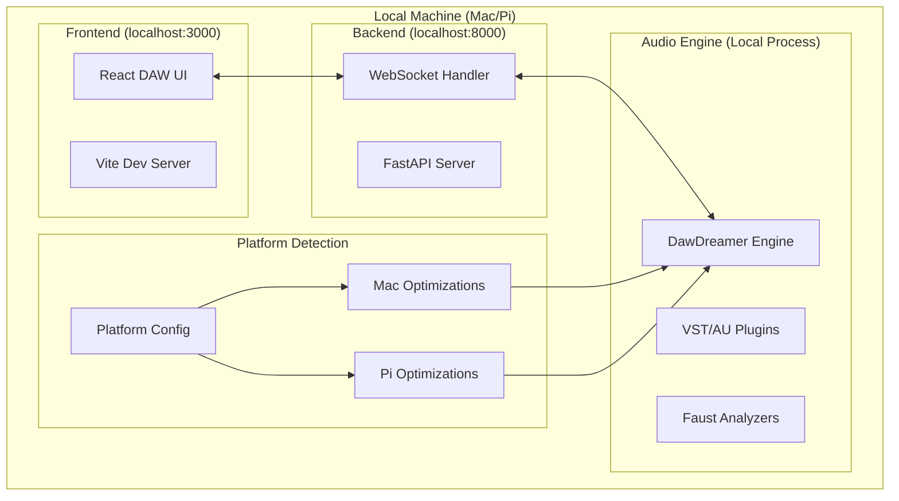
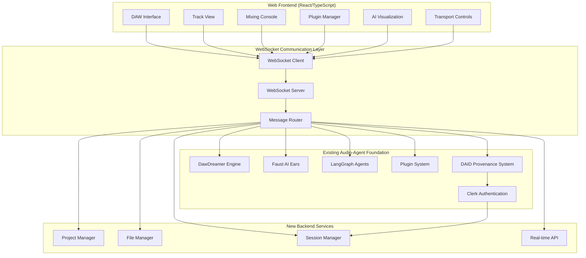
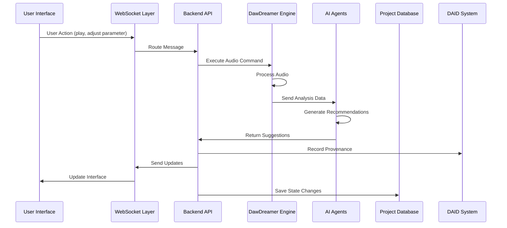

# Design Document

## Overview

The DAW UI Development project transforms the existing audio-agent-transformation foundation into a complete Digital Audio Workstation with a modern web-based interface. This design leverages the established DawDreamer engine, Faust "AI ears", and LangGraph orchestration while adding a comprehensive user interface layer.

The architecture follows a client-server model where the web interface communicates with the Python backend via WebSocket connections, providing real-time control over the audio engine while maintaining the AI-powered mixing capabilities.

## Architecture

### Deployment Architecture

The system supports two primary deployment modes:

1. **Local Development/Production**: Complete system running locally on M-series Mac or Raspberry Pi
2. **Hybrid Cloud**: Frontend served from CDN with local audio processing backend

### Local Deployment Architecture



### High-Level System Architecture



### Component Interaction Flow



## Components and Interfaces

### 1. Web Frontend Architecture

#### Technology Stack

- **React 18** with TypeScript for component-based UI
- **Vite** for fast development and building
- **Tailwind CSS** for responsive styling
- **Web Audio API** for client-side audio visualization
- **WebSocket** for real-time communication
- **Zustand** for state management
- **React Query** for server state synchronization
- **CopilotKit** for unified AI assistant integration with local models

#### Core UI Components

**Main DAW Interface**

```typescript
interface DAWInterface {
  trackView: TrackViewComponent;
  mixingConsole: MixingConsoleComponent;
  transportControls: TransportComponent;
  pluginManager: PluginManagerComponent;
  aiAssistant: AIAssistantComponent;
  projectBrowser: ProjectBrowserComponent;
}

interface TrackViewComponent {
  tracks: Track[];
  timeline: TimelineComponent;
  waveformDisplay: WaveformComponent;
  midiEditor: MidiEditorComponent;
  arrangementView: ArrangementComponent;
}

interface MixingConsoleComponent {
  channelStrips: ChannelStripComponent[];
  masterSection: MasterSectionComponent;
  sendReturns: SendReturnComponent[];
  djMixer?: DJMixerComponent; // Optional DJ-specific interface
}

interface DJMixerComponent {
  crossfader: CrossfaderComponent;
  deckA: DJDeckComponent;
  deckB: DJDeckComponent;
  beatSync: BeatSyncComponent;
  waveformDisplay: DJWaveformComponent;
  cueControls: CueControlsComponent;
}
```

**Real-Time Audio Visualization**

```typescript
interface AudioVisualization {
  spectrumAnalyzer: SpectrumAnalyzerComponent;
  waveformDisplay: WaveformDisplayComponent;
  levelMeters: LevelMeterComponent;
  aiInsights: AIInsightsComponent;
}

interface AIInsightsComponent {
  frequencyAnalysis: FrequencyAnalysisViz;
  dynamicAnalysis: DynamicAnalysisViz;
  mixingSuggestions: MixingSuggestionsPanel;
  explanations: ExplanationPanel;
}
```

#### Responsive Design System

**Breakpoint Strategy**

```typescript
const breakpoints = {
  mobile: '320px',    // Phone portrait
  tablet: '768px',    // Tablet portrait
  desktop: '1024px',  // Desktop
  studio: '1440px',   // Large studio monitors
  ultrawide: '2560px' // Ultra-wide displays
};

interface ResponsiveLayout {
  mobile: MobileDAWLayout;
  tablet: TabletDAWLayout;
  desktop: DesktopDAWLayout;
  studio: StudioDAWLayout;
}
```

### 2. WebSocket Communication Layer

#### Message Protocol Design

```typescript
interface WebSocketMessage {
  id: string;
  type: MessageType;
  timestamp: number;
  userId: string;
  data: MessageData;
}

enum MessageType {
  // Transport Control
  TRANSPORT_PLAY = 'transport.play',
  TRANSPORT_STOP = 'transport.stop',
  TRANSPORT_RECORD = 'transport.record',
  
  // Parameter Control
  PARAMETER_CHANGE = 'parameter.change',
  AUTOMATION_UPDATE = 'automation.update',
  
  // Project Management
  PROJECT_LOAD = 'project.load',
  PROJECT_SAVE = 'project.save',
  
  // AI Integration
  AI_ANALYSIS_REQUEST = 'ai.analysis.request',
  AI_SUGGESTION_RECEIVED = 'ai.suggestion.received',
  
  // Real-time Updates
  AUDIO_LEVEL_UPDATE = 'audio.level.update',
  SPECTRUM_DATA_UPDATE = 'spectrum.data.update',
  
  // DJ-specific
  CROSSFADER_CHANGE = 'dj.crossfader.change',
  BPM_SYNC_REQUEST = 'dj.bpm.sync.request',
  CUE_POINT_SET = 'dj.cue.point.set'
}

interface ParameterChangeMessage extends MessageData {
  trackId: string;
  pluginId?: string;
  parameterId: string;
  value: number;
  automation?: boolean;
}

interface AIAnalysisMessage extends MessageData {
  audioData: Float32Array;
  analysisType: 'spectral' | 'dynamic' | 'harmonic' | 'perceptual';
  contextData: CompositionContext;
}
```

#### WebSocket Server Implementation

```python
from fastapi import FastAPI, WebSocket, WebSocketDisconnect
from typing import Dict, List
import json
import asyncio

class WebSocketManager:
    def __init__(self):
        self.active_connections: Dict[str, WebSocket] = {}
        self.user_sessions: Dict[str, str] = {}
    
    async def connect(self, websocket: WebSocket, user_id: str):
        await websocket.accept()
        self.active_connections[user_id] = websocket
        self.user_sessions[user_id] = user_id
    
    async def disconnect(self, user_id: str):
        if user_id in self.active_connections:
            del self.active_connections[user_id]
            del self.user_sessions[user_id]
    
    async def send_message(self, user_id: str, message: dict):
        if user_id in self.active_connections:
            websocket = self.active_connections[user_id]
            await websocket.send_text(json.dumps(message))
    
    async def broadcast_message(self, message: dict, exclude_user: str = None):
        for user_id, websocket in self.active_connections.items():
            if user_id != exclude_user:
                await websocket.send_text(json.dumps(message))

class MessageRouter:
    def __init__(self, dawdreamer_engine, ai_agents, project_manager):
        self.dawdreamer_engine = dawdreamer_engine
        self.ai_agents = ai_agents
        self.project_manager = project_manager
    
    async def route_message(self, message: dict, user_id: str):
        message_type = message.get('type')
        
        if message_type.startswith('transport.'):
            return await self.handle_transport_message(message, user_id)
        elif message_type.startswith('parameter.'):
            return await self.handle_parameter_message(message, user_id)
        elif message_type.startswith('ai.'):
            return await self.handle_ai_message(message, user_id)
        elif message_type.startswith('project.'):
            return await self.handle_project_message(message, user_id)
        elif message_type.startswith('dj.'):
            return await self.handle_dj_message(message, user_id)
```

### 3. Backend Service Extensions

#### Project Management Service

```python
from pydantic import BaseModel, Field
from typing import List, Dict, Optional
import sqlite3
import json
from datetime import datetime

class ProjectMetadata(BaseModel):
    project_id: str
    name: str
    created_at: datetime
    modified_at: datetime
    user_id: str
    tempo: float
    sample_rate: int
    bit_depth: int
    track_count: int
    plugin_count: int
    file_size_mb: float

class ProjectManager:
    def __init__(self, db_path: str):
        self.db_path = db_path
        self.init_database()
    
    def init_database(self):
        conn = sqlite3.connect(self.db_path)
        conn.execute('''
            CREATE TABLE IF NOT EXISTS projects (
                project_id TEXT PRIMARY KEY,
                name TEXT NOT NULL,
                user_id TEXT NOT NULL,
                metadata TEXT NOT NULL,
                project_data TEXT NOT NULL,
                created_at TIMESTAMP DEFAULT CURRENT_TIMESTAMP,
                modified_at TIMESTAMP DEFAULT CURRENT_TIMESTAMP
            )
        ''')
        conn.commit()
        conn.close()
    
    async def save_project(self, project_data: dict, user_id: str) -> str:
        # Save project with versioning and backup
        pass
    
    async def load_project(self, project_id: str, user_id: str) -> dict:
        # Load project with user authorization
        pass
    
    async def list_user_projects(self, user_id: str) -> List[ProjectMetadata]:
        # List all projects for user
        pass
```

#### File Management Service

```python
class FileManager:
    def __init__(self, storage_path: str):
        self.storage_path = storage_path
        self.supported_formats = ['.wav', '.mp3', '.flac', '.aiff', '.m4a']
    
    async def import_audio_file(self, file_path: str, user_id: str) -> dict:
        # Import and convert audio files
        # Generate waveform data for visualization
        # Extract metadata (BPM, key, etc.)
        pass
    
    async def export_project(self, project_id: str, format: str, quality: str) -> str:
        # Export mixed audio in various formats
        pass
    
    async def generate_waveform_data(self, audio_file: str) -> dict:
        # Generate waveform visualization data
        pass
```

### 4. DJ-Specific Components

#### DJ Mixing Interface

```typescript
interface DJMixerComponent {
  crossfader: {
    position: number; // -1 to 1
    curve: 'linear' | 'logarithmic' | 'exponential';
    reverse: boolean;
  };
  
  deckA: DJDeck;
  deckB: DJDeck;
  
  beatSync: {
    enabled: boolean;
    masterDeck: 'A' | 'B' | 'auto';
    syncMode: 'tempo' | 'beat' | 'bar';
  };
}

interface DJDeck {
  track: AudioTrack;
  waveform: WaveformData;
  playhead: number;
  tempo: {
    bpm: number;
    adjustment: number; // -50% to +50%
    keyLock: boolean;
  };
  cuePoints: CuePoint[];
  loop: {
    enabled: boolean;
    start: number;
    end: number;
    length: number; // in beats
  };
  effects: DJEffect[];
}

interface DJEffect {
  type: 'filter' | 'echo' | 'flanger' | 'reverb' | 'bitcrusher';
  enabled: boolean;
  parameters: Record<string, number>;
  beatSync: boolean;
}
```

#### Beat Detection and Sync

```python
class BeatDetectionService:
    def __init__(self):
        self.tempo_detector = TempoDetector()
        self.beat_tracker = BeatTracker()
    
    async def analyze_track(self, audio_data: np.ndarray, sample_rate: int) -> dict:
        # Detect BPM, beat positions, and musical key
        bpm = self.tempo_detector.detect_tempo(audio_data, sample_rate)
        beats = self.beat_tracker.detect_beats(audio_data, sample_rate, bpm)
        key = self.detect_musical_key(audio_data, sample_rate)
        
        return {
            'bpm': bpm,
            'beats': beats.tolist(),
            'key': key,
            'confidence': self.calculate_confidence(audio_data, bpm, beats)
        }
    
    async def sync_tracks(self, track_a: dict, track_b: dict) -> dict:
        # Calculate sync parameters for beat matching
        pass
```

### 5. AI Integration and Visualization

#### AI Assistant Interface

```typescript
interface AIAssistantComponent {
  analysisPanel: {
    spectralAnalysis: SpectralVisualization;
    dynamicAnalysis: DynamicVisualization;
    harmonicAnalysis: HarmonicVisualization;
    spatialAnalysis: SpatialVisualization;
  };
  
  suggestionsPanel: {
    mixingSuggestions: MixingSuggestion[];
    pluginRecommendations: PluginRecommendation[];
    arrangementSuggestions: ArrangementSuggestion[];
  };
  
  explanationPanel: {
    currentExplanation: string;
    educationalContent: EducationalContent[];
    userLevel: 'beginner' | 'intermediate' | 'advanced';
  };
  
  interactionMode: 'observe' | 'suggest' | 'assist' | 'teach';
}

interface MixingSuggestion {
  id: string;
  type: 'eq' | 'compression' | 'reverb' | 'spatial';
  confidence: number;
  description: string;
  parameters: Record<string, number>;
  reasoning: string;
  alternatives: MixingSuggestion[];
}
```

#### Real-Time Visualization Components

```typescript
class SpectrumAnalyzerComponent extends React.Component {
  private canvasRef: React.RefObject<HTMLCanvasElement>;
  private animationFrame: number;
  
  componentDidMount() {
    this.startVisualization();
  }
  
  startVisualization() {
    const canvas = this.canvasRef.current;
    const ctx = canvas.getContext('2d');
    
    const draw = (spectrumData: Float32Array) => {
      // Draw real-time spectrum analysis
      this.drawSpectrum(ctx, spectrumData);
      this.animationFrame = requestAnimationFrame(() => draw(spectrumData));
    };
    
    // Connect to WebSocket for real-time data
    this.connectToSpectrumData(draw);
  }
}

class WaveformDisplayComponent extends React.Component {
  renderWaveform(audioData: Float32Array, width: number, height: number) {
    // Render high-resolution waveform with zoom and scroll
    // Include beat markers and cue points for DJ mode
    // Show AI-detected features (transients, pitch changes)
  }
}
```

### 6. CopilotKit Integration for Unified AI Experience

#### CopilotKit Architecture Integration

CopilotKit provides a unified AI assistant interface that integrates with the existing LangGraph agents, DAID provenance system, and DAW functionality to create a seamless AI-powered music production experience.

**CopilotKit Integration Architecture**

```typescript
// CopilotKit configuration for DAW integration
import { CopilotKit } from "@copilotkit/react-core";
import { CopilotSidebar } from "@copilotkit/react-ui";

interface DAWCopilotConfig {
  // Local AI model configuration
  runtimeUrl: string; // "http://localhost:8000/copilotkit"
  
  // Custom actions for DAW operations
  actions: DAWCopilotAction[];
  
  // Integration with existing systems
  langGraphIntegration: LangGraphCopilotBridge;
  daidIntegration: DAIDCopilotBridge;
  audioContextIntegration: AudioContextBridge;
}

interface DAWCopilotAction {
  name: string;
  description: string;
  parameters: CopilotActionParameter[];
  handler: (parameters: any) => Promise<any>;
}

// Example DAW-specific CopilotKit actions
const dawCopilotActions: DAWCopilotAction[] = [
  {
    name: "createTrack",
    description: "Create a new audio or MIDI track in the DAW",
    parameters: [
      { name: "trackType", type: "string", enum: ["audio", "midi", "instrument"] },
      { name: "trackName", type: "string" },
      { name: "trackColor", type: "string", optional: true }
    ],
    handler: async ({ trackType, trackName, trackColor }) => {
      const track = await dawService.createTrack({ type: trackType, name: trackName, color: trackColor });
      await daidService.trackProvenance("track_creation", track.id, { trackType, trackName });
      return { success: true, trackId: track.id };
    }
  },
  
  {
    name: "addPlugin",
    description: "Add a plugin to a track with AI-powered recommendations",
    parameters: [
      { name: "trackId", type: "string" },
      { name: "pluginType", type: "string", enum: ["eq", "compressor", "reverb", "delay", "instrument"] },
      { name: "musicStyle", type: "string", optional: true }
    ],
    handler: async ({ trackId, pluginType, musicStyle }) => {
      // Use existing plugin specialist for AI recommendations
      const recommendation = await pluginSpecialist.selectPluginForContext(
        pluginType, 
        await getAudioAnalysis(trackId),
        { style: musicStyle }
      );
      
      const plugin = await dawService.addPlugin(trackId, recommendation.plugin_name);
      await daidService.trackProvenance("plugin_addition", plugin.id, { 
        trackId, 
        pluginName: recommendation.plugin_name,
        aiRecommendation: true,
        reasoning: recommendation.reasoning
      });
      
      return { 
        success: true, 
        pluginId: plugin.id, 
        recommendation: recommendation.reasoning 
      };
    }
  },
  
  {
    name: "analyzeMix",
    description: "Analyze the current mix and provide AI-powered suggestions",
    parameters: [
      { name: "analysisType", type: "string", enum: ["spectral", "dynamic", "spatial", "comprehensive"] }
    ],
    handler: async ({ analysisType }) => {
      const analysis = await faustAnalyzer.analyzeCurrentMix(analysisType);
      const suggestions = await langGraphAgents.generateMixingSuggestions(analysis);
      
      await daidService.trackProvenance("mix_analysis", "current_mix", {
        analysisType,
        analysisResults: analysis,
        aiSuggestions: suggestions
      });
      
      return {
        analysis: analysis,
        suggestions: suggestions.map(s => ({
          type: s.type,
          description: s.description,
          confidence: s.confidence,
          reasoning: s.reasoning
        }))
      };
    }
  },
  
  {
    name: "applySchillingerTransform",
    description: "Apply Schillinger composition techniques to musical material",
    parameters: [
      { name: "entityId", type: "string" },
      { name: "transformType", type: "string", enum: ["rhythm_interference", "pitch_scales", "harmony_progression"] },
      { name: "parameters", type: "object" }
    ],
    handler: async ({ entityId, transformType, parameters }) => {
      const result = await schillingerService.applyTransform(entityId, transformType, parameters);
      
      await daidService.trackProvenance("schillinger_transform", result.id, {
        sourceEntityId: entityId,
        transformType,
        parameters,
        aiAssisted: true
      });
      
      return {
        success: true,
        resultId: result.id,
        transformation: result.description
      };
    }
  },
  
  {
    name: "exploreProvenance",
    description: "Explore the provenance chain of a musical entity",
    parameters: [
      { name: "entityId", type: "string" },
      { name: "entityType", type: "string" }
    ],
    handler: async ({ entityId, entityType }) => {
      const provenanceChain = await daidService.getProvenanceChain(entityType, entityId);
      
      return {
        chainLength: provenanceChain.chain_length,
        summary: provenanceChain.provenance_chain.map(item => ({
          operation: item.operation,
          timestamp: item.created_at,
          depth: item.depth,
          description: `${item.operation} performed at depth ${item.depth}`
        })),
        visualizationUrl: `/provenance/${entityType}/${entityId}`
      };
    }
  }
];
```

**CopilotKit UI Integration**

```typescript
// Main DAW component with CopilotKit integration
function DAWInterface() {
  return (
    <CopilotKit runtimeUrl="http://localhost:8000/copilotkit">
      <div className="daw-interface">
        <DAWHeader />
        <div className="daw-main">
          <TrackView />
          <MixingConsole />
          <PluginManager />
        </div>
        
        {/* CopilotKit sidebar with DAW context */}
        <CopilotSidebar
          instructions="You are an AI assistant for a professional Digital Audio Workstation. You can help with music production, mixing, plugin selection, and creative workflows. You have access to advanced audio analysis, AI mixing agents, and Schillinger composition techniques."
          defaultOpen={false}
          labels={{
            title: "DAW AI Assistant",
            initial: "How can I help with your music production today?"
          }}
        />
      </div>
    </CopilotKit>
  );
}

// Custom CopilotKit hook for DAW context
function useDAWCopilot() {
  const { useCopilotAction, useCopilotReadable } = useCopilotKit();
  
  // Make current DAW state readable to CopilotKit
  useCopilotReadable({
    description: "Current DAW project state",
    value: {
      projectName: useDAWStore(state => state.project.name),
      trackCount: useDAWStore(state => state.tracks.length),
      currentTrack: useDAWStore(state => state.selectedTrack),
      isPlaying: useDAWStore(state => state.transport.isPlaying),
      currentTime: useDAWStore(state => state.transport.currentTime),
      tempo: useDAWStore(state => state.project.tempo),
      key: useDAWStore(state => state.project.key)
    }
  });
  
  // Make audio analysis data readable
  useCopilotReadable({
    description: "Current audio analysis from Faust AI Ears",
    value: useDAWStore(state => state.audioAnalysis)
  });
  
  // Make AI suggestions readable
  useCopilotReadable({
    description: "Current AI mixing suggestions from LangGraph agents",
    value: useDAWStore(state => state.aiSuggestions)
  });
  
  // Register all DAW-specific actions
  dawCopilotActions.forEach(action => {
    useCopilotAction(action);
  });
}
```

**Backend CopilotKit Server Integration**

```python
from fastapi import FastAPI
from copilotkit.integrations.fastapi import add_fastapi_endpoint
from copilotkit import CopilotKitSDK, LangGraphAgent

app = FastAPI()

# Initialize CopilotKit with local AI models
copilot_sdk = CopilotKitSDK(
    agents=[
        LangGraphAgent(
            name="daw_mixing_agent",
            description="AI agent specialized in audio mixing and production",
            agent=existing_langgraph_coordinator  # Use existing LangGraph system
        ),
        LangGraphAgent(
            name="schillinger_composition_agent", 
            description="AI agent for Schillinger composition techniques",
            agent=schillinger_integration_agent
        ),
        LangGraphAgent(
            name="plugin_recommendation_agent",
            description="AI agent for intelligent plugin selection and configuration",
            agent=plugin_specialist_agent
        )
    ]
)

# Add CopilotKit endpoint to existing FastAPI app
add_fastapi_endpoint(app, copilot_sdk, "/copilotkit")

# Custom CopilotKit actions that integrate with existing systems
@copilot_sdk.add_action("analyze_audio_with_faust")
async def analyze_audio_with_faust(audio_data: bytes, analysis_type: str):
    """Analyze audio using Faust AI Ears and return insights."""
    analysis = await faust_analyzer.analyze(audio_data, analysis_type)
    
    # Track with DAID
    daid = await daid_client.create_provenance_record(
        entity_type="audio_analysis",
        entity_id=f"analysis_{uuid.uuid4()}",
        operation="faust_analysis",
        operation_metadata={
            "analysis_type": analysis_type,
            "copilot_initiated": True
        }
    )
    
    return {
        "analysis": analysis,
        "daid": daid,
        "insights": await generate_audio_insights(analysis)
    }

@copilot_sdk.add_action("get_mixing_suggestions")
async def get_mixing_suggestions(track_id: str, context: dict):
    """Get AI mixing suggestions from LangGraph agents."""
    suggestions = await langgraph_coordinator.get_mixing_suggestions(track_id, context)
    
    # Track with DAID
    daid = await daid_client.create_provenance_record(
        entity_type="mixing_suggestions",
        entity_id=f"suggestions_{uuid.uuid4()}",
        operation="ai_mixing_suggestions",
        operation_metadata={
            "track_id": track_id,
            "context": context,
            "copilot_initiated": True
        }
    )
    
    return {
        "suggestions": suggestions,
        "daid": daid,
        "reasoning": [s.reasoning for s in suggestions]
    }
```

**Local AI Model Configuration**

```yaml
# docker-compose.yml for local CopilotKit setup
version: '3.8'
services:
  copilotkit-runtime:
    image: copilotkit/copilotkit:latest
    ports:
      - "8000:8000"
    environment:
      - OPENAI_API_KEY=${LOCAL_AI_API_KEY}  # Use local AI model API
      - COPILOTKIT_RUNTIME_URL=http://localhost:8000
    volumes:
      - ./copilotkit-config:/app/config
    depends_on:
      - local-ai-model
  
  local-ai-model:
    image: ollama/ollama:latest
    ports:
      - "11434:11434"
    volumes:
      - ./ai-models:/root/.ollama
    environment:
      - OLLAMA_MODELS=/root/.ollama
    command: ["ollama", "serve"]
  
  daw-backend:
    build: ./backend
    ports:
      - "8001:8001"
    environment:
      - COPILOTKIT_URL=http://copilotkit-runtime:8000
      - DAID_API_URL=http://localhost:8002
    depends_on:
      - copilotkit-runtime
      - daid-service
```

### 7. DAID Provenance Integration

#### DAID Integration Architecture

The DAW UI integrates with the DAID (Digital Audio Identification and Documentation) system to provide comprehensive provenance tracking for all user interactions, audio processing, and AI operations.

**DAID Integration Points**

```typescript
interface DAIDIntegration {
  // Automatic provenance tracking
  trackUserAction: (action: UserAction) => Promise<string>;
  trackAudioProcessing: (operation: AudioOperation) => Promise<string>;
  trackAIDecision: (decision: AIDecision) => Promise<string>;
  trackProjectChange: (change: ProjectChange) => Promise<string>;
  
  // Provenance visualization
  getProvenanceChain: (entityType: string, entityId: string) => Promise<ProvenanceChain>;
  visualizeProvenance: (chain: ProvenanceChain) => ProvenanceVisualization;
  
  // User control
  setProvenancePreferences: (preferences: ProvenancePreferences) => Promise<void>;
  exportWithProvenance: (projectId: string, includeProvenance: boolean) => Promise<ExportResult>;
}

interface UserAction {
  type: 'parameter_change' | 'track_create' | 'plugin_add' | 'automation_record';
  entityType: string;
  entityId: string;
  parameters: Record<string, any>;
  timestamp: string;
  userId: string;
}

interface AudioOperation {
  type: 'render' | 'process' | 'analyze' | 'export';
  inputDAIDs: string[];
  operation: string;
  parameters: Record<string, any>;
  outputEntityId: string;
}

interface AIDecision {
  agentType: string;
  decision: string;
  confidence: number;
  reasoning: string;
  inputDAIDs: string[];
  outputEntityId: string;
  parameters: Record<string, any>;
}
```

**Real-Time Provenance Tracking**

```typescript
// WebSocket message types for DAID integration
enum DAIDMessageType {
  PROVENANCE_CREATED = 'daid.provenance.created',
  PROVENANCE_CHAIN_UPDATED = 'daid.chain.updated',
  PROVENANCE_VISUALIZATION_REQUEST = 'daid.visualization.request',
  PROVENANCE_EXPORT_REQUEST = 'daid.export.request'
}

interface ProvenanceMessage extends MessageData {
  daid: string;
  entityType: string;
  entityId: string;
  operation: string;
  parentDAIDs: string[];
  metadata: Record<string, any>;
}

// Automatic provenance tracking middleware
class DAIDTrackingMiddleware {
  async trackWebSocketMessage(message: WebSocketMessage): Promise<void> {
    if (this.shouldTrackMessage(message)) {
      const daid = await this.daidClient.createProvenanceRecord({
        entityType: this.extractEntityType(message),
        entityId: this.extractEntityId(message),
        operation: message.type,
        operationMetadata: {
          messageData: message.data,
          timestamp: message.timestamp,
          userId: message.userId
        }
      });
      
      // Broadcast provenance update to UI
      await this.broadcastProvenanceUpdate(daid, message.userId);
    }
  }
}
```

**UI Components for Provenance**

```typescript
interface ProvenanceVisualizationComponent {
  // Timeline view of provenance chain
  timelineView: ProvenanceTimelineComponent;
  
  // Graph view of entity relationships
  graphView: ProvenanceGraphComponent;
  
  // Detailed provenance inspector
  inspector: ProvenanceInspectorComponent;
  
  // User controls
  controls: ProvenanceControlsComponent;
}

interface ProvenanceTimelineComponent {
  // Visual timeline showing creation and transformation events
  renderTimeline: (chain: ProvenanceChain) => JSX.Element;
  
  // Interactive timeline with zoom and filtering
  interactiveTimeline: ProvenanceInteractiveTimeline;
  
  // Export timeline as image or data
  exportTimeline: (format: 'png' | 'svg' | 'json') => Promise<Blob>;
}

interface ProvenanceControlsComponent {
  // Privacy controls
  privacySettings: ProvenancePrivacyControls;
  
  // Export controls
  exportControls: ProvenanceExportControls;
  
  // Sharing controls
  sharingControls: ProvenanceSharingControls;
}
```

### 7. Performance Optimization

#### Client-Side Optimization

```typescript
// Virtual scrolling for large track lists
class VirtualizedTrackList extends React.Component {
  renderVisibleTracks() {
    // Only render tracks visible in viewport
    // Maintain smooth scrolling performance
  }
}

// Web Worker for audio processing
class AudioWorker {
  constructor() {
    this.worker = new Worker('/audio-worker.js');
  }
  
  processAudioData(audioData: Float32Array) {
    // Offload heavy audio processing to Web Worker
    // Generate waveform data, spectrum analysis
  }
}

// Efficient state management
interface DAWState {
  tracks: Track[];
  mixerState: MixerState;
  transportState: TransportState;
  aiState: AIState;
  projectState: ProjectState;
}

// Use Zustand for optimized state updates
const useDAWStore = create<DAWState>((set, get) => ({
  // Optimized state management with selective updates
}));
```

#### Server-Side Optimization

```python
class PerformanceOptimizer:
    def __init__(self):
        self.audio_buffer_pool = AudioBufferPool()
        self.parameter_cache = ParameterCache()
        self.analysis_cache = AnalysisCache()
    
    async def optimize_audio_processing(self, audio_data: np.ndarray):
        # Use buffer pooling to reduce memory allocation
        # Cache analysis results to avoid recomputation
        # Implement intelligent load balancing
        pass
    
    async def batch_parameter_updates(self, updates: List[ParameterUpdate]):
        # Batch multiple parameter changes for efficiency
        # Reduce WebSocket message overhead
        pass
```

## Data Models

### Extended Project Models

```python
class DAWProject(BaseModel):
    model_config = ConfigDict(strict=True)
    
    project_id: str
    name: str
    user_id: str
    created_at: datetime
    modified_at: datetime
    
    # Audio settings
    sample_rate: int = Field(default=44100, ge=22050, le=192000)
    bit_depth: int = Field(default=24, ge=16, le=32)
    buffer_size: int = Field(default=512, ge=64, le=4096)
    
    # Project structure
    tracks: List[Track]
    mixer_state: MixerState
    transport_state: TransportState
    
    # AI integration
    ai_preferences: AIPreferences
    analysis_history: List[AnalysisResult]
    
    # DAID provenance
    project_daid: str
    provenance_preferences: ProvenancePreferences
    
    # DJ-specific (optional)
    dj_settings: Optional[DJSettings] = None

class Track(BaseModel):
    model_config = ConfigDict(strict=True)
    
    track_id: str
    name: str
    track_type: Literal['audio', 'midi', 'instrument', 'bus']
    color: str
    
    # Audio properties
    audio_regions: List[AudioRegion]
    midi_regions: List[MidiRegion]
    
    # Mixing properties
    volume: float = Field(default=0.0, ge=-60.0, le=12.0)
    pan: float = Field(default=0.0, ge=-1.0, le=1.0)
    mute: bool = False
    solo: bool = False
    
    # Plugin chain
    plugin_chain: List[PluginInstance]
    
    # Automation
    automation_data: Dict[str, AutomationCurve]

class DJSettings(BaseModel):
    model_config = ConfigDict(strict=True)
    
    crossfader_curve: Literal['linear', 'logarithmic', 'exponential'] = 'logarithmic'
    crossfader_reverse: bool = False
    beat_sync_enabled: bool = True
    key_lock_enabled: bool = True
    cue_volume: float = Field(default=-6.0, ge=-60.0, le=0.0)
    
    deck_a_settings: DJDeckSettings
    deck_b_settings: DJDeckSettings

class ProvenancePreferences(BaseModel):
    model_config = ConfigDict(strict=True)
    
    # Tracking preferences
    track_user_actions: bool = True
    track_ai_decisions: bool = True
    track_audio_processing: bool = True
    track_parameter_changes: bool = True
    
    # Privacy preferences
    share_provenance_by_default: bool = False
    anonymize_user_actions: bool = False
    include_detailed_metadata: bool = True
    
    # Visualization preferences
    default_visualization: Literal['timeline', 'graph', 'list'] = 'timeline'
    show_technical_details: bool = False
    group_related_operations: bool = True
    
    # Export preferences
    include_provenance_in_exports: bool = True
    provenance_export_format: Literal['full', 'summary', 'minimal'] = 'summary'

class TrackWithProvenance(Track):
    model_config = ConfigDict(strict=True)
    
    # DAID provenance tracking
    track_daid: str
    creation_daid: str
    modification_daids: List[str] = Field(default_factory=list)
    
    # Provenance metadata
    provenance_chain_length: int = 0
    last_provenance_update: datetime
    
    # Source tracking
    source_file_daid: Optional[str] = None
    ai_generated: bool = False
    ai_model_daid: Optional[str] = None

class DJDeckSettings(BaseModel):
    model_config = ConfigDict(strict=True)
    
    tempo_range: float = Field(default=8.0, ge=4.0, le=50.0)  # +/- percentage
    pitch_bend_range: float = Field(default=4.0, ge=1.0, le=16.0)  # +/- percentage
    loop_roll_enabled: bool = True
    hot_cues: List[CuePoint] = Field(default_factory=list, max_length=8)
```

## Testing Strategy

### Frontend Testing

```typescript
// Component testing with React Testing Library
describe('MixingConsoleComponent', () => {
  test('renders channel strips correctly', () => {
    // Test component rendering and interaction
  });
  
  test('handles parameter changes', () => {
    // Test WebSocket communication
  });
});

// Integration testing with Cypress
describe('DAW Workflow', () => {
  test('complete mixing workflow', () => {
    // Test end-to-end user workflows
  });
});
```

### Backend Testing

```python
class TestWebSocketCommunication:
    async def test_parameter_updates(self):
        # Test real-time parameter synchronization
        pass
    
    async def test_ai_integration(self):
        # Test AI suggestion delivery
        pass

class TestDJFunctionality:
    async def test_beat_sync(self):
        # Test beat detection and synchronization
        pass
    
    async def test_crossfader_control(self):
        # Test crossfader parameter handling
        pass
```

## Deployment Architecture

### Development Environment

```yaml
# docker-compose.yml
version: '3.8'
services:
  frontend:
    build: ./frontend
    ports:
      - "3000:3000"
    volumes:
      - ./frontend:/app
    environment:
      - VITE_API_URL=http://localhost:8000
      - VITE_WS_URL=ws://localhost:8000/ws
  
  backend:
    build: ./backend
    ports:
      - "8000:8000"
    volumes:
      - ./backend:/app
      - ./audio_files:/app/audio_files
    environment:
      - DATABASE_URL=sqlite:///./daw.db
      - CLERK_SECRET_KEY=${CLERK_SECRET_KEY}
```

### Production Deployment

```yaml
# Production considerations
- CDN for static assets and audio files
- WebSocket load balancing with sticky sessions
- Redis for session management and caching
- Horizontal scaling for audio processing workers
- Monitoring with Prometheus and Grafana
```

This design provides a comprehensive foundation for building a full-featured DAW with modern web technologies while leveraging your existing audio-agent-transformation infrastructure. The architecture supports both traditional DAW workflows and DJ-specific functionality, with seamless AI integration throughout.
