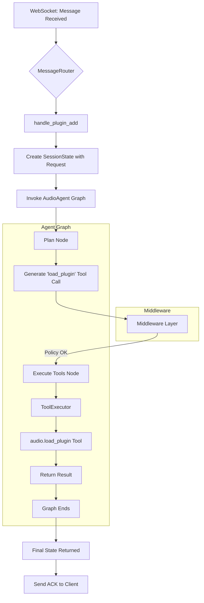

# Agent Runtime Architecture

This document outlines the architecture of the LangGraph-based agent runtime system, which powers both the Schillinger composition agent and the real-time audio agent.

## 1. Overview

The new architecture replaces the monolithic WebSocket message router with a flexible, modular, and observable system based on LangChain's LangGraph library. This allows for complex, stateful, and long-running interactions to be defined as graphs of nodes and edges.

Key benefits of this approach include:
- **Modularity:** Logic is broken down into self-contained nodes (planning, tool execution) and reusable components (tools, middleware).
- **State Management:** The `SessionState` provides a consistent, centralized state that is passed through the graph, making it easy to track the session's context.
- **Observability:** Integration with LangSmith provides detailed tracing of every step in the graph, making debugging and analysis significantly easier.
- **Safety and Control:** A powerful middleware layer allows for cross-cutting concerns like policy enforcement, human-in-the-loop (HITL) approvals, and caching to be applied cleanly.

## 2. Core Components

### 2.1. SessionState

Defined in `src/audio_agent/schemas/state.py`, the `SessionState` is a Pydantic model that represents the complete state of an agent session. It includes:
- Session and user identifiers (`session_id`, `user_id`, `org_id`).
- The user's `request`.
- A log of `tool_calls` and `tool_results`.
- A `context` dictionary for arbitrary data.
- A list of generated `artifacts`.

### 2.2. Agents (Graphs)

Each agent is a `StateGraph` compiled into a runnable application. The state of the graph is an instance of `SessionState`.

- **`SchillingerAgent` (`graph_schillinger.py`):** Responsible for music composition tasks based on the Schillinger System. Its graph is a linear flow: Plan -> Generate Motifs -> Evaluate Harmony -> Arrange Sections -> Export.

- **`AudioAgent` (`graph_audio_agent.py`):** Responsible for real-time DAW control. Its graph is a loop: Plan -> Execute Tools -> (Conditional) End or loop back to Plan. This allows it to handle multiple user interactions in a single session.

### 2.3. Tools

Tools are the basic building blocks that agents can execute. They are standard Python functions decorated with LangChain's `@tool` decorator.

- **Schillinger Tools (`tools/schillinger/`):** Functions for music generation, such as `generate_motif` and `evaluate_harmony`.
- **Audio Tools (`tools/audio/`):** Wrappers around `DawDreamerEngine` operations, such as `load_plugin` and `render_audio`. These are the only components that should directly interact with the audio engine.

### 2.4. Middleware (Callbacks)

Middleware is implemented as LangChain `BaseCallbackHandler` classes. This allows us to intercept events within the agent's lifecycle (e.g., on_tool_start).

- **`SummarizeMiddleware`:** Manages the token window of the context passed to an LLM by summarizing the history when it grows too large.
- **`PolicyMiddleware`:** Enforces operational safety. For example, it prevents more than a certain number of plugins from being loaded.
- **`HITLMiddleware`:** Pauses the agent for "critical" tool calls and waits for external approval via the `/api/approvals` endpoint before proceeding.

## 3. Request Flow Diagram

This diagram shows the flow of a request to add a plugin, which was decommissioned from the old `MessageRouter`.

