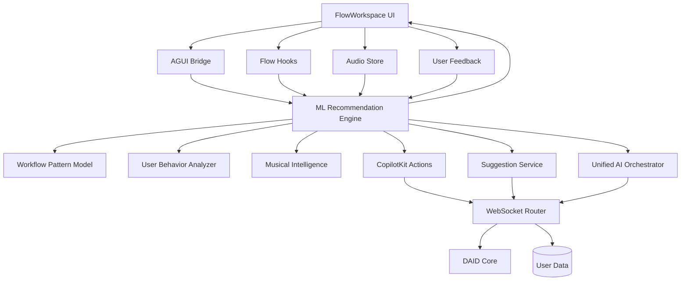

# ML Integration Flow Diagram

## 🔄 High-Level Integration Flow



## 🎯 Strategic Integration Points

### 1. **Primary Integration Hub**: ML Recommendation Engine
**Why**: Centralizes all ML capabilities and provides unified interface
**Impact**: Affects all AI features, creates consistency
**Effort**: Medium (core infrastructure)

### 2. **High-Impact Integration**: AGUI Bridge Enhancement
**Why**: Directly connects to user actions and existing AI events
**Impact**: Immediately improves user experience with intelligent suggestions
**Effort**: Low-Medium (enhancement of existing component)

### 3. **User-Centric Integration**: Behavior Analysis Layer
**Why**: Creates personalized experience and learning system
**Impact**: Long-term user engagement and retention
**Effort**: Medium (new data collection and analysis)

### 4. **Domain-Specific Integration**: Musical Intelligence
**Why**: Adds unique value in music production domain
**Impact**: Differentiates from generic AI assistants
**Effort**: High (domain expertise required)

## 🔗 Component Integration Matrix

| Component | Current State | ML Enhancement | Priority | Integration Effort |
|-----------|--------------|---------------|----------|-------------------|
| **AGUI Bridge** | Event processing | Pattern-aware events | HIGH | Low |
| **FlowWorkspace** | Basic UI | Smart suggestions | HIGH | Medium |
| **CopilotKit** | Rule-based actions | ML-powered actions | HIGH | Medium |
| **Suggestion Service** | Basic recs | Personalized ML recs | HIGH | Medium |
| **User Store** | Basic state | Behavior tracking | MEDIUM | Low |
| **Audio Engine** | Parameter control | ML optimization | MEDIUM | High |
| **Collaboration** | Basic multi-user | Intelligent collaboration | LOW | High |
| **DAID Core** | Provenance | ML-enhanced provenance | LOW | Low |

## 🚀 Implementation Sequence (Recommended)

### Phase 1: Foundation (Week 1)
**Goal**: Establish ML infrastructure and core integration

```
1. ML Recommendation Engine Setup
   └── TensorFlow.js models
   └── React hooks
   └── Basic prediction service

2. AGUI Bridge Enhancement
   └── ML event enrichment
   └── Pattern-aware processing
   └── Intelligent CopilotKit mapping

3. Basic Flow Integration
   └── Node suggestions
   └── Connection predictions
   └── Parameter optimization
```

### Phase 2: Intelligence (Week 2)
**Goal**: Add learning and personalization capabilities

```
1. User Behavior Analysis
   └── Action tracking
   └── Profile building
   └── Preference learning

2. Enhanced CopilotKit Integration
   └── ML-powered actions
   └── Contextual responses
   └── Personalized assistance

3. Workflow Pattern Recognition
   └── Pattern detection
   └── Completion suggestions
   └── Efficiency optimization
```

### Phase 3: Domain Expertise (Week 3)
**Goal**: Add musical intelligence and creative assistance

```
1. Musical Intelligence System
   └── Style recognition
   └── Harmony generation
   └── Rhythm patterns

2. Creative Assistance
   └── Melodic suggestions
   └── Arrangement ideas
   └── Instrumentation optimization

3. Schillinger Integration
   └── Systematic composition
   └── Pattern generation
   └── Structural analysis
```

### Phase 4: Advanced Features (Week 4)
**Goal**: Optimize performance and add advanced capabilities

```
1. Real-time Learning
   └── Online model updates
   └── Feedback incorporation
   └── Adaptive recommendations

2. Performance Optimization
   └── Model caching
   └── Lazy loading
   └── Batch processing

3. Advanced Analytics
   └── Usage patterns
   └── Success metrics
   └── A/B testing framework
```

## 🎛️ Configuration Strategy

### Environment-Based Features
```typescript
const MLConfig = {
  development: {
    enableAllFeatures: true,
    debugMode: true,
    mockData: false,
    performanceMonitoring: true
  },

  staging: {
    enableAllFeatures: true,
    debugMode: false,
    mockData: false,
    performanceMonitoring: true
  },

  production: {
    enableWorkflowPatterns: true,
    enableUserBehaviorAnalysis: true,
    enableMusicalIntelligence: false, // Roll out later
    enableRealTimePrediction: true,
    debugMode: false,
    performanceMonitoring: true
  }
};
```

### Feature Flags
```typescript
interface MLFeatureFlags {
  workflowPatterns: boolean;
  userBehaviorAnalysis: boolean;
  musicalIntelligence: boolean;
  realTimePrediction: boolean;
  collaborationML: boolean;
  performanceOptimization: boolean;
}
```

## 📊 Success Metrics Dashboard

### Technical Metrics
- **Model Accuracy**: Pattern recognition >85%
- **Prediction Latency**: Real-time <100ms
- **User Engagement**: Suggestion acceptance >60%
- **Learning Rate**: Model improvement over time

### User Experience Metrics
- **Workflow Efficiency**: Time reduction >30%
- **Skill Progression**: Measurable improvement
- **Creative Exploration**: New techniques tried
- **Collaboration Efficiency**: Multi-user optimization

### Business Metrics
- **User Retention**: Improved engagement
- **Feature Adoption**: ML feature usage
- **Performance**: System responsiveness
- **Satisfaction**: User feedback scores

## 🔧 Technical Considerations

### Performance Optimization
1. **Model Caching**: Cache ML model predictions
2. **Lazy Loading**: Load models on-demand
3. **Batch Processing**: Group similar predictions
4. **Web Workers**: Offload heavy computations

### Error Handling
1. **Graceful Degradation**: Fall back to rule-based
2. **User Control**: Allow ML feature disabling
3. **Clear Feedback**: Explain why suggestions fail
4. **Recovery**: Automatic retry mechanisms

### Privacy & Security
1. **Local Processing**: Keep data client-side when possible
2. **Encrypted Storage**: Protect user preference data
3. **Opt-in Consent**: Clear permission for ML features
4. **Data Cleanup**: Regular removal of old data

This integration flow ensures we're building a cohesive, intelligent system that enhances every aspect of the audio production workflow while maintaining performance and user control.