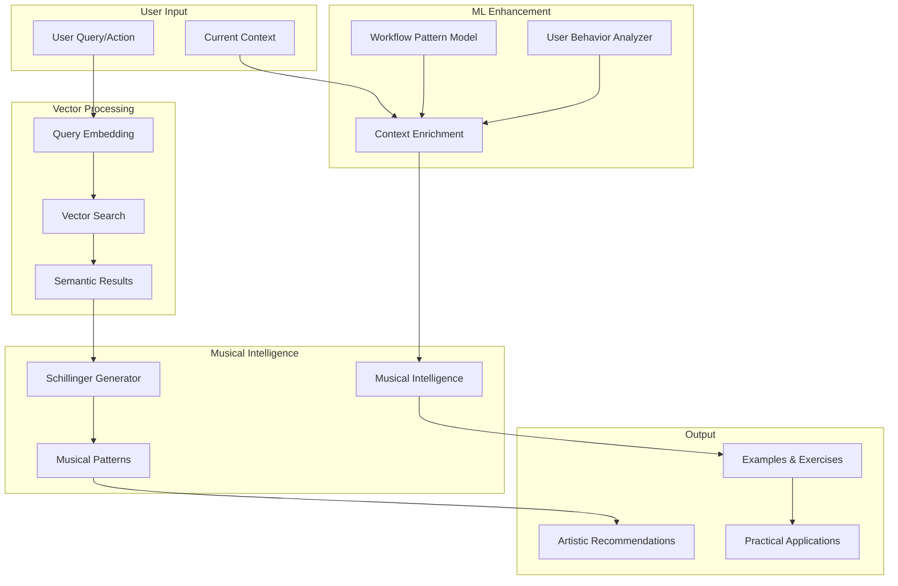

# Schillinger Vector Database Integration Strategy

## 🎯 Game-Changing Opportunity

Having a vector database of Schillinger books means we can move from **rule-based pattern generation** to **semantic similarity-based musical intelligence**. This is a massive upgrade!

## 📚 Current Schillinger Integration vs. Vector DB Enhancement

### Current Approach (Limited)
```typescript
// Hard-coded patterns
const schillingerPatterns = [
  { name: 'Resultant Rhythm', pattern: [1, 0, 0.5, 0, 1, 0, 0.5, 0] },
  { name: 'Pitch Scales', intervals: [0, 2, 4, 5, 7, 9, 11] }
];
```

### Vector DB Approach (Revolutionary)
```typescript
// Semantic search through entire Schillinger system
const findSimilarConcepts = await vectorDB.search({
  query: "how to create polyrhythms with 3 against 4",
  k: 5,
  filter: { source: "schillinger_books", type: "rhythm_theory" }
});

// Results: Exact page references, examples, exercises with context
```

## 🚀 Enhanced Musical Intelligence Architecture

### 1. Schillinger Vector Integration
```
┌─────────────────────────────────────────────────────────────────┐
│                  SCHILLINGER VECTOR SYSTEM                        │
├─────────────────────────────────────────────────────────────────┤
│  Vector Database (Pinecone/Weaviate/Chroma)                     │
│  ├─ Book 1: Theory of Rhythm (vectorized concepts)              │
│  ├─ Book 2: Theory of Pitch Scales                              │
│  ├─ Book 3: Variations of Music                                  │
│  ├─ Book 4: Theory of Harmony                                    │
│  ├─ Book 5: Theory of Counterpoint                               │
│  ├─ Book 6: Theory of Orchestration                              │
│  ├─ Book 7: Theory of Melody                                     │
│  ├─ Book 8: Theory of Instrumentation                            │
│  ├─ Book 9: Theory of Canon                                     │
│  ├─ Book 10: Theory of Fugue                                    │
│  ├─ Book 11: Theory of Instrumentation                          │
│  └─ Book 12: Theory of Form                                     │
│                                                                 │
│  Semantic Search Layer                                           │
│  ├─ Natural language queries → vector embeddings                │
│  ├─ Similarity search across all concepts                        │
│  ├─ Context-aware result filtering                              │
│  └─ Cross-reference discovery                                   │
└─────────────────────────────────────────────────────────────────┘
```

### 2. Enhanced ML Integration Flow


## 🧠 Enhanced Musical Intelligence Capabilities

### 1. Semantic Schillinger Query System
```typescript
interface SchillingerQuery {
  naturalLanguage: string;
  context: {
    currentChords?: string[];
    style?: string;
    instruments?: string[];
    skillLevel?: string;
    goal?: string;
  };
  filters?: {
    books?: number[]; // 1-12 for specific Schillinger books
    types?: string[]; // 'rhythm', 'harmony', 'melody', 'form'
    complexity?: string[]; // 'beginner', 'intermediate', 'advanced'
  };
}

interface SchillingerResult {
  concept: string;
  book: number;
  chapter: string;
  page: number;
  explanation: string;
  musicalExamples: Array<{
    notation: string;
    audio?: string;
    midi?: number[];
  }>;
  exercises: Array<{
    description: string;
    steps: string[];
    difficulty: string;
  }>;
  relatedConcepts: Array<{
    concept: string;
    similarity: number;
    book: number;
  }>;
  applicationSuggestions: Array<{
    type: string;
    description: string;
    implementation: string;
  }>;
}
```

### 2. Context-Aware Schillinger Applications
```typescript
class SchillingerIntelligence {
  async querySystem(query: SchillingerQuery): Promise<SchillingerResult[]> {
    // 1. Convert natural language to semantic query
    const embedding = await this.generateQueryEmbedding(query.naturalLanguage);

    // 2. Search vector database with context awareness
    const results = await this.vectorDB.search({
      vector: embedding,
      k: 10,
      filter: {
        books: query.filters?.books,
        types: query.filters?.types,
        complexity: query.filters?.complexity
      }
    });

    // 3. Rank results by relevance to user context
    const rankedResults = await this.rankByContext(results, query.context);

    // 4. Enrich with practical applications
    return this.addApplications(rankedResults, query.context);
  }

  async generateFromConcept(
    concept: string,
    context: {
      key?: string;
      tempo?: number;
      style?: string;
      instruments?: string[];
    }
  ): Promise<{
    pattern: number[];
    explanation: string;
    variations: number[][];
    exercises: string[];
  }> {
    // Generate actual musical output from Schillinger concepts
  }
}
```

### 3. Enhanced Musical Features
```typescript
interface EnhancedMusicalFeatures extends MusicalFeatures {
  schillingerAnalysis?: {
    detectedConcepts: Array<{
      concept: string;
      book: number;
      confidence: number;
      application: string;
    }>;
    rhythmicTechniques: string[];
    harmonicTechniques: string[];
    melodicTechniques: string[];
    formTechniques: string[];
  };
  semanticSimilarity?: {
    toUserGoal: number;
    toCurrentStyle: number;
    toSkillLevel: number;
  };
}
```

## 🔧 Implementation Strategy

### Phase 1: Vector Database Integration (Week 1)
```typescript
// 1. Set up vector database connection
const vectorDB = new PineconeClient({
  apiKey: process.env.PINECONE_API_KEY,
  environment: process.env.PINECONE_ENVIRONMENT
});

// 2. Create embedding service
const embeddingService = new OpenAIEmbeddings({
  model: "text-embedding-3-large"
});

// 3. Implement semantic search
async function searchSchillinger(query: string, context: any) {
  const embedding = await embeddingService.embedQuery(query);
  const results = await vectorDB.search({
    vector: embedding,
    topK: 10,
    includeMetadata: true
  });
  return results;
}
```

### Phase 2: Schillinger Intelligence Layer (Week 2)
```typescript
class SchillingerIntelligenceService {
  async suggestRhythmicPattern(
    userContext: {
      currentRhythm: number[];
      style: string;
      complexity: 'simple' | 'moderate' | 'complex';
    }
  ): Promise<SchillingerResult[]> {
    const query = `Generate rhythmic patterns using Schillinger theory appropriate for ${userContext.style} music at ${userContext.complexity} complexity level`;

    return await this.querySchillingerSystem({
      naturalLanguage: query,
      context: userContext,
      filters: { types: ['rhythm'], books: [1, 3] }
    });
  }

  async suggestHarmonicProgression(
    context: {
      key: string;
      currentChord: string;
      style: string;
      nextFunction: string;
    }
  ): Promise<SchillingerResult[]> {
    const query = `Schillinger harmonic theory for ${context.nextFunction} in ${context.key}, transitioning from ${context.currentChord} in ${context.style} style`;

    return await this.querySchillingerSystem({
      naturalLanguage: query,
      context: context,
      filters: { types: ['harmony'], books: [4, 5] }
    });
  }
}
```

### Phase 3: Integration with ML Engine (Week 3)
```typescript
// Enhanced Musical Intelligence with Schillinger Vectors
class EnhancedMusicalIntelligence extends MusicalIntelligence {
  private schillingerService: SchillingerIntelligenceService;

  async generateMusicalRecommendations(
    features: EnhancedMusicalFeatures,
    context: {
      nodes: FlowNode[];
      edges: FlowEdge[];
      userGoal?: string;
      skillLevel?: string;
    }
  ): Promise<MLPrediction[]> {
    const recommendations: MLPrediction[] = [];

    // 1. Schillinger-based rhythmic suggestions
    if (context.nodes.some(n => n.type === 'rhythm')) {
      const rhythmRecs = await this.schillingerService.suggestRhythmicPattern({
        currentRhythm: features.melodicContour,
        style: this.inferStyleFromFeatures(features),
        complexity: this.mapSkillToComplexity(context.skillLevel || 'beginner')
      });

      rhythmRecs.forEach(rec => {
        recommendations.push({
          id: this.generatePredictionId(),
          type: 'musical_suggestion',
          title: `Schillinger Rhythm: ${rec.concept}`,
          description: rec.explanation,
          confidence: this.calculateConfidence(rec, context),
          reasoning: `Based on Schillinger Book ${rec.book}, Chapter ${rec.chapter}`,
          priority: 'high',
          estimatedImpact: 'significant',
          data: rec,
          actionItems: [
            {
              type: 'apply_rhythm_pattern',
              target: 'rhythm_node',
              parameters: rec.musicalExamples[0]
            }
          ],
          metadata: {
            modelUsed: 'schillinger-vector-search',
            timestamp: Date.now(),
            musicalContext: features,
            schillingerSource: {
              book: rec.book,
              chapter: rec.chapter,
              page: rec.page
            }
          }
        });
      });
    }

    // 2. Schillinger-based harmonic suggestions
    if (context.nodes.some(n => n.type === 'harmony')) {
      const harmonyRecs = await this.schillingerService.suggestHarmonicProgression({
        key: features.key,
        currentChord: features.chordProgression[features.chordProgression.length - 1],
        style: this.inferStyleFromFeatures(features),
        nextFunction: this.inferNextHarmonicFunction(features)
      });

      harmonyRecs.forEach(rec => {
        recommendations.push({
          id: this.generatePredictionId(),
          type: 'musical_suggestion',
          title: `Schillinger Harmony: ${rec.concept}`,
          description: rec.explanation,
          confidence: this.calculateConfidence(rec, context),
          reasoning: `From Schillinger harmonic theory in Book ${rec.book}`,
          priority: 'high',
          estimatedImpact: 'transformative',
          data: rec,
          actionItems: [
            {
              type: 'apply_harmony',
              target: 'harmony_node',
              parameters: rec.musicalExamples[0]
            }
          ],
          metadata: {
            modelUsed: 'schillinger-vector-search',
            timestamp: Date.now(),
            musicalContext: features,
            schillingerSource: {
              book: rec.book,
              chapter: rec.chapter,
              page: rec.page
            }
          }
        });
      });
    }

    return recommendations;
  }
}
```

## 🎯 Revolutionary Capabilities Enabled

### 1. Natural Language Schillinger Queries
```typescript
// Instead of hard-coded patterns, users can ask:
"I want to create a polyrhythm that combines 3/4 and 4/4 using Schillinger techniques"
"How would Schillinger approach creating a melody in Phrygian mode?"
"What Schillinger exercises would help me improve my counterpoint?"
```

### 2. Context-Aware Schillinger Applications
```typescript
// System automatically applies Schillinger concepts based on context
const userContext = {
  currentNodes: ['piano', 'drums'],
  style: 'jazz',
  skillLevel: 'intermediate',
  goal: 'create walking bassline'
};

// System finds: Schillinger Book 1, Chapter 8 - "Walking Bass Patterns"
// Provides: Specific examples, exercises, and variations
```

### 3. Cross-Reference Discovery
```typescript
// Find relationships between different Schillinger concepts
const relatedConcepts = await vectorDB.search({
  query: "relationship between rhythmic resultants and harmonic variations",
  filter: { books: [1, 3] }
});
// Returns: Connections across Book 1 (Rhythm) and Book 3 (Variations)
```

### 4. Personalized Learning Paths
```typescript
// Create personalized Schillinger study programs based on user's current work
const learningPath = await generateSchillingerPath({
  currentWork: user.currentWorkflow,
  skillLevel: user.skillLevel,
  goals: user.musicalGoals,
  interests: user.preferredStyles
});
```

## 📊 Enhanced Success Metrics

### Technical Metrics
- **Semantic Search Accuracy**: >90% relevant results
- **Query Response Time**: <200ms for semantic search
- **Concept Application Success**: >80% successful musical applications
- **Cross-Reference Discovery**: >70% relevant concept connections

### User Experience Metrics
- **Natural Language Queries**: Users can ask questions in plain English
- **Musical Quality**: Generated patterns are musically coherent and useful
- **Learning Effectiveness**: Measurable improvement in musical knowledge
- **Creative Inspiration**: Users report increased creativity and ideas

### Musical Intelligence Metrics
- **Schillinger Coverage**: All 12 books searchable and applicable
- **Style Adaptation**: Schillinger concepts adapted to user's preferred style
- **Skill Appropriateness**: Recommendations match user's skill level
- **Practical Application**: Generated examples are immediately usable

## 🚀 Competitive Advantage

With the Schillinger vector database, we're not just another DAW with AI suggestions - we're becoming **the most musically intelligent audio production system** that:

1. **Deep Musical Knowledge**: Access to entire Schillinger System
2. **Semantic Understanding**: Natural language interface to musical theory
3. **Contextual Application**: Theory applied to user's specific needs
4. **Learning Integration**: Users learn composition techniques naturally
5. **Creative Inspiration**: Endless combinations of Schillinger concepts

This transforms our system from a "smart tool" into a "musical intelligence partner" that genuinely helps users become better musicians and composers.