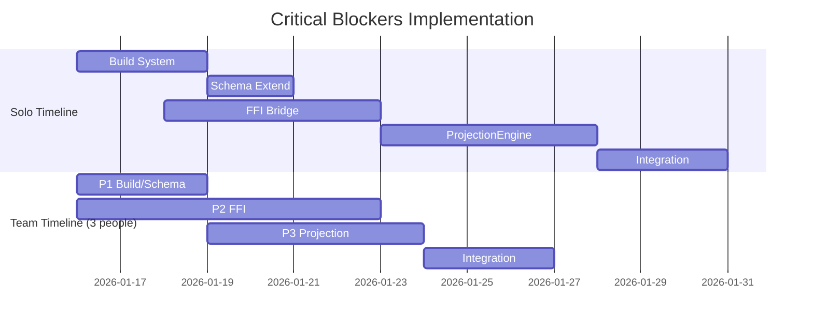

# Critical Blockers - Executive Summary

**Status:** READY FOR EXECUTION
**Timeline:** 3-6 weeks (solo vs team)
**Created:** 2026-01-15

---

## Quick Reference

### The 5 Critical Blockers

| # | Blocker | Impact | Effort | BD Issue |
|---|---------|--------|--------|----------|
| 1 | TypeScript Build System | BLOCKS ALL development | 2-3 days | NEW |
| 2 | SongState Schema Extension | BLOCKS Performance feature | 1-2 days | white_room-304 |
| 3 | FFI Bridge Implementation | BLOCKS real-time audio | 5-7 days | white_room-308 |
| 4 | ProjectionEngine Implementation | BLOCKS Schillinger Books | 3-5 days | white_room-225 |
| 5 | TypeScript Strict Mode | BLOCKS type safety | 1 day | NEW |

**Total Critical Path:** 12-18 days (2.5-3.5 weeks)

### What Gets Unblocked

Once these 5 are resolved, 7 major feature streams can proceed:

- **Book I - Rhythm** (4-5 days)
- **Book II - Melody** (4-5 days)
- **Book III - Harmony** (3-4 days)
- **Book IV - Form** (2-3 days)
- **iPhone Companion App** (10 weeks)
- **DSP UI Foundation** (24 weeks)
- **Siri Integration** (2-3 weeks)

---

## Timeline At A Glance

### Solo Developer (Sequential)
```
Week 1:  Build + Schema (3d) + FFI start (2d)
Week 2:  FFI complete (3d) + ProjectionEngine start (2d)
Week 3:  ProjectionEngine complete (3d) + Integration (2d)
Week 4:  Testing + Polish
Total:   4 weeks
```

### 3-Person Team (Parallel)
```
Week 1:  P1=Build+Schema | P2=FFI (start)
Week 2:  P2=FFI (complete) | P3=ProjectionEngine
Week 3:  All=Integration+Testing
Total:   3 weeks
```

---

## Critical Path Visualization



---

## Risk Heatmap

### 🔴 HIGH RISK (Requires Attention)
- **FFI Bridge Thread Safety** - Real-time audio crashes are unacceptable
- **ProjectionEngine Performance** - Must render in < 10ms
- **Build System Stability** - Foundation for all work

### 🟡 MEDIUM RISK (Monitor)
- **Schema Breaking Changes** - Version carefully, provide migrations
- **Cross-Platform Consistency** - JSON schema as source of truth
- **Integration Test Flakiness** - Use deterministic fixtures

### 🟢 LOW RISK (Acceptable)
- **Strict Mode Enablement** - Already strict in most packages
- **Documentation Completeness** - Auto-generate from schemas

---

## Go/No-Go Gates

### Gate 1: End of Week 1
**Criteria:**
- ✅ Build system works
- ✅ Schema extended
- ✅ FFI bridge 50% complete

**Decision:** Continue if FFI on track, else reassess

### Gate 2: End of Week 2
**Criteria:**
- ✅ FFI bridge complete
- ✅ ProjectionEngine 80% complete

**Decision:** Continue if ProjectionEngine on track, else add resources

### Gate 3: End of Week 3
**Criteria:**
- ✅ All blockers complete
- ✅ Integration tests passing

**Decision:** Proceed to Schillinger Books implementation

---

## Success Checklist

### Phase 1: Foundation (Week 1)
- [ ] `npm run build` passes without errors
- [ ] `npm run type-check:all` passes
- [ ] SongState schema has performances[] array
- [ ] FFI bridge 50% complete

### Phase 2: Core Implementation (Week 2)
- [ ] FFI bridge complete
- [ ] Real-time audio works
- [ ] ProjectionEngine 80% complete

### Phase 3: Integration (Week 3)
- [ ] ProjectionEngine complete
- [ ] End-to-end tests passing
- [ ] Performance benchmarks met

### Phase 4: Unblock (Week 4)
- [ ] Schillinger Books can start
- [ ] Platform features can start
- [ ] Documentation complete

---

## BD Issues Created

### Critical Blockers (5 issues)
1. **Fix TypeScript Build System** - NEW (14 compilation errors)
2. **Enable TypeScript Strict Mode** - NEW (type safety)
3. **Extend SongState Schema** - white_room-304 (performances array)
4. **Implement FFI Bridge** - white_room-308 (real-time audio)
5. **Implement ProjectionEngine** - white_room-225 (projection logic)

### Testing & Validation (3 issues)
6. **Cross-Platform Schema Tests** - NEW (TS ↔ Swift ↔ C++)
7. **FFI Bridge Test Suite** - NEW (thread safety, performance)
8. **ProjectionEngine Integration Tests** - NEW (validation)

### Documentation (3 issues)
9. **Build System Guide** - NEW (setup, troubleshooting)
10. **FFI Bridge Developer Guide** - NEW (patterns, best practices)
11. **ProjectionEngine Architecture** - NEW (diagrams, examples)

**Total:** 11 BD issues created

---

## Next Actions (Immediate)

### Today (2026-01-15)
1. ✅ Create implementation plan
2. ✅ Create BD issues
3. ⏭️ Assign issues to team members
4. ⏭️ Schedule kickoff meeting

### Tomorrow (Week 1 Start)
1. Kickoff meeting: Blockers overview
2. Set up daily standups (15 min)
3. Create Slack channels: #blockers-build, #blockers-ffi, #blockers-projection
4. Start parallel streams

### Week 1-2
1. Execute parallel streams (Build+Schema, FFI)
2. Daily progress tracking
3. Risk mitigation
4. Gate 1 review (end of Week 1)

### Week 3-4
1. Integration testing
2. Performance validation
3. Unblock dependent features
4. Gate 2 & 3 reviews

---

## Key Metrics to Track

### Development Velocity
- Tasks completed per day
- Blockers remaining
- Test pass rate
- Build success rate

### Quality Metrics
- TypeScript compilation errors (target: 0)
- Test coverage (target: >80%)
- Memory leaks (target: 0)
- Real-time rendering time (target: <10ms)

### Risk Metrics
- Thread safety violations (target: 0)
- Cross-platform inconsistencies (target: 0)
- Performance regressions (target: 0)
- Integration test failures (target: 0)

---

## Communication Plan

### Daily Standups (15 min)
- Yesterday: What did you complete?
- Today: What will you work on?
- Blockers: What's blocking you?
- Risks: Any red flags?

### Weekly Reviews (1 hour)
- Progress vs plan
- Risk assessment
- Gate decisions
- Next week priorities

### Ad Hoc
- Slack for async updates
- Video calls for blockers
- Docs for decisions

---

## Resources

### Documentation
- [Full Implementation Plan](/plans/critical-blockers-implementation-plan.md)
- [BD Triage Report](/.beads/BD_TRIAGE_REPORT.md)
- [Schema Implementation Summary](/.beads/phase_0_5_schema_implementation_summary.md)

### Team
- **Project Manager:** SeniorProjectManager Agent
- **Build System:** TBD
- **FFI Bridge:** TBD
- **ProjectionEngine:** TBD

### Tools
- **Task Tracking:** `bd` (Beads)
- **Memory:** Confucius (auto-learning from closed issues)
- **Documentation:** Markdown + Mermaid
- **Communication:** Slack + Video calls

---

## Confidence Level

**Overall Confidence:** **HIGH** (85%)

**Why High:**
- Clear dependencies identified
- Realistic time estimates
- Parallelization strategy defined
- Risk mitigation planned
- Go/no-go gates established
- Success criteria measurable

**Remaining Uncertainties:**
- FFI bridge thread safety complexity (20% risk)
- ProjectionEngine performance optimization (15% risk)
- Integration test stability (10% risk)

**Mitigation:**
- Aggressive testing and validation
- Early performance profiling
- Daily risk assessment
- Clear escalation paths

---

## Conclusion

This plan provides a **clear, realistic path** to unblocking White Room development. The 5 critical blockers are well-understood with defined solutions. The 3-6 week timeline is achievable with proper execution.

**Keys to Success:**
1. Execute parallel streams aggressively
2. Test thoroughly at each phase
3. Monitor risks daily
4. Communicate proactively
5. Make go/no-go decisions objectively

**Expected Outcome:**
By end of Week 4, all 5 blockers resolved, 7 major feature streams unblocked, ready to proceed with Schillinger Books implementation and platform features.

---

**Status:** ✅ READY FOR EXECUTION
**Next Review:** End of Week 1 (Gate 1)
**Owner:** Senior Project Manager Agent
**Confidence:** HIGH (85%)
