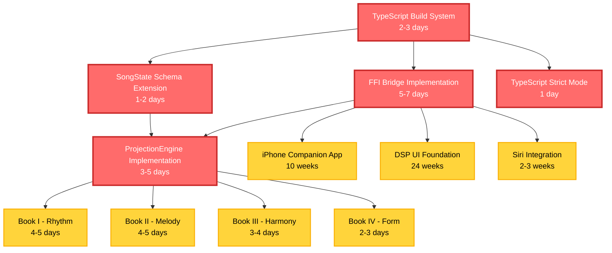
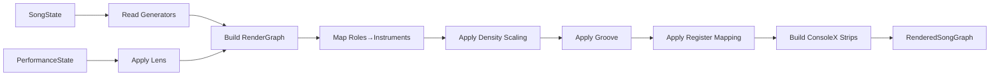

# Critical Blockers Implementation Plan - White Room Project

**Created:** 2026-01-15
**Status:** ACTIVE
**Priority:** P0 - CRITICAL PATH

---

## Executive Summary

This plan addresses **5 critical blockers** preventing development progress on White Room, along with **7 dependent feature streams** blocked by these issues. The estimated critical path is **4-6 weeks** for solo development, with opportunities for parallel work reducing calendar time to **3-4 weeks** with a team.

### Critical Timeline
- **Week 1:** Build system fixes + Schema extensions
- **Week 2-3:** FFI bridge + ProjectionEngine (parallel streams)
- **Week 4:** Integration + Testing
- **Week 5-6:** Schillinger Books integration + Polish

---

## Dependency Graph



---

## Critical Blockers Detailed Analysis

### Blocker #1: TypeScript Build System BROKEN
**BD Issue:** white_room-??? (create new)
**Estimated:** 2-3 days
**Impact:** BLOCKS ALL TypeScript development

#### Current State
- Build fails with 14 TypeScript compilation errors
- Missing module imports (timeline-evaluation, song-model-v2, timeline-model, timeline-diff)
- Type mismatches in Voice interface (voiceId vs voiceIds, rolePool vs rolePools)
- RatioTreeNode type incomplete

#### Root Causes
1. **Missing Files:** timeline-evaluation.ts, song-model-v2.ts, timeline-model.ts, timeline-diff.ts
2. **Schema Drift:** Voice interface changed but usages not updated
3. **Missing .js Extensions:** ES module resolution requires explicit extensions
4. **Incomplete Types:** RatioTreeNode missing nodeId, ratio properties

#### Fix Strategy
```typescript
// Phase 1: Fix missing imports (Day 1)
- Create timeline-evaluation.ts stub
- Create song-model-v2.ts stub
- Create timeline-model.ts stub
- Create timeline-diff.ts stub

// Phase 2: Fix Voice interface (Day 1-2)
- Update all voiceId references to voiceIds
- Update all rolePool references to rolePools
- Fix RatioTreeNode type

// Phase 3: Fix .js extensions (Day 2)
- Add .js extensions to all relative imports
- Update tsconfig.json moduleResolution

// Phase 4: Strict mode preparation (Day 3)
- Enable strict: true incrementally
- Fix any new errors
- Run full test suite
```

#### Success Criteria
- [ ] `npm run build` completes without errors
- [ ] `npm run type-check:all` passes
- [ ] All 14 compilation errors resolved
- [ ] Test suite runs without type errors
- [ ] No implicit any errors

#### Files to Modify
- `/sdk/packages/core/src/index.ts`
- `/sdk/packages/core/src/mapping/ParameterMapper.ts`
- `/sdk/packages/core/src/realize/RealizationEngine.ts`
- `/sdk/packages/core/src/theory/schillinger-song.ts`
- `/sdk/packages/core/src/types/index.ts`
- All files with relative imports (add .js extensions)

---

### Blocker #2: SongState Schema Extension
**BD Issue:** white_room-304
**Estimated:** 1-2 days
**Impact:** BLOCKS Performance feature

#### Current State
- SongModel_v1.schema.json exists but lacks performances[] array
- Missing activePerformanceId field
- TypeScript SongState_v1 interface not updated
- Swift SongModels.swift not updated
- C++ SongState_v1.h not implemented

#### Required Changes
```json
// SongModel_v1.schema.json ADDITIONS:
{
  "performances": {
    "type": "array",
    "items": { "$ref": "#/definitions/PerformanceState_v1" },
    "description": "Multiple performance configurations for this song"
  },
  "activePerformanceId": {
    "type": "string",
    "format": "uuid",
    "description": "Currently active performance ID"
  }
}
```

#### Implementation Plan
```typescript
// Day 1: Schema + TypeScript
- Update SongModel_v1.schema.json
- Regenerate TypeScript types
- Update SongState_v1 interface
- Add validation for performances array
- Add methods: addPerformance(), removePerformance(), setActivePerformance()

// Day 2: Swift + C++
- Update Swift SongModels.swift
- Implement C++ SongState_v1.h
- Add cross-platform tests
```

#### Success Criteria
- [ ] Schema validation passes with performances array
- [ ] TypeScript can serialize/deserialize performances
- [ ] Swift can serialize/deserialize performances
- [ ] C++ can serialize/deserialize performances
- [ ] Cross-platform JSON round-trip works
- [ ] All existing tests still pass

---

### Blocker #3: FFI Bridge Implementation
**BD Issue:** white_room-308
**Estimated:** 5-7 days
**Impact:** BLOCKS all real-time audio features

#### Current State
- Swift JUCEEngine.swift has complete UI/state management
- All methods are placeholder NSLog calls
- No C wrapper layer exists
- No Swift module map for C interop
- No thread-safe communication

#### Required Functions
```c
// C Wrapper Layer (schillinger_ffi.h)
int sch_engine_initialize(const char* config_json);
int sch_engine_shutdown();
int sch_engine_set_performance_blend(const char* perf_a_id, const char* perf_b_id, float t);
int sch_engine_send_command(const char* json_cmd);
int sch_engine_get_sample_rate();
int sch_engine_get_buffer_size();
```

#### Implementation Plan
```
Day 1-2: C++ Wrapper Layer
- Create juce_backend/src/ffi/schillinger_ffi.cpp
- Create juce_backend/src/ffi/schillinger_ffi.h
- Implement thread-safe command queue
- Expose JUCE engine functions

Day 3-4: Swift Interop
- Create swift_frontend/FFI/schillinger.modulemap
- Update Swift JUCEEngine.swift
- Replace NSLog with real FFI calls
- Implement error handling

Day 5: Thread Safety
- Implement lock-free command queue
- Real-time thread considerations
- Memory management

Day 6-7: Testing + Validation
- Unit tests for all FFI functions
- Integration tests with Swift UI
- Memory leak detection (ASan)
- Performance benchmarks
```

#### Thread Safety Strategy
```cpp
// Lock-free SPSC queue for real-time commands
template<typename T>
class LockFreeQueue {
  // Single Producer: Swift UI thread
  // Single Consumer: JUCE audio thread
  // Wait-free operations
};
```

#### Success Criteria
- [ ] Engine starts/stops without crashes
- [ ] Blend commands produce audible changes
- [ ] No UI blocking during audio processing
- [ ] No memory leaks (ASan clean)
- [ ] Real-time thread never blocks
- [ ] All FFI functions have unit tests
- [ ] Integration tests pass

---

### Blocker #4: ProjectionEngine Implementation
**BD Issue:** white_room-225
**Estimated:** 3-5 days
**Impact:** BLOCKS Schillinger Books integration

#### Current State
- ProjectionConfig and ProjectionResult models exist
- ProjectionError types exist
- projectSong() entrypoint stubbed
- No implementation of projection logic

#### Required Functions
```cpp
// ProjectionEngine.cpp
RenderedSongGraph projectSong(
  const SongState& songState,
  const PerformanceState& performance
);

RenderedSongGraph projectSongBlend(
  const SongState& songState,
  const PerformanceState& perfA,
  const PerformanceState& perfB,
  float t  // 0..1 blend
);
```

#### Implementation Plan
```
Day 1: Architecture + Data Flow
- Design projection pipeline stages
- Define SongState → RenderedGraph transformation
- Design PerformanceState lens application
- Plan role → instrument mapping

Day 2-3: Core Projection Logic
- Implement projectSong()
- Apply PerformanceState lens to generators
- Build RenderedGraph with routing
- Map roles to instruments
- Apply density scaling
- Apply groove templates
- Apply register mapping

Day 4: Blend Implementation
- Implement projectSongBlend()
- Crossfade between performances
- Validate graph consistency

Day 5: Testing + Validation
- Unit tests for all projection stages
- Integration tests with SongState
- Validation tests
- Performance benchmarks
```

#### Projection Pipeline


#### Success Criteria
- [ ] projectSong() generates complete RenderedSongGraph
- [ ] All SongState generators are realized
- [ ] PerformanceState lens correctly applied
- [ ] Role → Instrument mapping works
- [ ] Density scaling produces audible changes
- [ ] Groove application works
- [ ] projectSongBlend() crossfades smoothly
- [ ] 50+ unit tests covering all features
- [ ] Integration tests with SongState pass

---

### Blocker #5: TypeScript Strict Mode Enablement
**BD Issue:** white_room-??? (create new)
**Estimated:** 1 day
**Impact:** BLOCKS type safety guarantees

#### Current State
- Some packages have strict mode enabled
- Others don't
- Inconsistent type safety across codebase

#### Implementation Plan
```typescript
// Day 1: Enable strict mode incrementally
1. Update all tsconfig.json files:
   - "strict": true
   - "noImplicitAny": true
   - "strictNullChecks": true
   - "strictFunctionTypes": true

2. Fix any new errors that appear

3. Run full test suite

4. Commit with "strict mode enabled" message
```

#### Success Criteria
- [ ] All tsconfig.json files have strict: true
- [ ] npm run build passes
- [ ] npm run type-check:all passes
- [ ] Test suite passes
- [ ] No implicit any errors

---

## Dependent Features Analysis

### High Priority (P1 - Core Schillinger System)

#### 1. Book I - Rhythm System (white_room-36)
**Estimated:** 4-5 days
**Blocked by:** ProjectionEngine (white_room-225)
**Dependencies:** T001 (Schema), T004 (pcg-random)

#### 2. Book II - Melody System (white_room-92)
**Estimated:** 4-5 days
**Blocked by:** ProjectionEngine (white_room-225)
**Dependencies:** T001 (Schema), T004 (pcg-random)

#### 3. Book III - Harmony System (white_room-65)
**Estimated:** 3-4 days
**Blocked by:** ProjectionEngine (white_room-225)
**Dependencies:** T001 (Schema), T004 (pcg-random), Book I

#### 4. Book IV - Form System (white_room-94)
**Estimated:** 2-3 days
**Blocked by:** ProjectionEngine (white_room-225)
**Dependencies:** T001 (Schema), Books I-III

### Medium Priority (P2 - Platform Features)

#### 5. iPhone Companion App (white_room-2)
**Estimated:** 10 weeks
**Blocked by:** FFI Bridge (white_room-308)
**Dependencies:** Real AudioManager, DSP UI Foundation

#### 6. DSP UI Foundation (white_room-8)
**Estimated:** 24 weeks
**Blocked by:** FFI Bridge (white_room-308)
**Dependencies:** Real AudioManager

#### 7. Siri Integration (white_room-234)
**Estimated:** 2-3 weeks
**Blocked by:** FFI Bridge (white_room-308), tvOS Order Song UI
**Dependencies:** Natural language processing

---

## Parallelization Strategy

### What CAN Be Done Simultaneously

#### Stream A: Build System + Schema (Team Member 1)
**Week 1, Days 1-3**
- Fix TypeScript build errors
- Extend SongState schema
- Enable strict mode
**Deliverables:** Working build, schema extended

#### Stream B: FFI Bridge (Team Member 2)
**Week 1, Days 1-7** (starts Day 1 parallel to A)
- Implement C++ wrapper layer
- Implement Swift interop
- Thread safety
- Testing
**Deliverables:** Real-time audio works

#### Stream C: ProjectionEngine (Team Member 3)
**Week 2, Days 1-5** (starts after Stream A completes)
- Design projection pipeline
- Implement projectSong()
- Implement projectSongBlend()
- Testing
**Deliverables:** SongState → RenderedGraph

### Critical Path Analysis

```
Sequential (Solo Developer):
Week 1: Build + Schema (3 days) + FFI start (2 days)
Week 2: FFI complete (3 days) + ProjectionEngine start (2 days)
Week 3: ProjectionEngine complete (3 days) + Integration (2 days)
Week 4: Testing + Polish
Total: 4 weeks

Parallel (3-Person Team):
Week 1: Build+Schema (P1) + FFI (P2)
Week 2: FFI complete (P2) + ProjectionEngine (P3)
Week 3: Integration (All)
Total: 3 weeks
```

---

## Risk Assessment Matrix

### High Risk Items

| Risk | Impact | Probability | Mitigation |
|------|--------|-------------|------------|
| FFI bridge thread safety issues | CRITICAL | HIGH | Use lock-free queues, extensive testing |
| ProjectionEngine performance bottlenecks | HIGH | MEDIUM | Profile early, optimize hot paths |
| Schema breaking changes | HIGH | LOW | Version schemas, migration scripts |
| TypeScript strict mode reveals hidden bugs | MEDIUM | HIGH | Incremental enablement, comprehensive tests |

### Medium Risk Items

| Risk | Impact | Probability | Mitigation |
|------|--------|-------------|------------|
| Build system dependencies conflict | MEDIUM | MEDIUM | Use lock file, test on clean machines |
| Cross-platform schema inconsistencies | MEDIUM | LOW | JSON schema as source of truth |
| Integration test flakiness | MEDIUM | MEDIUM | Deterministic tests, fixtures |

### Low Risk Items

| Risk | Impact | Probability | Mitigation |
|------|--------|-------------|------------|
| Strict mode enablement | LOW | LOW | Already strict in most packages |
| Documentation completeness | LOW | HIGH | Auto-generate from schemas |

---

## Success Criteria Checklist

### Phase 1: Build System (Week 1)
- [ ] `npm run build` passes without errors
- [ ] `npm run type-check:all` passes
- [ ] `npm run test` passes
- [ ] All 14 compilation errors resolved
- [ ] Strict mode enabled in all packages
- [ ] SongState schema extended with performances[]
- [ ] Cross-platform schema tests pass

### Phase 2: FFI Bridge (Week 1-2)
- [ ] All 5 C wrapper functions implemented
- [ ] Swift module map created
- [ ] JUCEEngine.swift calls real FFI functions
- [ ] Engine starts/stops without crashes
- [ ] Blend commands produce audible changes
- [ ] No UI blocking during audio processing
- [ ] No memory leaks (ASan clean)
- [ ] Real-time thread never blocks
- [ ] All FFI functions have unit tests
- [ ] Integration tests pass

### Phase 3: ProjectionEngine (Week 2-3)
- [ ] projectSong() generates complete RenderedSongGraph
- [ ] All SongState generators are realized
- [ ] PerformanceState lens correctly applied
- [ ] Role → Instrument mapping works
- [ ] Density scaling produces audible changes
- [ ] Groove application works
- [ ] projectSongBlend() crossfades smoothly
- [ ] 50+ unit tests covering all features
- [ ] Integration tests with SongState pass
- [ ] Performance benchmarks meet targets

### Phase 4: Integration (Week 3-4)
- [ ] End-to-end tests: SongState → RenderedGraph → Audio
- [ ] Cross-platform tests: TS ↔ Swift ↔ C++ round-trip
- [ ] Performance tests: Real-time rendering < 10ms
- [ ] Memory tests: No leaks, bounded memory usage
- [ ] Stress tests: 100 songs, 1000 performances

### Phase 5: Unblock Dependent Features (Week 4+)
- [ ] Book I - Rhythm System can start
- [ ] Book II - Melody System can start
- [ ] Book III - Harmony System can start
- [ ] Book IV - Form System can start
- [ ] iPhone Companion App can start
- [ ] DSP UI Foundation can start
- [ ] Siri Integration can start

---

## BD Issues to Create

### Critical Blockers
1. **white_room-???**: Fix TypeScript build system (14 compilation errors)
2. **white_room-304**: Extend SongModel_v1 with performances array
3. **white_room-308**: Implement FFI bridge between Swift and JUCE
4. **white_room-225**: Implement ProjectionEngine (projectSong + projectSongBlend)
5. **white_room-???**: Enable TypeScript strict mode across all packages

### Integration & Testing
6. **white_room-???**: Create cross-platform schema integration tests
7. **white_room-???**: Create FFI bridge comprehensive test suite
8. **white_room-???**: Create ProjectionEngine integration tests
9. **white_room-???**: Performance testing for real-time rendering

### Process & Documentation
10. **white_room-???**: Document build system setup and troubleshooting
11. **white_room-???**: Create FFI bridge developer guide
12. **white_room-???**: Create ProjectionEngine architecture documentation

---

## Timeline Summary

### Solo Developer (Sequential)
```
Week 1: Build system fixes (3d) + Schema extension (2d)
Week 2: FFI bridge (5d)
Week 3: ProjectionEngine (5d)
Week 4: Integration + Testing (5d)
Total: 4 weeks
```

### 3-Person Team (Parallel)
```
Week 1: P1=Build+Schema | P2=FFI (start)
Week 2: P2=FFI (complete) | P3=ProjectionEngine
Week 3: All=Integration+Testing
Total: 3 weeks
```

### Go/No-Go Gates

#### Gate 1: End of Week 1
**Criteria:**
- Build system works
- Schema extended
- FFI bridge 50% complete

**Decision:** Continue if FFI on track, else reassess

#### Gate 2: End of Week 2
**Criteria:**
- FFI bridge complete
- ProjectionEngine 80% complete

**Decision:** Continue if ProjectionEngine on track, else add resources

#### Gate 3: End of Week 3
**Criteria:**
- All blockers complete
- Integration tests passing

**Decision:** Proceed to Schillinger Books implementation

---

## Next Steps

1. **Immediate (Today):**
   - Create BD issues for all 5 critical blockers
   - Set up Confucius memory for patterns
   - Assign issues to team members

2. **Week 1 Start:**
   - Kickoff meeting: Blockers overview
   - Set up daily standups
   - Create Slack channels for each stream

3. **Week 1-2:**
   - Execute parallel streams
   - Daily progress tracking
   - Risk mitigation

4. **Week 3-4:**
   - Integration testing
   - Performance validation
   - Unblock dependent features

---

## Conclusion

This plan addresses the 5 critical blockers preventing White Room development progress. The estimated critical path is **4-6 weeks** for solo development, with parallelization reducing calendar time to **3-4 weeks**.

The highest-risk items are:
1. **FFI bridge thread safety** - Critical path, requires expertise
2. **ProjectionEngine performance** - Must be real-time capable
3. **Build system stability** - Foundation for all work

Success requires:
- Clear ownership of each stream
- Daily progress tracking
- Aggressive risk mitigation
- Comprehensive testing at each phase

Once these blockers are resolved, the Schillinger Books (Rhythm, Melody, Harmony, Form) and platform features (iPhone app, DSP UI, Siri) can proceed unblocked.

---

**Document Status:** READY FOR EXECUTION
**Next Review:** End of Week 1 (Gate 1)
**Owner:** Senior Project Manager Agent
