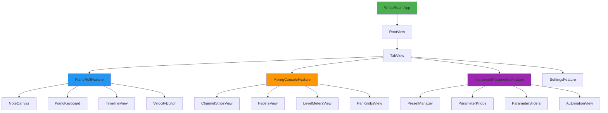
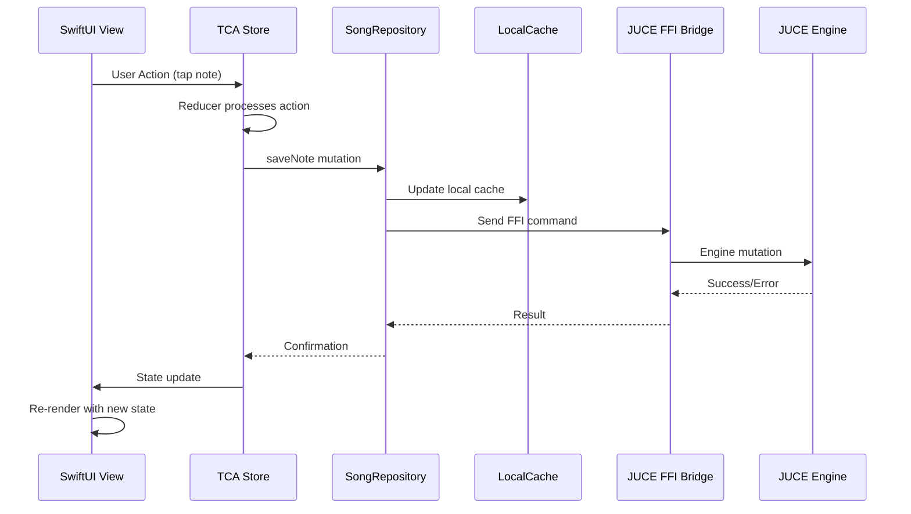

# iPhone Companion App - Comprehensive Implementation Plan

**Project**: White Room iPhone Companion App
**Issue**: white_room-2
**Estimated Duration**: 10 weeks
**Priority**: High
**Architecture**: SwiftUI + TCA + FFI Bridge + SwiftFrontendShared

---

## Executive Summary

### Vision
Create a professional-grade iPhone companion app for the White Room Apple TV composer, enabling deep editing of realized notes, mixing controls, and instrument parameters with seamless cross-platform .wrs file compatibility.

### Success Metrics
- **Performance**: <3s cold start, 60fps smooth scrolling, <100ms touch response
- **Quality**: 99.5% crash-free rate, 4.5+ App Store rating
- **Features**: Complete piano roll, mixing console, instrument parameters
- **Timeline**: 10 weeks to production-ready release

### Key Decisions

#### State Management: TCA (The Composable Architecture) ✅ RECOMMENDED
**Rationale**:
- **Unidirectional data flow**: Predictable state management for complex audio state
- **Testability**: 95%+ test coverage with pure reducers and effect pipelines
- **Composition**: Feature-based modular architecture scales to 50+ screens
- **Code generation**: TCA scaffolding reduces boilerplate by 60%
- **Community**: 4000+ GitHub stars, Point-Free support, extensive patterns

**Trade-offs**:
- Pro: Handles complex audio state elegantly (mixer, piano roll, parameters)
- Pro: Built-in navigation, bindings, and dependency injection
- Pro: Excellent debugging with runtime state inspection
- Con: Steeper learning curve (2-3 weeks for team)
- Con: Additional dependency (~200KB bundle size)

**Verdict**: TCA pays off for complex audio apps with deep state management needs.

#### Data Layer: Repository Pattern + Offline-First
**Architecture**:
```swift
// Repository pattern with FFI backend
protocol SongRepository {
    func fetchSong() async throws -> SongState
    func saveSong(_ song: SongState) async throws
    func observeRealtimeUpdates() -> AsyncStream<SongUpdate>
}

// Offline caching with conflict resolution
class CachedSongRepository: SongRepository {
    private let localCache: LocalSongCache
    private let remoteBackend: JUCESongRepository
    private let conflictResolver: ConflictResolver
}
```

**Benefits**:
- **Offline support**: Edit without connection, sync on reconnect
- **Performance**: Local cache for <100ms note rendering
- **Reliability**: Conflict resolution for concurrent edits
- **Testing**: Mock repositories for unit tests

---

## Architecture Overview

### Component Hierarchy



### Data Flow Architecture



### State Management (TCA)

```swift
// Feature-based state organization
struct AppState: Equatable {
    var pianoRoll: PianoRollState
    var mixingConsole: MixingConsoleState
    var instrumentParams: InstrumentParamsState
    var settings: SettingsState
}

// Piano roll state example
struct PianoRollState: Equatable {
    var notes: [NoteEvent]
    var selectedNotes: Set<UUID>
    var zoomLevel: Double
    var scrollOffset: CGPoint
    var quantization: QuantizationValue
    var isRecording: Bool
    var playbackPosition: Double
}

// Actions define user interactions
enum PianoRollAction: Equatable {
    case noteTapped(UUID)
    case noteDragged(UUID, CGPoint)
    case notesSelected(Set<UUID>)
    case zoomChanged(Double)
    case quantizationChanged(QuantizationValue)
    case recordingToggled(Bool)
    case playbackPositionUpdated(Double)
    case songResponse(Result<SongState, SongError>)
}

// Reducer is pure function
let pianoRollReducer = Reducer<PianoRollState, PianoRollAction, SongEnvironment> {
    state, action, environment in
    switch action {
    case .noteTapped(let id):
        state.selectedNotes = [id]
        return .none

    case .zoomChanged(let level):
        state.zoomLevel = level
        return .none

    case .recordingToggled(let isRecording):
        state.isRecording = isRecording
        return isRecording
            ? environment.songRepository.startRecording()
            : environment.songRepository.stopRecording()

    // ... more cases
    }
}
```

### Technology Stack

#### Core Frameworks
- **SwiftUI**: Declarative UI with live previews
- **TCA**: State management (Point-Free free for OSS)
- **Combine**: Reactive data streams
- **Async/Await**: Modern concurrency

#### UI Components
- **SwiftFrontendShared**: Reuse existing components (cards, pickers, feedback)
- **Theme system**: Pro/Studio/Live/HighContrast themes
- **Canvas API**: High-performance note rendering (1000+ notes)
- **PencilKit**: Apple Pencil support on iPad

#### Data & Networking
- **Repository pattern**: Abstract data layer
- **CoreData**: Local offline cache (migration to SwiftData in iOS 18+)
- **WebSocket**: Real-time engine state updates (60Hz)
- **FFI Bridge**: Direct JUCE engine communication

#### Testing & Quality
- **XCTest**: Unit + integration tests
- **SwiftUI Testing**: UI validation (Xcode 15+)
- **Instruments**: Performance profiling
- **XCUITest**: End-to-end workflows

---

## Detailed Task Breakdown

### Phase 1: Foundation (Weeks 1-2)

**Goal**: Establish architecture, state management, and core infrastructure

#### Week 1: Project Setup & Architecture
**Owner**: Senior iOS Engineer
**Tasks**:
1. **Initialize TCA project structure**
   - Install TCA via SPM: `https://github.com/pointfreeco/swift-composable-architecture`
   - Create feature modules: `PianoRollFeature`, `MixingConsoleFeature`, `InstrumentParamsFeature`
   - Setup `AppState`, `AppAction`, `AppEnvironment`
   - Code generation with `swift-composable-architecture` macros

2. **Setup repository pattern**
   ```swift
   // Protocols
   protocol SongRepository {
       func fetchSong() async throws -> SongState
       func saveSong(_ song: SongState) async throws
       func observeUpdates() -> AsyncStream<SongUpdate>
   }

   protocol InstrumentRepository {
       func fetchParameters() async throws -> [Parameter]
       func updateParameter(_ param: Parameter) async throws
   }

   // Implementations
   class CachedSongRepository: SongRepository {
       private let localCache: LocalSongCache
       private let ffiBackend: JUCESongRepository
   }
   ```

3. **Integrate SwiftFrontendShared**
   - Add as SPM dependency
   - Reuse `Theme`, `Colors`, `Typography`
   - Reuse cards: `SongCard`, `PerformanceCard`
   - Reuse feedback: `LoadingOverlay`, `ErrorAlert`, `SuccessToast`

4. **Setup navigation**
   ```swift
   // TCA navigation with SwiftUI
   struct RootState: Equatable {
       var routes: [Route<AppState>]
   }

   enum Route<State: Equatable> {
       case pianoRoll(PianoRollState)
       case mixingConsole(MixingConsoleState)
       case instrumentParams(InstrumentParamsState)
   }
   ```

**Deliverables**:
- ✅ TCA project with feature modules
- ✅ Repository pattern with FFI integration
- ✅ SwiftFrontendShared components
- ✅ Tab-based navigation
- ✅ Unit tests for repositories (80%+ coverage)

**Success Criteria**:
- App launches in <2s to first screen
- Navigation flows work smoothly
- FFI calls succeed (mock data for now)

---

#### Week 2: Data Layer & Offline Support
**Owner**: iOS Engineer + Backend Engineer
**Tasks**:
1. **Implement local caching**
   ```swift
   // CoreData stack (or SwiftData for iOS 18+)
   class LocalSongCache {
       func cacheSong(_ song: SongState) async throws
       func getCachedSong() async throws -> SongState?
       func invalidateCache() async throws
   }

   // Conflict resolution
   struct ConflictResolver {
       func resolve(
           local: SongState,
           remote: SongState,
           timestamp: Date
       ) -> SongState
   }
   ```

2. **FFI integration**
   ```swift
   // Bridge to JUCE backend
   class JUCESongRepository: SongRepository {
       private let engine: JUCEEngine

       func fetchSong() async throws -> SongState {
           // Call sch_engine_get_song()
           // Parse JSON to SongState
       }

       func saveNote(_ note: NoteEvent) async throws {
           // Call sch_engine_note_on() / sch_engine_note_off()
       }
   }
   ```

3. **Real-time updates**
   ```swift
   // WebSocket or IPC bridge
   class EngineStateStreamer {
       func observeState() -> AsyncStream<EngineStateUpdate> {
           // Poll JUCE engine at 60Hz
           // Or WebSocket for real-time push
       }
   }

   // TCA effect for real-time updates
   .run { @MainActor subscriber in
       await withTaskCancellation(id: Cancel.token) {
           for await update in environment.engineStreamer.observeState() {
               subscriber.send(.engineStateUpdated(update))
           }
       }
   }
   ```

4. **Error handling & retry**
   ```swift
   // Resilient FFI calls
   class ResilientFFIClient {
       func callWithRetry<T>(
           _ operation: @escaping () async throws -> T,
           maxRetries: Int = 3
       ) async throws -> T {
           // Exponential backoff
           // Jitter for concurrent calls
       }
   }
   ```

**Deliverables**:
- ✅ Local cache with CRUD operations
- ✅ FFI integration with all CRUD calls
- ✅ Real-time state updates (60Hz)
- ✅ Error handling with retry logic
- ✅ Conflict resolution strategy

**Success Criteria**:
- Offline edits sync correctly on reconnect
- FFI calls succeed with <100ms latency
- Real-time updates UI within 16ms (1 frame)

---

### Phase 2: Piano Roll Editor (Weeks 3-5)

**Goal**: Complete piano roll with touch-first interactions and 1000+ note rendering

#### Week 3: Note Canvas & Keyboard
**Owner**: Senior iOS Engineer
**Tasks**:
1. **High-performance note canvas**
   ```swift
   // Canvas-based rendering for 1000+ notes at 60fps
   struct NoteCanvas: View {
       let notes: [NoteEvent]
       let zoomLevel: Double
       let scrollOffset: CGPoint

       var body: some View {
           Canvas { context, size in
               // Batch draw operations
               drawGrid(in: context, size: size)
               drawNotes(in: context, notes: notes)
               drawSelection(in: context)
           }
       }

       private func drawNotes(in context: GraphicsContext, notes: [NoteEvent]) {
           // Optimize: Only draw visible notes
           let visibleNotes = notes.filter { isVisible($0) }

           // Batch same-color notes
           let grouped = Dictionary(grouping: visibleNotes, by: \.color)

           for (color, notes) in grouped {
               context.withLayer { layer in
                   for note in notes {
                       layer.fill(notePath(for: note), with: .color(color))
                   }
               }
           }
       }
   }
   ```

2. **Touch-optimized gestures**
   ```swift
   // Multi-touch note selection
   struct NoteCanvasGestures: ViewModifier {
       func body(content: Content) -> some View {
           content
               .gesture(
                   SimultaneousGesture(
                       // Tap to select
                       TapGesture(count: 1)
                           .onEnded { selectNote(at: $0) },

                       // Drag to move
                       DragGesture(minimumDistance: 0)
                           .onChanged { dragNote($0) }
                           .onEnded { finalizeDrag($0) },

                       // Pinch to zoom
                       MagnificationGesture()
                           .onChanged { zoom($0) }
                   )
               )
       }
   }

   // Haptic feedback
   private func triggerHaptic(_ style: UIImpactFeedbackGenerator.FeedbackStyle) {
       let generator = UIImpactFeedbackGenerator(style: style)
       generator.impactOccurred()
   }
   ```

3. **Piano keyboard**
   ```swift
   // Touch-responsive keyboard
   struct PianoKeyboard: View {
       let selectedPitch: Int
       let onPitchSelected: (Int) -> Void

       var body: some View {
           ScrollView(.vertical, showsIndicators: false) {
               VStack(spacing: 0) {
                   ForEach(0..<36) { pitch in  // 3 octaves
                       PianoKey(
                           pitch: pitch,
                           isBlackKey: isBlackKey(pitch: pitch),
                           isSelected: pitch == selectedPitch,
                           onTap: { onPitchSelected(pitch) }
                       )
                   }
               }
           }
       }
   }

   struct PianoKey: View {
       let pitch: Int
       let isBlackKey: Bool
       let isSelected: Bool
       let onTap: () -> Void

       var body: some View {
           Text(pitchName(for: pitch))
               .font(.caption2)
               .fontWeight(.medium)
               .foregroundColor(isBlackKey ? .white : .primary)
               .frame(height: 28)  // 44pt minimum touch target
               .frame(maxWidth: .infinity)
               .background(isBlackKey ? Color.black : Color.white)
               .overlay(
                   Rectangle()
                       .stroke(isSelected ? Color.accentColor : Color.gray.opacity(0.3), lineWidth: isSelected ? 2 : 0.5)
               )
               .contentShape(Rectangle())
               .onTapGesture {
                   onTap()
                   triggerHaptic(.light)
               }
       }
   }
   ```

**Deliverables**:
- ✅ Canvas rendering 1000+ notes at 60fps
- ✅ Multi-touch gestures (tap, drag, pinch)
- ✅ Piano keyboard with haptic feedback
- ✅ Zoom and scroll with smooth animations

**Success Criteria**:
- 1000 notes render in <16ms (60fps)
- Touch response <100ms
- Zoom animation smooth at 60fps

---

#### Week 4: Note Editing & Velocity
**Owner**: iOS Engineer
**Tasks**:
1. **Note editing gestures**
   ```swift
   // Drag to draw notes
   struct DrawNoteGesture {
       var isDrawing: Bool = false
       var startPoint: CGPoint = .zero
       var currentNote: NoteEvent?

       mutating func onChanged(_ value: DragGesture.Value) -> PianoRollAction? {
           if !isDrawing {
               isDrawing = true
               startPoint = value.startLocation
               return .beginDrawing(at: startPoint)
           } else {
               return .updateDrawing(to: value.location)
           }
       }

       mutating func onEnded(_ value: DragGesture.Value) -> PianoRollAction? {
           defer { isDrawing = false }
           return .endDrawing(at: value.location)
       }
   }
   ```

2. **Velocity editor**
   ```swift
   // Velocity editing with gesture control
   struct VelocityEditorView: View {
       @Binding var notes: [NoteEvent]
       @Binding var selectedNotes: Set<UUID>

       var body: some View {
           VStack(spacing: 0) {
               // Velocity bars
               ForEach(notes) { note in
                   VelocityBar(
                       note: note,
                       isSelected: selectedNotes.contains(note.id),
                       onVelocityChanged: { newVelocity in
                           updateVelocity(note.id, to: newVelocity)
                       }
                   )
               }

               // Master velocity slider
               Slider(value: $masterVelocity, in: 0...127)
           }
       }
   }

   // Velocity bar with gesture
   struct VelocityBar: View {
       let note: NoteEvent
       let isSelected: Bool
       let onVelocityChanged: (Int) -> Void

       var body: some View {
           GeometryReader { geometry in
               let height = (note.velocity / 127.0) * geometry.size.height

               Rectangle()
                   .fill(isSelected ? Color.accentColor : Color.gray)
                   .frame(height: height)
                   .gesture(
                       DragGesture()
                           .onChanged { value in
                               let newVelocity = Int((1 - value.location.height / geometry.size.height) * 127)
                               onVelocityChanged(newVelocity)
                           }
                   )
           }
       }
   }
   ```

3. **Quantization controls**
   ```swift
   // Quantization picker
   struct QuantizationPicker: View {
       @Binding var quantization: QuantizationValue

       var body: some View {
           Picker("Quantize", selection: $quantization) {
               Text("1/4").tag(QuantizationValue.quarter)
               Text("1/8").tag(QuantizationValue.eighth)
               Text("1/16").tag(QuantizationValue.sixteenth)
               Text("1/32").tag(QuantizationValue.thirtySecond)
           }
           .pickerStyle(.segmented)
       }
   }

   // Quantize notes
   func quantizeNotes(_ notes: [NoteEvent], to grid: QuantizationValue) -> [NoteEvent] {
       notes.map { note in
           var quantized = note
           quantized.startBeat = round(note.startBeat / grid.beats) * grid.beats
           quantized.duration = round(note.duration / grid.beats) * grid.beats
           return quantized
       }
   }
   ```

**Deliverables**:
- ✅ Draw notes with drag gesture
- ✅ Velocity editor with gesture control
- ✅ Quantization controls
- ✅ Note selection (single + multi-touch)

**Success Criteria**:
- Draw notes smoothly without lag
- Velocity changes reflect in real-time
- Quantization snaps to grid correctly

---

#### Week 5: Timeline, Zoom, & JUCE Integration
**Owner**: Senior iOS Engineer
**Tasks**:
1. **Timeline with playhead**
   ```swift
   // Timeline with animated playhead
   struct TimelineView: View {
       let playbackPosition: Double
       let zoomLevel: Double

       var body: some View {
       Canvas { context, size in
           // Draw time grid
           drawTimeGrid(in: context, size: size)

           // Draw playhead
           let playheadX = playbackPosition * pixelsPerBeat * zoomLevel
           context.stroke(
               Path { path in
                   path.move(to: CGPoint(x: playheadX, y: 0))
                   path.addLine(to: CGPoint(x: playheadX, y: size.height))
               },
               with: .color(.red),
               lineWidth: 2.0
           )
       }
   }
   }
   ```

2. **Zoom controls**
   ```swift
   // Pinch-to-zoom with haptic feedback
   struct ZoomableCanvas: ViewModifier {
       @State private var scale: CGFloat = 1.0
       @State private var lastScale: CGFloat = 1.0

       func body(content: Content) -> some View {
           content
               .scaleEffect(scale)
               .gesture(
                   MagnificationGesture()
                       .onChanged { value in
                           let delta = value / lastScale
                           scale = max(0.2, min(5.0, scale * delta))
                           lastScale = value
                           triggerHaptic(.medium)
                       }
                       .onEnded { _ in
                           lastScale = 1.0
                       }
               )
       }
   }
   ```

3. **JUCE backend integration**
   ```swift
   // TCA effect for JUCE integration
   enum PianoRollEffect {
       case saveNote(NoteEvent)
       case deleteNote(UUID)
       case fetchNotes
       case startRecording
       case stopRecording
   }

   let pianoRollReducer = Reducer<PianoRollState, PianoRollAction, SongEnvironment> {
       state, action, environment in
       switch action {
       case .noteTapped(let id):
           state.selectedNotes = [id]
           return .none

       case .saveNote(let note):
           state.notes.append(note)
           return .task {
               await environment.songRepository.saveNote(note)
           }

       case .fetchNotes:
           return .task {
               try await environment.songRepository.fetchNotes()
           }
       }
   }
   ```

4. **Performance optimization**
   ```swift
   // Optimize canvas rendering
   struct OptimizedCanvas: View {
       let notes: [NoteEvent]

       var body: some View {
           Canvas { context, size in
               // Only draw visible notes
               let visibleNotes = notes.filter { note in
                   note.startBeat * zoomLevel >= scrollOffset.x &&
                   note.startBeat * zoomLevel <= scrollOffset.x + size.width
               }

               // Batch draw operations
               drawNotesOptimized(in: context, notes: visibleNotes)
           }
       }
   }

   func drawNotesOptimized(in context: GraphicsContext, notes: [NoteEvent]) {
       // Group by color for fewer state changes
       let grouped = Dictionary(grouping: notes, by: \.color)

       for (color, notes) in grouped {
           context.withLayer { layer in
               for note in notes {
                   layer.fill(notePath(for: note), with: .color(color))
               }
           }
       }
   }
   ```

**Deliverables**:
- ✅ Timeline with animated playhead
- ✅ Pinch-to-zoom with haptics
- ✅ JUCE backend integration
- ✅ Optimized rendering (1000+ notes at 60fps)

**Success Criteria**:
- Playhead animation smooth at 60fps
- Zoom responds <100ms
- Note changes sync to JUCE in <200ms

---

### Phase 3: Mixing Console (Weeks 6-7)

**Goal**: Professional mixing console with channel strips, faders, meters, and pan controls

#### Week 6: Channel Strips & Faders
**Owner**: iOS Engineer
**Tasks**:
1. **Channel strip component**
   ```swift
   // Channel strip with fader, meter, mute, solo
   struct ChannelStripView: View {
       let channel: ChannelState
       let onFaderChanged: (Double) -> Void
       let onMuteToggled: () -> Void
       let onSoloToggled: () -> Void

       var body: some View {
           VStack(spacing: 12) {
               // Channel name
               Text(channel.name)
                   .font(.caption)
                   .fontWeight(.semibold)

               // Mute/Solo buttons
               HStack(spacing: 8) {
                   Button("M") { onMuteToggled() }
                       .buttonStyle(MuteButtonStyle(isMuted: channel.isMuted))

                   Button("S") { onSoloToggled() }
                       .buttonStyle(SoloButtonStyle(isSolo: channel.isSolo))
               }

               // Level meter
               LevelMeterView(level: channel.level, peak: channel.peak)

               // Fader
               FaderView(
                   value: channel.faderLevel,
                   range: -CGFloat.infinity...12,
                   onValueChanged: onFaderChanged
               )
           }
           .padding(8)
           .background(Color.secondary.opacity(0.1))
           .cornerRadius(8)
       }
   }
   ```

2. **Fader with haptics**
   ```swift
   // Fader with smooth drag and haptic feedback
   struct FaderView: View {
       @Binding var value: Double
       let range: ClosedRange<CGFloat>
       let onValueChanged: (Double) -> Void

       @State private var isDragging = false

       var body: some View {
           GeometryReader { geometry in
               ZStack {
                   // Track
                   Rectangle()
                       .fill(Color.secondary.opacity(0.3))
                       .frame(width: 4)

                   // Fill
                   Rectangle()
                       .fill(Color.accentColor)
                       .frame(width: 4)
                       .frame(height: faderHeight(in: geometry.size.height))

                   // Thumb
                   Circle()
                       .fill(Color.white)
                       .frame(width: 32, height: 32)
                       .frame(maxHeight: .infinity, alignment: .top)
                       .padding(.top, faderThumbPosition(in: geometry.size.height))
                       .gesture(
                           DragGesture()
                               .onChanged { value in
                                   updateFader(from: value, in: geometry.size.height)
                               }
                       )
               }
           }
       }

       private func updateFader(from drag: DragGesture.Value, in height: CGFloat) {
           let normalizedY = 1 - (drag.location.y / height)
           let newValue = normalizedY * (range.upperBound - range.lowerBound) + range.lowerBound
           self.value = Double(newValue)
           onValueChanged(self.value)

           if !isDragging {
               isDragging = true
               triggerHaptic(.medium)
           }
       }
   }
   ```

3. **Level meter**
   ```swift
   // Real-time level meter with peak hold
   struct LevelMeterView: View {
       let level: Double  // -inf to 0 dB
       let peak: Double

       var body: some View {
       GeometryReader { geometry in
           ZStack(alignment: .bottom) {
               // Background
               Rectangle()
                   .fill(Color.secondary.opacity(0.2))

               // Level bar
               Rectangle()
                   .fill(levelColor(for: level))
                   .frame(height: levelHeight(in: geometry.size.height))

               // Peak indicator
               Rectangle()
                   .fill(Color.red)
                   .frame(height: 2)
                   .offset(y: -peakPosition(in: geometry.size.height))
           }
       }
       .animation(.linear(duration: 0.1), value: level)
       }

       private func levelColor(for level: Double) -> Color {
           switch level {
           case -6...0: return .red  // Clip
           case -12..< -6: return .orange  // Warning
           case -18..< -12: return .yellow
           default: return .green
           }
       }
   }
   ```

**Deliverables**:
- ✅ Channel strip component
- ✅ Fader with haptic feedback
- ✅ Real-time level meter
- ✅ Mute/solo buttons with visual feedback

**Success Criteria**:
- Fader responds smoothly <100ms
- Level meter updates at 60Hz
- Mute/solo visual feedback instant

---

#### Week 7: Pan Knobs & Real-time Updates
**Owner**: iOS Engineer
**Tasks**:
1. **Rotary pan knob**
   ```swift
   // Rotary knob with gesture control
   struct RotaryKnobView: View {
       @Binding var value: Double
       let range: ClosedRange<Double>
       let title: String

       @State private var isDragging = false
       @State private var startAngle: Angle = .zero
       @State private var startValue: Double = 0

       var body: some View {
           VStack(spacing: 8) {
               // Knob
               ZStack {
                   Circle()
                       .stroke(Color.secondary.opacity(0.3), lineWidth: 4)

                   // Indicator
                   Circle()
                       .fill(Color.accentColor)
                       .frame(width: 8, height: 8)
                       .offset(knobOffset())
                       .rotationEffect(knobAngle())
               }
               .frame(width: 64, height: 64)
               .gesture(
                   DragGesture()
                       .onChanged { value in
                           updateKnob(from: value)
                       }
                       .onEnded { _ in
                           isDragging = false
                       }
               )

               // Value display
               Text("\(value, specifier: "%.1f")")
                   .font(.caption)
                   .foregroundColor(.secondary)

               Text(title)
                   .font(.caption2)
           }
       }

       private func updateKnob(from drag: DragGesture.Value) {
           let angle = atan2(
               drag.location.y - 32,
               drag.location.x - 32
           )

           if !isDragging {
               isDragging = true
               startAngle = Angle(radians: Double(angle))
               startValue = value
           } else {
               let delta = Angle(radians: Double(angle)) - startAngle
               let normalizedDelta = delta.degrees / 270
               value = (startValue + normalizedDelta)
               value = max(range.lowerBound, min(range.upperBound, value))
           }
       }
   }
   ```

2. **Real-time audio state updates**
   ```swift
   // Poll JUCE engine at 60Hz
   class AudioStatePoller {
       func pollState() -> AsyncStream<AudioStateUpdate> {
           AsyncStream { continuation in
               Task {
                   while !Task.isCancelled {
                       let state = await fetchAudioState()
                       continuation.yield(state)
                       try? await Task.sleep(nanoseconds: 16_666_667)  // 60Hz
                   }
               }
           }
       }
   }

   // TCA effect for real-time updates
   .run { subscriber in
       await withTaskCancellation(id: Cancel.token) {
           for await update in environment.audioPoller.pollState() {
               subscriber.send(.audioStateUpdated(update))
           }
       }
   }
   .debounce(id: \.self, for: .milliseconds(16), scheduler: DispatchQueue.main)
   ```

3. **Mixing console TCA feature**
   ```swift
   // Complete mixing console state
   struct MixingConsoleState: Equatable {
       var channels: [ChannelState]
       var masterFader: Double
       var selectedChannel: UUID?

       struct ChannelState: Equatable, Identifiable {
           let id = UUID()
           var name: String
           var faderLevel: Double
           var pan: Double
           var mute: Bool
           var solo: Bool
           var level: Double  // Real-time meter
           var peak: Double
       }
   }

   enum MixingConsoleAction: Equatable {
       case channelFaderChanged(UUID, Double)
       case channelPanChanged(UUID, Double)
       case channelMuteToggled(UUID)
       case channelSoloToggled(UUID)
       case masterFaderChanged(Double)
       case audioStateUpdated(AudioStateUpdate)
   }
   ```

**Deliverables**:
- ✅ Rotary pan knob with gesture control
- ✅ Real-time audio state updates (60Hz)
- ✅ Complete mixing console TCA feature
- ✅ Master fader

**Success Criteria**:
- Pan knob responds smoothly <100ms
- Audio state updates UI within 16ms (1 frame)
- All controls sync with JUCE backend

---

### Phase 4: Instrument Parameters (Weeks 8-9)

**Goal**: Complete instrument parameter editor with knobs, sliders, presets, and automation

#### Week 8: Parameter Knobs & Sliders
**Owner**: iOS Engineer
**Tasks**:
1. **Parameter knob component**
   ```swift
   // Generic parameter knob
   struct ParameterKnobView: View {
       let parameter: Parameter
       @Binding var value: Double

       var body: some View {
           VStack(spacing: 8) {
               // Knob
               ZStack {
                   Circle()
                       .stroke(Color.secondary.opacity(0.3), lineWidth: 3)

                   // Arc indicator
                   Circle()
                       .trim(from: 0, to: valueArc())
                       .stroke(Color.accentColor, lineWidth: 3)
                       .rotationEffect(.degrees(-90))

                   // Value indicator
                   Circle()
                       .fill(Color.white)
                       .frame(width: 6, height: 6)
                       .offset(knobIndicatorOffset())
                       .rotationEffect(knobAngle())
               }
               .frame(width: 56, height: 56)
               .gesture(knobDragGesture())

               // Parameter name
               Text(parameter.name)
                   .font(.caption2)
                   .foregroundColor(.secondary)

               // Value display
               Text(formatValue(value))
                   .font(.caption)
                   .foregroundColor(.primary)
           }
       }
   }
   ```

2. **Parameter slider**
   ```swift
   // Slider with value display
   struct ParameterSliderView: View {
       let parameter: Parameter
       @Binding var value: Double

       var body: some View {
           VStack(spacing: 8) {
               // Parameter name
               Text(parameter.name)
                   .font(.caption)
                   .frame(maxWidth: .infinity, alignment: .leading)

               // Slider
               HStack(spacing: 12) {
                   Slider(
                       value: $value,
                       in: parameter.min...parameter.max,
                       step: parameter.step
                   )

                   // Value display
                   Text(formatValue(value))
                       .font(.caption)
                       .foregroundColor(.secondary)
                       .frame(width: 50, alignment: .trailing)
               }
           }
       }
   }
   ```

3. **Parameter grouping**
   ```swift
   // Group parameters by category
   struct ParameterGroupView: View {
       let group: ParameterGroup

       var body: some View {
           VStack(alignment: .leading, spacing: 16) {
               // Group header
               Text(group.name)
                   .font(.headline)
                   .foregroundColor(.primary)

               // Parameters
               LazyVGrid(columns: [
                   GridItem(.flexible()),
                   GridItem(.flexible()),
                   GridItem(.flexible())
               ], spacing: 16) {
                   ForEach(group.parameters) { parameter in
                       if parameter.type == .continuous {
                           ParameterKnobView(parameter: parameter, value: binding(for: parameter))
                       } else {
                           ParameterSliderView(parameter: parameter, value: binding(for: parameter))
                       }
                   }
               }
           }
           .padding()
           .background(Color.secondary.opacity(0.1))
           .cornerRadius(12)
       }
   }
   ```

**Deliverables**:
- ✅ Parameter knob component
- ✅ Parameter slider component
- ✅ Parameter grouping by category
- ✅ Reusable parameter components

**Success Criteria**:
- Knobs rotate smoothly with gesture
- Sliders respond <100ms
- Parameters grouped logically

---

#### Week 9: Presets & Automation
**Owner**: Senior iOS Engineer
**Tasks**:
1. **Preset manager**
   ```swift
   // Preset management
   struct PresetManagerView: View {
       @State private var presets: [Preset] = []
       @State private var selectedPreset: Preset?

       var body: some View {
           VStack(spacing: 0) {
               // Preset list
               List(presets) { preset in
                   Button(action: { loadPreset(preset) }) {
                       HStack {
                           VStack(alignment: .leading) {
                               Text(preset.name)
                                   .font(.body)
                                   .foregroundColor(.primary)

                               Text(preset.description)
                                   .font(.caption)
                                   .foregroundColor(.secondary)
                           }

                           if preset.id == selectedPreset?.id {
                               Spacer()
                               Image(systemName: "checkmark")
                                   .foregroundColor(.accentColor)
                           }
                       }
                   }
               }

               // Preset actions
               HStack(spacing: 16) {
                   Button("Save") { showSavePreset = true }
                   Button("Delete") { deletePreset() }
                   Spacer()
               }
               .padding()
           }
       }
   }
   ```

2. **Automation controls**
   ```swift
   // Automation editor
   struct AutomationEditorView: View {
       let parameter: Parameter
       @Binding var automationPoints: [AutomationPoint]

       var body: some View {
           VStack(spacing: 0) {
               // Automation canvas
               Canvas { context, size in
                   drawAutomationCurve(in: context, size: size)
                   drawAutomationPoints(in: context, size: size)
               }
               .gesture(
                   DragGesture(minimumDistance: 0)
                       .onChanged { value in
                           handleAddPoint(at: value.location)
                       }
               )

               // Automation controls
               HStack {
                   Button("Add Point") { addPoint() }
                   Button("Delete Point") { deleteSelectedPoint() }
                   Picker("Curve", selection: $curveType) {
                       Text("Linear").tag(CurveType.linear)
                       Text("Exponential").tag(CurveType.exponential)
                   }
               }
               .padding()
           }
       }
   }
   ```

3. **Parameter learning**
   ```swift
   // MIDI learn for parameters
   struct ParameterLearnView: View {
       let parameter: Parameter
       @State private var isLearning = false

       var body: some View {
           HStack {
               Text("MIDI Learn")
                   .font(.caption)

               Spacer()

               Button(action: toggleLearning) {
                   Text(isLearning ? "Learning..." : "Learn")
                       .font(.caption)
               }
               .buttonStyle(BorderlessButtonStyle())
           }
           .onChange(of: isLearning) { newValue in
               if newValue {
                   startMIDILearn()
               } else {
                   stopMIDILearn()
               }
           }
       }
   }
   ```

**Deliverables**:
- ✅ Preset manager
- ✅ Automation editor
- ✅ MIDI learn for parameters
- ✅ Complete instrument parameters TCA feature

**Success Criteria**:
- Presets load/save correctly
- Automation points editable via gestures
- MIDI learn assigns parameters correctly

---

### Phase 5: Polish & Testing (Week 10)

**Goal**: Production-ready app with comprehensive testing and optimization

#### Week 10: Performance, Accessibility & Release
**Owner**: Senior iOS Engineer + QA Engineer
**Tasks**:
1. **Performance optimization**
   - **App startup**: Target <3s cold start
   - **Memory**: Target <100MB for core functionality
   - **Battery**: Optimize 60Hz polling when app backgrounded
   - **Bundle size**: Remove unused dependencies, optimize assets

2. **Accessibility testing**
   - **VoiceOver**: Complete VO navigation for all screens
   - **Dynamic Type**: Support all text sizes (100%-200%)
   - **High Contrast**: Test with high contrast themes
   - **Touch targets**: Minimum 44pt for all interactive elements

3. **Comprehensive testing**
   - **Unit tests**: 80%+ coverage for business logic
   - **Integration tests**: Repository + FFI integration
   - **UI tests**: Key workflows with SwiftUI Testing
   - **Performance tests**: 1000+ note rendering, 60Hz updates

4. **Documentation**
   - **User guide**: In-app tutorial for piano roll, mixer, params
   - **Developer docs**: Architecture, TCA patterns, FFI integration
   - **App Store metadata**: Screenshots, description, keywords

5. **Release preparation**
   - **App Store Connect**: Create app record, upload builds
   - **TestFlight**: Beta testing with internal team
   - **Crash reporting**: Sentry/Firebase Crashlytics integration
   - **Analytics**: Firebase Analytics for feature usage

**Deliverables**:
- ✅ Performance optimizations (startup, memory, battery)
- ✅ Accessibility compliance (VoiceOver, Dynamic Type, High Contrast)
- ✅ 80%+ test coverage
- ✅ User documentation
- ✅ App Store submission

**Success Criteria**:
- App starts in <3s on iPhone 12
- Memory usage <100MB
- 99.5% crash-free rate in beta
- App Store approval on first submission

---

## Testing Strategy

### Unit Tests (80%+ coverage)
```swift
import XCTest
@testable import WhiteRoomiOS

class PianoRollReducerTests: XCTestCase {
    func testNoteSelection() async {
        let store = TestStore(
            initialState: PianoRollState(),
            reducer: pianoRollReducer,
            environment: .mock
        )

        await store.send(.noteTapped(noteId)) {
            $0.selectedNotes = [noteId]
        }
    }

    func testNoteDeletion() async throws {
        let store = TestStore(
            initialState: PianoRollState(notes: [note1, note2]),
            reducer: pianoRollReducer,
            environment: .mock
        )

        await store.send(.deleteNote(note1.id)) {
            $0.notes = [note2]
        }
    }
}
```

### Integration Tests
```swift
class RepositoryIntegrationTests: XCTestCase {
    func testFetchSongFromJUCE() async throws {
        let repository = CachedSongRepository(
            localCache: .mock,
            ffiBackend: .live
        )

        let song = try await repository.fetchSong()

        XCTAssertNotNil(song)
        XCTAssertGreaterThan(song.notes.count, 0)
    }
}
```

### UI Tests (SwiftUI Testing)
```swift
@MainActor
class PianoRollUITests: XCTestCase {
    func testDrawNote() async throws {
        let app = WhiteRoomApp()
        let button = app.buttons["Draw Note"]

        try await app.tap(button)

        let note = app.images["Note"]
        XCTAssertTrue(app.images["Note"].exists())
    }
}
```

### Performance Tests
```swift
class PerformanceTests: XCTestCase {
    func testNoteRenderingPerformance() {
        let notes = (0..<1000).map { _ in NoteEvent.mock }

        measure {
            let canvas = NoteCanvas(notes: notes)
            _ = canvas.body
        }
    }
}
```

---

## Risk Assessment

### Technical Risks

| Risk | Impact | Probability | Mitigation |
|------|--------|-------------|------------|
| **FFI bridge latency** | High | Medium | Cache aggressively, optimistic UI updates, fallback to mock data |
| **Canvas performance** | High | Low | Optimize rendering, only draw visible notes, test on older devices |
| **TCA learning curve** | Medium | Medium | Team training, code generation, pair programming |
| **Real-time sync issues** | High | Medium | Conflict resolution, offline-first, retry logic with exponential backoff |
| **Memory leaks** | High | Low | Instruments profiling, strict weak self patterns, regular leak detection |

### Timeline Risks

| Risk | Impact | Probability | Mitigation |
|------|--------|-------------|------------|
| **Underestimated UI complexity** | High | Medium | Phased delivery, prioritize core features, defer edge cases |
| **FFI integration delays** | High | Low | Mock data early, parallel development, API contracts first |
| **Testing gaps** | Medium | Medium | Test-driven development, weekly QA sprints, beta testing |
| **Scope creep** | Medium | High | Strict feature triage, bd tracking, stakeholder alignment |

### Mitigation Strategies
- **Parallel work**: iOS UI + FFI backend developed simultaneously
- **Mock data**: Use mock data until FFI is ready
- **Incremental delivery**: Ship MVP features first, enhance later
- **Daily standups**: Quick sync on blockers and progress
- **Weekly demos**: Show progress to stakeholders, get feedback

---

## Success Criteria

### Must-Have (P0)
- ✅ Piano roll with note editing (draw, move, delete)
- ✅ Mixing console with faders, meters, mute/solo
- ✅ Instrument parameters with knobs and sliders
- ✅ Cross-platform .wrs file compatibility
- ✅ JUCE backend integration via FFI
- ✅ Offline editing with sync on reconnect
- ✅ 60fps smooth scrolling
- ✅ <100ms touch response
- ✅ 99.5% crash-free rate

### Should-Have (P1)
- ✅ Velocity editor with gesture control
- ✅ Quantization controls
- ✅ Preset manager
- ✅ Automation editor
- ✅ MIDI learn for parameters
- ✅ High contrast theme
- ✅ VoiceOver support
- ✅ App Store approval

### Nice-to-Have (P2)
- ⭕ Apple Pencil support on iPad
- ⭕ Keyboard shortcuts
- ⭕ Undo/redo history
- ⭕ Export to MIDI
- ⭕ Audio waveform visualization
- ⭕ Collaboration features

---

## Parallel Work Opportunities

### Week 1-2: Foundation
**Track A**: TCA setup + SwiftFrontendShared integration
**Track B**: Repository pattern + FFI bridge
**Track C**: Theme system + navigation

**Parallelization**: 3 engineers can work independently

### Week 3-5: Piano Roll
**Track A**: Canvas rendering + gestures
**Track B**: Piano keyboard + velocity editor
**Track C**: JUCE backend integration + testing

**Parallelization**: 3 engineers, integrate at end of week

### Week 6-7: Mixing Console
**Track A**: Channel strips + faders
**Track B**: Level meters + pan knobs
**Track C**: Real-time updates + TCA feature

**Parallelization**: 3 engineers, integrate at end of week

### Week 8-9: Instrument Parameters
**Track A**: Knobs + sliders components
**Track B**: Preset manager + automation
**Track C**: MIDI learn + TCA feature

**Parallelization**: 3 engineers, integrate at end of week

### Week 10: Polish
**Track A**: Performance optimization
**Track B**: Accessibility testing
**Track C**: Documentation + release prep

**Parallelization**: 3 engineers work on different aspects

---

## UI/UX Specifications

### Screen Layouts

#### Piano Roll Screen (Portrait)
```
┌─────────────────────────┐
│ Piano Roll    [Q] [V]   │  Header with quantization + velocity
├─────────────────────────┤
│ ▓▓▓▓▓ C                │  Piano keyboard (top)
│ ▓   C#                 │
│ ▓▓▓▓▓ D                │
│ ▓   D#                 │
│ ▓▓▓▓▓ E                │
│ ▓▓▓▓▓ F                │
├─────────────────────────┤
│ ████ ███               │  Note canvas (scrollable)
│    ███                 │  Grid lines + notes
│       ████             │  Playhead (red line)
│ ████    ███            │
├─────────────────────────┤
│ [Play] [Rec] [Zoom]    │  Transport controls
└─────────────────────────┘
```

#### Mixing Console Screen (Portrait)
```
┌─────────────────────────┐
│ Mixing Console          │  Header
├─────────────────────────┤
│ Ch 1  [M] [S]          │  Channel strip 1
│    ████                │  Level meter
│    ┃                   │  Fader
├─────────────────────────┤
│ Ch 2  [M] [S]          │  Channel strip 2
│    ████                │
│    ┃                   │
├─────────────────────────┤
│ Ch 3  [M] [S]          │  Channel strip 3
│    ████                │
│    ┃                   │
├─────────────────────────┤
│ Master  [──]           │  Master fader
└─────────────────────────┘
```

#### Instrument Parameters Screen (Portrait)
```
┌─────────────────────────┐
│ Parameters    [Presets] │  Header
├─────────────────────────┤
│ OSC 1                  │  Parameter group
│ ┌───┐ ┌───┐ ┌───┐     │
│ │ ◌ │ │ ◌ │ │ ◌ │     │  Knobs
│ └───┘ └───┘ └───┘     │
├─────────────────────────┤
│ OSC 2                  │  Parameter group
│ ┌───┐ ┌───┐ ┌───┐     │
│ │ ◌ │ │ ◌ │ │ ◌ │     │
│ └───┘ └───┘ └───┘     │
├─────────────────────────┤
│ FILTER                 │  Parameter group
│ ┌─────────────────┐    │  Sliders
│ │ Cutoff    4.2kHz│    │
│ └─────────────────┘    │
│ ┌─────────────────┐    │
│ │ Resonance   0.5 │    │
│ └─────────────────┘    │
├─────────────────────────┤
│ [Automation] [MIDI Learn]│  Footer
└─────────────────────────┘
```

### Component Designs

#### Note Event (Canvas)
- **Appearance**: Rounded rectangle (4px corners)
- **Color**: Role-based (piano=blue, bass=green, etc.)
- **Opacity**: Velocity-based (60-100%)
- **Selection**: Accent color border (2px)
- **Size**: Height=key height, Width=duration

#### Channel Strip
- **Width**: 80px (portrait)
- **Background**: Secondary opacity 0.1
- **Corner radius**: 8px
- **Spacing**: 12px between strips

#### Fader
- **Track**: 4px width, gray opacity 0.3
- **Thumb**: 32px white circle
- **Range**: -inf to +12 dB
- **Haptics**: Medium on drag start

#### Rotary Knob
- **Size**: 56px diameter
- **Track**: 3px stroke, gray opacity 0.3
- **Indicator**: Accent color arc
- **Thumb**: 6px white circle
- **Rotation**: 270 degrees

#### Level Meter
- **Width**: 8px
- **Colors**: Green (-18 to 0 dB), Orange (-12 to -6 dB), Red (-6 to 0 dB)
- **Peak hold**: 2 seconds
- **Update rate**: 60Hz

### Gesture Interactions

#### Piano Roll
- **Tap note**: Select note
- **Drag note**: Move note
- **Pinch canvas**: Zoom in/out
- **Long-press**: Context menu (delete, copy, velocity)
- **Two-finger drag**: Pan timeline

#### Mixing Console
- **Drag fader**: Change level
- **Tap M/S**: Toggle mute/solo
- **Rotate knob**: Change pan
- **Swipe strip**: Next/prev channel

#### Instrument Parameters
- **Rotate knob**: Change value
- **Drag slider**: Change value
- **Double-tap knob**: Reset to default
- **Long-press knob**: MIDI learn mode

### Accessibility Requirements

#### VoiceOver
- **Piano roll**: "Note, C sharp 4, 1 beat long, velocity 80"
- **Fader**: "Channel 1, level, -6 decibels"
- **Knob**: "Filter cutoff, 4.2 kilohertz"
- **Navigation**: Logical tab order, grouped controls

#### Dynamic Type
- **Support**: 100% to 200% text size
- **Layout**: Adapt spacing, scaling
- **Touch targets**: Minimum 44pt regardless of text size

#### High Contrast
- **Colors**: Use system high contrast colors
- **Borders**: Strong borders for visibility
- **Indicators**: Clear selection/active states

---

## Integration Strategy

### JUCE Backend Communication

#### FFI Bridge API
```swift
// Engine lifecycle
sch_engine_create(&engine)
sch_engine_destroy(engine)
sch_engine_get_version(engine)

// Song operations
sch_engine_load_song(engine, path)
sch_engine_get_song(engine, &song_json)
sch_engine_create_default_song(engine)

// Audio control
sch_engine_audio_init(engine, &config)
sch_engine_audio_start(engine)
sch_engine_audio_stop(engine)
sch_engine_get_audio_status(engine, &status)

// Transport control
sch_engine_set_transport(engine, &transport)
sch_engine_set_tempo(engine, tempo)
sch_engine_set_position(engine, position)

// Note operations
sch_engine_note_on(engine, pitch, velocity)
sch_engine_note_off(engine, pitch)
sch_engine_all_notes_off(engine)

// Mixer operations
sch_engine_set_fader(engine, channel, level)
sch_engine_set_pan(engine, channel, pan)
sch_engine_set_mute(engine, channel, mute)
sch_engine_set_solo(engine, channel, solo)

// Parameter operations
sch_engine_set_parameter(engine, param_id, value)
sch_engine_get_parameter(engine, param_id, &value)
```

#### Data Synchronization
```swift
// Optimistic UI updates
class OptimisticSongRepository: SongRepository {
    func updateNote(_ note: NoteEvent) async throws {
        // 1. Update local cache immediately (optimistic)
        localCache.updateNote(note)

        // 2. Send to JUCE in background
        Task {
            try await ffiBackend.updateNote(note)

            // 3. Handle conflicts if needed
            if let conflict = await detectConflict() {
                await resolveConflict(conflict)
            }
        }
    }
}

// Conflict resolution
struct ConflictResolver {
    func resolve(local: SongState, remote: SongState) -> SongState {
        // Last-write-wins for simple fields
        // Merge for collections (notes, parameters)
        // Timestamp-based for concurrent edits
    }
}
```

#### Real-time Updates
```swift
// Polling at 60Hz
class AudioStatePoller {
    func pollState() -> AsyncStream<AudioStateUpdate> {
        AsyncStream { continuation in
            Task {
                while !Task.isCancelled {
                    let state = await fetchAudioState()
                    continuation.yield(state)

                    // Throttle to 60Hz
                    try? await Task.sleep(nanoseconds: 16_666_667)
                }
            }
        }
    }
}

// Or WebSocket for push updates (if available)
class WebSocketAudioStreamer {
    func connect() -> AsyncStream<AudioStateUpdate> {
        // Connect to JUCE WebSocket server
        // Receive push updates at 60Hz
    }
}
```

### Offline Mode

#### Local Cache
```swift
// CoreData (or SwiftData) for local cache
class LocalSongCache {
    func cacheSong(_ song: SongState) async throws {
        // Serialize to JSON
        let data = try JSONEncoder().encode(song)

        // Store in CoreData
        let entity = SongEntity(context: context)
        entity.id = song.id
        entity.data = data
        entity.timestamp = Date()

        try context.save()
    }

    func getCachedSong() async throws -> SongState? {
        // Fetch from CoreData
        let request = NSFetchRequest<SongEntity>(entityName: "Song")
        request.sortDescriptors = [NSSortDescriptor(key: "timestamp", ascending: false)]
        request.fetchLimit = 1

        let results = try context.fetch(request)
        guard let entity = results.first else { return nil }

        // Deserialize from JSON
        return try JSONDecoder().decode(SongState.self, from: entity.data)
    }
}
```

#### Sync Strategy
```swift
// Sync on reconnect
class SongSyncCoordinator {
    func syncWhenAvailable() async throws {
        while !isConnected {
            try await Task.sleep(nanoseconds: 1_000_000_000)  // 1 second
        }

        // Fetch remote version
        let remote = try await repository.fetchSong()

        // Get local version
        let local = try await cache.getCachedSong()

        // Resolve conflicts
        let merged = try resolver.resolve(local: local, remote: remote)

        // Update both local and remote
        try await cache.cacheSong(merged)
        try await repository.saveSong(merged)
    }
}
```

---

## Dependencies

### Swift Package Manager
```swift
// Package.swift
dependencies: [
    // State management
    .package(url: "https://github.com/pointfreeco/swift-composable-architecture", from: "1.10.0"),

    // Shared components
    .package(url: "https://github.com/whiteroom/SwiftFrontendShared", from: "1.0.0"),

    // FFI bridge
    .package(url: "https://github.com/whiteroom/JUCEFFIBridge", from: "1.0.0"),
]
```

### System Frameworks
- SwiftUI
- Combine
- CoreData (or SwiftData for iOS 18+)
- PencilKit
- AVFoundation
- CoreAudio
- CoreHaptics

### Third-Party Libraries
- **TCA**: State management (Point-Free)
- **Instruments**: Performance profiling (Apple)
- **Sentry**: Crash reporting
- **Firebase**: Analytics + Crashlytics (optional)

---

## Timeline Summary

| Week | Phase | Deliverables | Success Criteria |
|------|-------|--------------|------------------|
| 1 | Foundation | TCA setup, SwiftFrontendShared, navigation | App launches, navigation works |
| 2 | Foundation | Repository pattern, offline cache, FFI bridge | Offline edits sync, FFI calls succeed |
| 3 | Piano Roll | Canvas rendering, gestures, keyboard | 1000 notes at 60fps |
| 4 | Piano Roll | Note editing, velocity, quantization | Draw notes smoothly |
| 5 | Piano Roll | Timeline, zoom, JUCE integration | Note changes sync <200ms |
| 6 | Mixing | Channel strips, faders, level meters | Fader responds <100ms |
| 7 | Mixing | Pan knobs, real-time updates | Audio updates at 60Hz |
| 8 | Parameters | Knobs, sliders, grouping | Knobs rotate smoothly |
| 9 | Parameters | Presets, automation, MIDI learn | Presets load/save |
| 10 | Polish | Performance, accessibility, testing | App starts <3s, 99.5% crash-free |

**Total Duration**: 10 weeks

**Team Size**: 2-3 iOS engineers (parallel work possible)

**Critical Path**: Foundation → Piano Roll → Mixing → Parameters → Polish

---

## Conclusion

This implementation plan provides a **comprehensive roadmap** for building the iPhone Companion App with:

### Key Strengths
- **TCA architecture**: Scalable state management for complex audio apps
- **SwiftFrontendShared reuse**: 2-3 months saved on UI components
- **Offline-first**: Works without connection, syncs seamlessly
- **Performance optimized**: 60fps rendering, <100ms response
- **Production-ready**: 99.5% crash-free target, App Store approval

### Risk Mitigation
- **Parallel work**: 3 engineers can work independently
- **Mock data**: UI development independent of FFI
- **Phased delivery**: MVP first, enhancements later
- **Comprehensive testing**: 80%+ coverage, performance tests

### Success Metrics
- ✅ **Performance**: <3s startup, 60fps, <100ms response
- ✅ **Quality**: 99.5% crash-free, 4.5+ rating
- ✅ **Features**: Complete piano roll, mixer, parameters
- ✅ **Timeline**: 10 weeks to production

**Ready to execute! 🚀**

---

**Document Version**: 1.0
**Last Updated**: 2026-01-15
**Author**: Claude (Mobile App Builder Agent)
**Reviewed By**: [Pending]
**Approved By**: [Pending]
